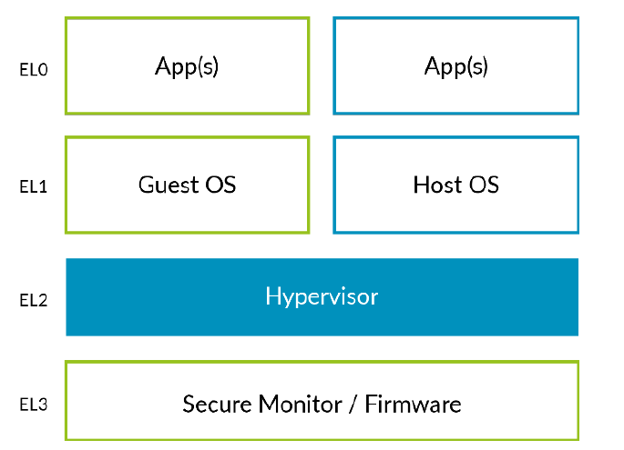
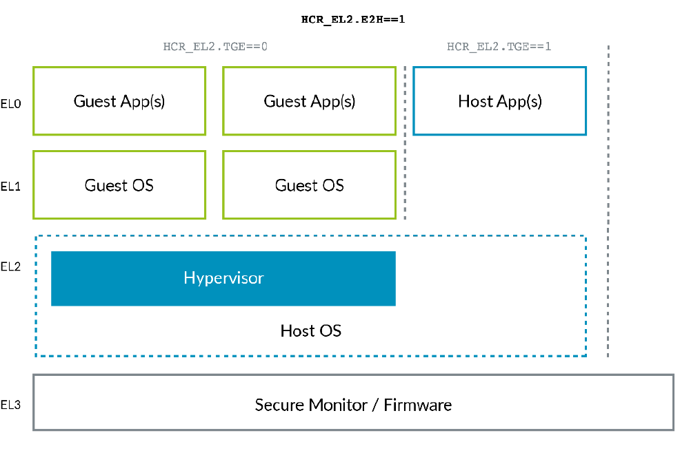
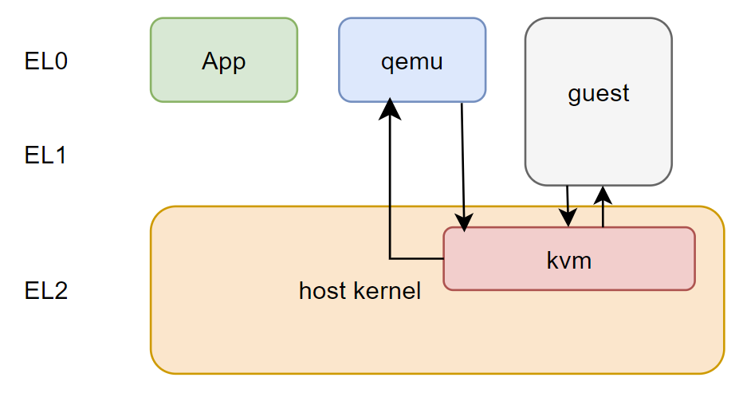

# <font style="color:rgb(51, 51, 51);">什么是虚拟化？</font>
<font style="color:rgb(51, 51, 51);">什么是虚拟化？文献[1]已经给出了很好的解释。这里我们更通俗的来理解一下虚拟化。</font>

<font style="color:rgb(51, 51, 51);">当我们在使用一台只有一个cpu的电脑时，我们可以同时聊天看电影，似乎这两个进程在同时工作。进程分时工作好像虚拟出了多个cpu，我们可以将进程看作cpu的虚拟化。我们的电脑只有8G的内存，但是我们可以在一个程序中访问远高于8G的地址空间，因为操作系统给我们使用的是虚拟内存。我们还听过java是被编译成架构无关的字节码，编译一次可以到处运行，前提是机器上装有java虚拟机。容器是前些年很火的技术，至今仍是云计算的基础。它给用户一个轻量的隔离的执行环境。还有我们常用的虚拟机，也是本文关注的重点。广义上，上面这些例子都可以归结为虚拟化的范畴。实际上我们常说的虚拟化技术指的是容器和虚拟机，而本文只关注虚拟机技术。</font>

# <font style="color:rgb(51, 51, 51);">系统虚拟化</font>
<font style="color:rgb(51, 51, 51);">系统虚拟化是指模拟出完整计算机系统的技术，包括cpu，内存外设等。这个虚拟出来的系统就是虚拟机。在虚拟机内部一般很难察觉当前是处于虚拟机还是物理机。根据虚拟机执行指令的ISA于所处物理机ISA是否相同，有两种实现方式。一种是纯软件模拟，它可以在一台物理机上虚拟出跟当前物理CPU不同架构的计算机。常见的比如在x86机器上模拟arm架构的计算机。但这种方式性能很差。另一种实现方式是虚拟机和运行它的物理机拥有同样的ISA，这样虚拟机中的代码可以直接运行在物理机中不需要模拟。它的实现需要借助于硬件的帮助。</font>

<font style="color:rgb(51, 51, 51);">在谈论虚拟机时，我们常常会用到几个专有名词，宿主机（host），客户机（guest），虚拟机管理软件（virtual machine monitor简称VMM），它们都是什么含义呢？宿主机是指虚拟机运行所在的系统，一般是物理机。客户机是虚拟机模拟出的系统。这好比主人和客人之间的关系，主人只有一个，客人可以有很多，而且要受到主人的”控制“或”“监视“。虚拟机管理软件是指将虚拟机运行起来，维持虚拟机生命周期内正常运转的软件。另一个跟VMM相似的概念是hypervisor，它也属于VMM的范畴，后面我们再做进一步区分。</font>

# <font style="color:rgb(51, 51, 51);">虚拟化漏洞</font>
<font style="color:rgb(51, 51, 51);">我们使用虚拟机的目的之一是为了隔离，虚拟机内运行的程序不能影响物理机的正常运行。这也需要虚拟机拥有另外一个属性，受控。一个不受控制的虚拟机是无法保证物理机安全的。但是某些指令天然的有破坏性。比如存访kernel页表基地址的寄存器。一般称这些对物理机有破坏的指令为敏感指令。如何防止虚拟机执行敏感指令？幸运的是敏感指令一般都是特权指令，特权指令是那些只能在更高特权级执行的指令。如果虚拟机执行特权指令，会主动陷入到高特权级，这样VMM就可以捕捉到这些指令从而模拟这些指令的执行并返回。但是如果一个架构并不是所有的敏感指令都是特权指令，那么某些敏感指令在执行时将无法被捕捉到，这就是虚拟化漏洞。</font>

# <font style="color:rgb(51, 51, 51);">硬件虚拟化</font>
为了消除虚拟化漏洞，各大主流CPU设计公司都推出了支持虚拟化的特性。比如intel的VT-x，amd的svm以及arm64的hyp mode。之后的VMM就可以基于这些硬件新特性来开发，大大提升虚拟化效率。这些基于硬件支持的虚拟机技术称为硬件虚拟化。

# 虚拟机的工作原理
前文提到在虚拟机中可以通过陷入后模拟的方式来执行敏感指令，事实确实如此，陷入模拟是虚拟机的最普遍有效的做法。在执行普通指令是直接在硬件上执行，效率很高，只有在执行敏感指令时才需要陷入到VMM模拟。下面是一个虚拟机工作原理的伪代码。

```plain
while true;
switch typeOfInstruct(instruct):
canRunInGuest:
Run(instruct); continue;
needEmulate:
exitAndEmulate(instruct); continue;
needExit:
break;
done
```

<font style="color:rgb(51, 51, 51);">从上面的伪代码可以看出，虚拟机在一个大循环里执行客户的代码（所谓客户也就是英文里的guest，常常指代需要在虚拟机中执行的代码，典型的比如一个完整的OS）。如果指令无需模拟则直接运行，如果需要模拟则退出虚拟机完成模拟后重新回到循环继续执行，如果需要退出虚拟机则退出虚拟机循环。 </font>

<font style="color:rgb(51, 51, 51);">一个物理机能够给软件提供的运行环境可以分为cpu，memory，io设备，中断由于其特殊性可以单独拿出来。因此，虚拟化也可以据此划分为：cpu虚拟化，内存虚拟化，中断虚拟化和设备虚拟化。本书其他章节将按照这个顺序讲解。</font>

# <font style="color:rgb(51, 51, 51);">arm64虚拟化架构</font>
<font style="color:rgb(51, 51, 51);">在现代系统中，OS和应用程序运行在不同的特权级别，这是软硬件协同发展的结果。arm64架构也是如此，下图是arm64经典的异常级别架构图：</font>



<font style="color:rgb(51, 51, 51);">这张图清晰地展示了armv8架构的异常级。host/guest的应用运行在EL0，host/guest的OS运行在EL1，hypervisor运行在EL2，secure monitor运行在EL3，到这里似乎一切都很好。但是设计上看似完美的结构在面对现实应用的时候却不是那么完美。linux的虚拟化模块kvm是跟kernel在一起的，按照上面的设计，平时OS会运行在EL1，偶尔处理虚拟化相关事务就会切换到EL2.本来就是一个东西却要硬生生分在两个空间运行，增加了切换的开销。于是arm又给出了一个叫VHE的feature来克服这个问题，就有了下面这张图：</font>



<font style="color:rgb(51, 51, 51);">上图中，host OS和hypervisor共同运行在EL2，这样host OS就会一直呆在EL2不会来回切换了。</font>

<font style="color:rgb(51, 51, 51);">现在我们了解了arm64虚拟化架构中的异常级，但是仅仅是这些对于了解arm的虚拟化还是远远不够。在接下来的章节，我们会按照cpu，memory，中断虚拟化，分别阐述arm架构对虚拟化的支持。</font>

# <font style="color:rgb(51, 51, 51);">hypervisor分类</font>
<font style="color:rgb(51, 51, 51);">有两种主要的硬件虚拟化模型，一种是hypervisor直接运行在硬件上，完全控制硬件，这种类型称之为typeⅠ。它的典型代表是Xen项目。另一种是hypervisor寄生在一个操作系统内，作为一个模块存在，称为typeⅡ。典型的就是linux中的kvm模块。本文只讲解kvm。</font>

<font style="color:rgb(51, 51, 51);">对于kvm而言，它无法独立运行虚拟机，必须在用户态存在一个VMM辅助，典型的就是Qemu。这可以引出VMM和hypervisor的差异。我们约定，本书中的hyperivsor仅仅指类似于kvm这样的虚拟机管理软件，而VMM既可以指代用户态的虚拟机管理软件也可以指kvm，但是为了避免混淆，本书约定，VMM仅指代用户态的虚拟机管理软件。</font>

# <font style="color:rgb(51, 51, 51);">kvm简介及实践</font>
<font style="color:rgb(51, 51, 51);">kvm（kernel-base virtual machine）是2006前后由一家以色列的公司开发并进入到内核主线，从此成为linux kernel的默认虚拟化方案。在x86平台上，kvm可以编译成模块的形式，但是在arm上，它只能编入kernel。kvm的代码分为架构无关代码和架构相关代码。前者位于linux/virt/kvm下，后者在linux/arch/*/kvm下。</font>

<font style="color:rgb(51, 51, 51);">虽然kvm提供了内核级别的虚拟化支持，但是需要用户态工具的帮助才能一起管理虚拟机。其中最为有名的开源工具是Qemu。近来由于云计算的兴发展，诞生了一些轻量级的用户态虚拟机管理软件，如firecracker，cloud hypervisor等。</font>

<font style="color:rgb(51, 51, 51);">下面是一个qemu-kvm在arm64上的架构图。</font>



<font style="color:rgb(51, 51, 51);">qemu作为用户态工具运行在EL0，kvm运行在EL2。qemu通过调用kvm接口创建虚拟机，当虚拟机运行起来时，一般由kvm负责cpu，memory和中断的虚拟化，而qemu多用来模拟设备。因此当guest退出到kvm时，如果kvm可以完成模拟则会在完成后返回虚拟机，如果kvm无法模拟则交由qemu来模拟，完成后再调用接口返回kvm，再由kvm返回到虚拟机中。</font>

<font style="color:rgb(51, 51, 51);">如果kernel使能了虚拟化会在/dev下生成一个字符设备/dev/kvm，通过它来与kvm交互完成虚拟机的创建和管理。</font>

<font style="color:rgb(51, 51, 51);">首先准备一段二进制文件作为虚拟机的运行程序，这段程序只会打印出一段字符串。</font>

```plain
main:
mov x4, #0x4000
/*
* welcomm to univmm!
* 119, 101, 108, 99, 111, 109, 109, 32, 116, 111, 32, 117, 110, 105, 118, 109, 109, 33,
*/
mov x2, #119
str x2, [x4]
mov x2, #101
str x2, [x4]
mov x2, #108
str x2, [x4]
mov x2, #99
str x2, [x4]
mov x2, #111
str x2, [x4]
mov x2, #109
str x2, [x4]
mov x2, #109
str x2, [x4]
mov x2, #32
str x2, [x4]
mov x2, #116
str x2, [x4]
mov x2, #111
str x2, [x4]
mov x2, #32
str x2, [x4]
mov x2, #117
str x2, [x4]
mov x2, #110
str x2, [x4]
mov x2, #105
str x2, [x4]
mov x2, #118
str x2, [x4]
mov x2, #109
str x2, [x4]
mov x2, #109
str x2, [x4]
mov x2, #33
str x2, [x4]
mov x2, #10
str x2, [x4]
mov x2, #7
str x2, [x4]
hlt 0
```

<font style="color:rgb(51, 51, 51);">上面的代码可以分为两部分，首先讲mmio地址0x4000写入x4，然后将字符的ascii码写入该地址。因为向mmio地址写入会引发guest exit到用户态VMM来处理，我们可以在VMM通过添加处理函数来打印出字符。</font>

<font style="color:rgb(51, 51, 51);">将上述代码写入文件，命名为test.S。编译。</font>

```plain
gcc -c -o test.o test.S
```

<font style="color:rgb(51, 51, 51);">我们的VM没有运行ELF格式文件的能力，所以只取其可执行部分。</font>

```plain
objcopy -O binary test.o test.bin
```

<font style="color:rgb(51, 51, 51);">接下来看一下如何写一个简单得用户态VMM。</font>

```plain
//通过打开kvm设备获得一个kvm句柄
int kvmfd = open("/dev/kvm", O_RDWR);

//获取代表虚拟机的句柄
int vmfd = ioctl(kvmfd, KVM_CREATE_VM, 0);

//分配一段内存
unsigned char *ram = mmap(NULL, 0x1000, PROT_READ |PROT_WRITE, MAP_SHARED | MAP_ANONYMOUS, 0, 0);

//打开需要执行的二进制文件
int kfd = open("test.bin", O_RDONLY);

//将二进制文件读入内存中
ret = read(kfd, ram, 4096);

//将上面分配的内存组织成虚拟机可用的物理内存
struct kvm_userspace_memory_region mem = {
.slot = 0,
.guest_phys_addr = 0,
.memory_size = 0x1000,
.userspace_addr = (unsigned long)ram,
};
ret = ioctl(vmfd, KVM_SET_USER_MEMORY_REGION, &mem);

//给VM创建vcpu
int vcpufd = ioctl(vmfd, KVM_CREATE_VCPU, 0);

//创建一段kvm和用户态vmm的共享内存空间
int mmap_size = ioctl(kvmfd, KVM_GET_VCPU_MMAP_SIZE, NULL);
struct kvm_run *run = mmap(NULL, mmap_size, PROT_READ | PROT_WRITE, MAP_SHARED, vcpufd, 0);

//初始化vcpu上下文
ret = arch_init_sregs(vcpufd);
ret = arch_init_regs(vcpufd);
ret = arch_init_vcpu(vmfd, vcpufd, 0);

//现在可以进入虚拟机运行了
while(1) {
ret = ioctl(vcpufd, KVM_RUN, NULL);
if (ret == -1) {
printf("KVM_RUN fail, errno is %d\n", errno);
return -1;
}
switch (run->exit_reason) {
//处理mmio退出
case KVM_EXIT_MMIO:
ret = arch_handle_mmio(run);
...
}
```

<font style="color:rgb(51, 51, 51);">这里省略了错误处理和cpu初始化部分的代码，但是整体框架使完整的。我们可以大概梳理一下vmm创建和管理虚拟机的基本步骤。</font>

<font style="color:rgb(51, 51, 51);">1. 打开kvm字符设备，作为后续创建虚拟机的基础；</font>

<font style="color:rgb(51, 51, 51);">2. 使kvm fd创建一个VM，这时会做很多跟vcpu以外的跟整体系统相关部分的初始化，比如stage 2 mmu，gic，timer等；</font>

<font style="color:rgb(51, 51, 51);">3. 给VM创建一段物理内存空间，将要执行的二进制文件写入该内存并注册到kvm；</font>

<font style="color:rgb(51, 51, 51);">4. 创建一段kvm与vmm共享的内存空间，用来传递诸如guest 退出原因的信息；</font>

<font style="color:rgb(51, 51, 51);">5. 创建vcpu并初始化；</font>

<font style="color:rgb(51, 51, 51);">6. 进入while循环使用KVM_RUN ioctl进入虚拟机并处理虚拟机退出。</font>

<font style="color:rgb(51, 51, 51);">一个VMM的运行的基本原理大致如此，当然实际的VMM要复杂得多。最后我们运行一下这个虚拟机（可以拉去代码编译后运行）</font>

```plain
root@odroidn2:~/univmm# ./univmm
welcomm to univmm!
```

<font style="color:rgb(51, 51, 51);">仅仅是打印出一行字符串就退出。</font>

<font style="color:rgb(51, 51, 51);">现在我们对虚拟机的创建已经有了一个感性的认识，但是还不能解释它。接下来的章节会阐释它背后的原理，相信读完本书，上面的例子已经不再神秘。</font>

<font style="color:rgb(51, 51, 51);">注：</font>

<font style="color:rgb(51, 51, 51);">[1] 《系统虚拟化 原理与实现》清华大学出版社</font>
