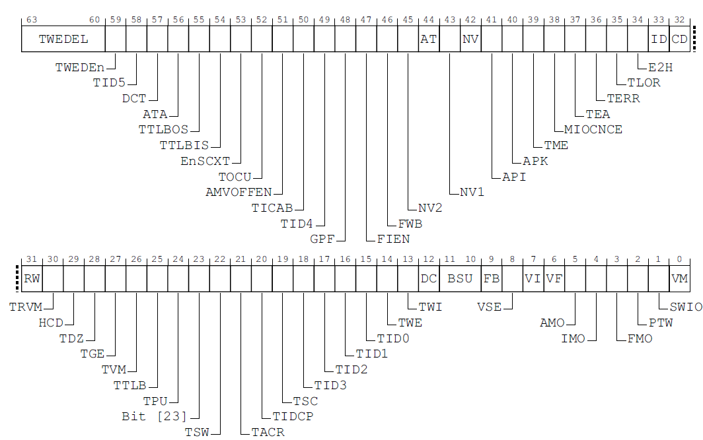

<font style="color:rgb(51, 51, 51);">cpu虚拟化是整个虚拟化的核心。虚拟机给运行于其上的指令虚拟出一个物理机器，使其分辨不出真假。指令是在cpu之上运行，于是这种虚拟的首要在于cpu的虚拟，可以称之为cpu虚拟化（当然这不是一个合格的定义）</font>

<font style="color:rgb(51, 51, 51);">对cpu虚拟的理解可以从两个方面来考虑。首先cpu有自己的上下文，主要包括cpu内部的寄存器组，通用寄存器，某些系统寄存器等；其次是cpu具有执行功能。完成这两方面的模拟即可实现cpu的虚拟化。对于前者比较容易理解，在虚拟cpu开始执行时将上下文加载到虚拟cpu上，在它不执行的时候将上下文保存起来。对于后者我们无法用软件来模拟一个真实能执行指令的cpu上，所以这个虚拟cpu的执行功能还是要落实到物理cpu上。但是为了使其受控，它必须处于cpu的某种受控模式下，也就是某些功能被阉割的，具体来说就是前面提到敏感指令不能在受控的cpu中执行，而是要回到VMM来执行。换句话说，在执行非敏感指令时，虚拟cpu和物理cpu并无区别，都是在物理cpu上运行，区别在于敏感指令的执行，物理cpu可以正常执行，而虚拟cpu必须由VMM模拟。所以，cpu的虚拟化很大程度上体现在敏感指令的模拟上。当然，cpu的功能不只是运行一个执行流，还可以响应中断，这就涉及到中断虚拟化，我们将在第四章讲述，本章我们侧重在指令的模拟上。</font>

<font style="color:rgb(51, 51, 51);">上一章中我们提到虚拟化最经典的原理，陷入后模拟，意思是对于可能影响宿主机的指令，我们必须将其识别并使虚拟机监控软件模拟其行为。这需要硬件的帮助，也就是cpu需要有这样的特性。现代cpu架构为了支持虚拟化都加入了新特性使之可虚拟化，比如intel VT，arm的hyp mode。</font>

<font style="color:rgb(51, 51, 51);">上面我们是从一个微观的状态来查看指令的虚拟化，接下来我们从宏观的角度查看。</font>

<font style="color:rgb(51, 51, 51);">现代操作系统非常复杂，它要处理来自众多用户的任务，中断。资源总是有限的，因此所有任务必须分时共享硬件资源，典型的就是cpu。要想让各个任务可以分时享用cpu，就必须要任务在停止之后还能恢复。能够使任务从上一个断点启动运行的关键在于在停止运行时保存任务上下文，在恢复运行时加载上下文，而这就形成了我们所熟知的进程或线程的概念，所以，其实我们可以认为是进程/线程承载了指令的运行，更进一步可以认为进程/线程就是cpu的抽象。虚拟机中的cpu数量可以是比物理机中的cpu数量更多，可知它是虚拟的cpu，但在虚拟机中我们无法分辨出它是假的，这就是cpu虚拟化。进程/线程作为cpu的抽象很切合虚拟cpu的功能，因此虚拟cpu可以用一个进程/线程来承载，这就是vCPU线程。</font>

<font style="color:rgb(51, 51, 51);">现代OS的进程都需要进程控制块来表示，比如linux中task_struct结构。vCPU也需要一些结构来表示，提供cpu上下文的虚拟，在kvm中一般由kvm_vcpu结构体来表示。请注意，这并不是说vCPU在运行的时候使用的是kvm_vcpu结构来保存上下文，它只是在进入/退出虚拟机时来保存虚拟机vCPU的上下文，vCPU在运行的时候仍然使用物理cpu。从这个意义上讲并不存在一个vCPU的物理实体，它只是一个抽象概念。</font>

<font style="color:rgb(51, 51, 51);">像其他普通线程一样，vCPU线程也需要服从host kernel的调度。但终究还是有那么些许不同，比如有一些额外的虚拟化相关的上下文需要保存和恢复。</font>

<font style="color:rgb(51, 51, 51);">以上这些内容都会在讲解kvm源码时进一步阐述。</font>

# <font style="color:rgb(51, 51, 51);">arm64的cpu虚拟化支持</font>
<font style="color:rgb(51, 51, 51);">上一章中我们提到，虚拟化引入一个新的cpu运行模式，客户机模式或是guest模式。为了支持这种功能，x86的引入一个专门的硬件扩展特性来支持cpu虚拟化，比如Intel的VMX，又引入用于虚拟机切换的一组指令。如果想从x86的角度来在armv8上寻找相似的结构恐怕要失望了。armv8架构并没有提供这种明显的虚拟化组件，而是引入了一个新的异常级别EL2和一些控制寄存器来支持硬件虚拟化，除了极少数特殊指令外并没有额外指令来显式的完成虚拟机生命周期的管理。从x86的视角来看，它非常不同，没有那么清晰的流程。在这些少数的控制寄存器中，最重要的是HCR_EL2。下面我们来仔细的查看它。</font>

<font style="color:rgb(51, 51, 51);">HCR_EL2是一个64位寄存器，全称是Hypervisor Configuration Register，可知其是专门用来配置hypervisor的寄存器。下图是手册中各个bit的含义。</font>



由于内容很多，我们仅就几个比较常用的bit进行讲解。

bit0：VM位，如果置一则guest在访问内存时会经过stage2的转换，这些内容会在内存虚拟化一章详细讲解；

bit4：IMO位，如果置一，guest执行时发生的irq会route到EL2，这对中断虚拟化很重要；

bit13：TWI位，如果置一，guest执行wfi会trap到EL2；

bit14：TWE位，如果置一，guest执行wfe会trap到EL2；

bit26：TVM位，如果置一，guest写virtual memory的控制寄存器时会trap到EL2；

bit27：TGE位，Trap General Exceptions from EL0，如果置一，将guest所有trap到EL1的异常trap到EL2，使得EL2可以控制在EL0产生的异常；

bit34：E2H位，如果cpu支持VHE，置一会使能VHE；

上面出现的wfi指令全称wait for interrupt，wfe全称wait for event，都会将cpu置于低功耗状态，是高频指令。

VHE全称virtual host extension。可以使得host kernel运行在EL2而不是通常的EL1，这样可以减少hypervisor在不同异常级跳跃的开销。比较新的arm服务器芯片大都支持VHE，因此我们在kvm源码讲解时只介绍开启VHE的场景。

<font style="color:rgb(51, 51, 51);">有三种指令可能需要陷入后模拟。</font>

1. <font style="color:rgb(51, 51, 51);">特殊指令，典型的如WFI/WFE，其会陷入到EL2并重新调度；</font>
2. <font style="color:rgb(51, 51, 51);">访问某些系统寄存器，比如：ID_AA64MMFR0_EL1，hypervisor会返回虚拟值给VM；</font>
3. <font style="color:rgb(51, 51, 51);">访问MMIO地址，这类地址是没有经过VMM设置的一段空间。</font>

<font style="color:rgb(51, 51, 51);">访问这些指令都会陷入EL2然后模拟，这是cpu虚拟化的基础。</font>

<font style="color:rgb(51, 51, 51);">某些敏感指令或读写会trap的系统寄存器的使用或访问的频率很高，如果每次都trap会增加虚拟机的开销。为了优化性能，某些寄存器拥有为虚拟化专属的寄存器，也就是在虚拟机中访问的寄存器会重定向到相应的虚拟寄存器，而访问该虚拟寄存器不需要trap，这样就大大减少了虚拟机的trap的次数。比如wfi指令可以由HCR_EL2.TVM来控制是否在EL0/EL1执行时trap。MIDR和MPIDR有对应的VMIDR和VMPIDR。Arm提供了一组寄存器用来控制虚拟机内指令或寄存器访问的行为，主要由H开头的一组寄存器：</font>

<font style="color:rgb(51, 51, 51);">HACR_EL2: Hypervisor Auxiliary Control Register；</font>

<font style="color:rgb(51, 51, 51);">HAFGRTR_EL2, Hypervisor Activity Monitors Fine-Grained Read Trap Register；</font>

<font style="color:rgb(51, 51, 51);">HCRX_EL2, Extended Hypervisor Configuration Register；</font>

<font style="color:rgb(51, 51, 51);">HDFGRTR_EL2, Hypervisor Debug Fine-Grained Read Trap Register；</font>

<font style="color:rgb(51, 51, 51);">HFGITR_EL2, Hypervisor Fine-Grained Instruction Trap Register；</font>

<font style="color:rgb(51, 51, 51);">HFGWTR_EL2, Hypervisor Fine-Grained Write Trap Register；</font>

<font style="color:rgb(51, 51, 51);">HPFAR_EL2, Hypervisor IPA Fault Address Register；</font>

<font style="color:rgb(51, 51, 51);">hcrx_el2， mdcr_el2，cptr_el2;</font>

<font style="color:rgb(51, 51, 51);">这些寄存器提供了丰富的精细化的接口来控制敏感指令在虚拟机内的行为，可以查询arm的官方手册来了解详细信息</font>_<font style="color:rgb(51, 51, 51);">。</font>_

# kvm cpu虚拟化相关代码分析
从现在开始到本章结束我们都将讨论kvm的实现。有关cpu虚拟化内容较多，以下我们将围绕几个话题展开：

+ 指令模拟的实现
+ 虚拟机的切入切出
+ 虚拟机如何创建
+ 虚拟机的整体运行流程
+ vcpu的调度

## <font style="color:rgb(51, 51, 51);">kvm对指令模拟的实现</font>
<font style="color:rgb(51, 51, 51);">对于敏感指令的模拟一般有虚拟机退出到hypervisor模拟。处理虚拟机退出最重要的函数为handle_exit。</font>

```plain
int handle_exit(struct kvm_vcpu *vcpu, int exception_index)
{
struct kvm_run *run = vcpu->run;

...
exception_index = ARM_EXCEPTION_CODE(exception_index);

switch (exception_index) {
case ARM_EXCEPTION_IRQ:
return 1;
...
case ARM_EXCEPTION_TRAP:
return handle_trap_exceptions(vcpu);
...
}
}
```

<font style="color:rgb(51, 51, 51);">上述代码略去了不重要的部分，虚拟机退出的主要原因是物理irq中断（由ARM_EXCEPTION_IRQ表示）和虚拟机的trap（由ARM_EXCEPTION_TRAP表示）。有关irq的退出处理留待中断虚拟化一章讲解，现在我们看一下kvm对trap的处理。</font>

```plain
static int handle_trap_exceptions(struct kvm_vcpu *vcpu)
{
int handled;

if (!kvm_condition_valid(vcpu)) {
...
} else {
exit_handle_fn exit_handler;

exit_handler = kvm_get_exit_handler(vcpu);
handled = exit_handler(vcpu);
}

return handled;
}
```

<font style="color:rgb(51, 51, 51);">处理trap的逻辑很简单，从vcpu中得到虚拟机退出原因据此找到对应处理函数然后执行。</font>

```plain
static exit_handle_fn kvm_get_exit_handler(struct kvm_vcpu *vcpu)
{
u64 esr = kvm_vcpu_get_esr(vcpu);
u8 esr_ec = ESR_ELx_EC(esr);

return arm_exit_handlers[esr_ec];
}
```

<font style="color:rgb(51, 51, 51);">从esr_el2中获取到guest的退出原因。esr_elx寄存器存放了系统发生exception的原因，对于debug非常重要。在fixup_guest_exit函数中将esr_el2寄存器的值赋给vcpu.arch.fault.esr_el2，因此我们可以在vcpu数据结构中找到该寄存器的值。</font>

<font style="color:rgb(51, 51, 51);">所有的exit handler都存储在arm_exit_handlers数组中。</font>

```plain
static exit_handle_fn arm_exit_handlers[] = {
...
[ESR_ELx_EC_WFx] = kvm_handle_wfx,
[ESR_ELx_EC_HVC32] = handle_hvc,
[ESR_ELx_EC_SMC32] = handle_smc,
[ESR_ELx_EC_HVC64] = handle_hvc,
[ESR_ELx_EC_SMC64] = handle_smc,
[ESR_ELx_EC_SVC64] = handle_svc,
[ESR_ELx_EC_SYS64] = kvm_handle_sys_reg,
[ESR_ELx_EC_SVE] = handle_sve,
[ESR_ELx_EC_ERET] = kvm_handle_eret,
[ESR_ELx_EC_IABT_LOW] = kvm_handle_guest_abort,
[ESR_ELx_EC_DABT_LOW] = kvm_handle_guest_abort,
...
};
```

<font style="color:rgb(51, 51, 51);">wfx包含wfi和wfe，hvc，smc，svc，sve，eret是会trap的指令。kvm_handle_sys_reg处理寄存器访问产生的trap，kvm_handle_guest_abort处理访问mmio或者stage 2 page fault。这完整对应了上文提到到三类虚拟机退出指令。</font>

### <font style="color:rgb(51, 51, 51);">小实验</font>
<font style="color:rgb(51, 51, 51);">为了能让读者对trap模拟有一个更直观的认识，这里借助bpftrace对虚拟机因访问寄存器退出进行探测。bpftrace是一款简单实用的bpf工具，通过bpftrace可以以非常简洁的代码来实现对kernel事件或函数的观测。</font>

<font style="color:rgb(51, 51, 51);">首先安装bpftrace，对于ubuntu可以直接使用apt安装；然后编写探测代码。我们的探测对象是kvm_sys_access静态探测点，代码如下：</font>

```plain
#!/usr/bin/env bpftrace

tracepoint:kvm:kvm_sys_access
{
$name = args->name;
printf("%s: name: %s\n", comm, str($name));
}
```

<font style="color:rgb(51, 51, 51);">上述代码会在kvm执行kvm_handle_sys_reg是打印出当前VMM命令和虚拟机访问的寄存器名。加上执行权限后运行该脚本，在另一个终端运行kvm虚拟机就会观察到虚拟机访问的系统寄存器了。</font>

```plain
root@odroidn2:~/bpf/bpftrace# ./kvm_sys_reg_misc.bt
Attaching 1 probe...
qemu-system-aar: name: SYS_ID_AA64MMFR0_EL1
qemu-system-aar: name: SYS_MAIR_EL1
qemu-system-aar: name: SYS_TCR_EL1
qemu-system-aar: name: SYS_TTBR0_EL1
qemu-system-aar: name: SYS_SCTLR_EL1
qemu-system-aar: name: SYS_ID_AA64PFR0_EL1
qemu-system-aar: name: SYS_ID_AA64PFR0_EL1
qemu-system-aar: name: SYS_ID_AA64MMFR0_EL1
qemu-system-aar: name: SYS_ID_AA64MMFR0_EL1
qemu-system-aar: name: SYS_CTR_EL0
qemu-system-aar: name: SYS_CTR_EL0
qemu-system-aar: name: SYS_ID_AA64MMFR0_EL1
qemu-system-aar: name: SYS_CTR_EL0
qemu-system-aar: name: SYS_CTR_EL0
....
```

<font style="color:rgb(51, 51, 51);">这里的寄存器都加了SYS_前缀。根据实验观测结果，CTR_EL0是产生trap最多的寄存器。理论上可以提供一个virtual版的CTR_EL0来减少trap提升性能。</font>

<font style="color:rgb(51, 51, 51);">在/sys/kernel/debug/kvm下有有关虚拟机退出事件的统计。</font>

## <font style="color:rgb(51, 51, 51);">kvm中虚拟机退出和切入的实现</font>
<font style="color:rgb(51, 51, 51);">Intel的硬件虚拟化支持中对虚拟机与host的切换是使用明确的指令来做到的，看起来非常直观。arm是另一种风格。在arm架构中需要在不同异常级上跳跃来实现进出虚拟机。比如从虚拟机退出到hypervisor，通常是通过执行敏感指令发生异常陷入到EL2。为了理解这个过程我们需要对cpu异常级有一个了解。</font>

<font style="color:rgb(51, 51, 51);">我们在上一章讲到arm64有4个异常级，除了安全相关的EL3，用户程序运行在EL0，kernel可以运行在EL1/EL2，hypervisor运行在EL2。cpu在执行指令时会处在某一个异常级，从低特权级到高特权级叫trap（陷入）从高特权级到低特权级叫陷出。比如从EL0到EL1可以执行svc指令，这是syscall的实现方式。当在EL0执行svc指令时会发生同步异常，cpu会将执行svc的下一条指令记录在ELR_EL1寄存器中，当需要从EL1返回EL0时，调用eret即可。当从guest模式陷入到EL2，模拟完成后返回也是调用eret指令，cpu会跳转到ELR寄存器保存的指令中继续执行。为验证这一点，我们来看看kvm是怎么做的。</font>

### <font style="color:rgb(51, 51, 51);">进入虚拟机</font>
<font style="color:rgb(51, 51, 51);">kvm中进入虚拟机的代码为</font>[<font style="color:rgb(51, 51, 51);">__kvm_vcpu_run_vhe</font>](https://elixir.bootlin.com/linux/v6.10/C/ident/__kvm_vcpu_run_vhe)<font style="color:rgb(51, 51, 51);">->__guest_enter，位于arch/arm64/kvm/hyp/entry.S。</font>

```plain
SYM_FUNC_START(__guest_enter)
// x0: vcpu
// x1-x17: clobbered by macros
// x29: guest context

...
// Restore the guest's sp_el0
restore_sp_el0 x29, x0

// Restore guest regs x0-x17
ldp x0, x1, [x29, #CPU_XREG_OFFSET(0)]
ldp x2, x3, [x29, #CPU_XREG_OFFSET(2)]
ldp x4, x5, [x29, #CPU_XREG_OFFSET(4)]
ldp x6, x7, [x29, #CPU_XREG_OFFSET(6)]
ldp x8, x9, [x29, #CPU_XREG_OFFSET(8)]
ldp x10, x11, [x29, #CPU_XREG_OFFSET(10)]
ldp x12, x13, [x29, #CPU_XREG_OFFSET(12)]
ldp x14, x15, [x29, #CPU_XREG_OFFSET(14)]
ldp x16, x17, [x29, #CPU_XREG_OFFSET(16)]

// Restore guest regs x18-x29, lr
restore_callee_saved_regs x29

// Do not touch any register after this!
eret
sb
```

<font style="color:rgb(51, 51, 51);">只保留我们感兴趣的部分。这段代码主要是从vcpu中恢复guest退出前的上下文，然后执行eret来回到guest退出时的位置或者下一条指令。但是ELR寄存器在哪里设置呢？自然是在eret之前。我们可以在__kvm_vcpu_run_vhe->sysreg_restore_guest_state_vhe->__sysreg_restore_el2_return_state发现下面的代码。</font>

```plain
static inline void __sysreg_restore_el2_return_state(struct kvm_cpu_context *ctxt)
{
...
write_sysreg_el2(ctxt->regs.pc, SYS_ELR);
...
}
```

<font style="color:rgb(51, 51, 51);">上述函数会将保存在ctxt结构体中guest退出时的指令（或者是下一条指令）加载到ELR_EL2中给eret使用。</font>

### <font style="color:rgb(51, 51, 51);">kvm_vcpu结构体</font>
<font style="color:rgb(51, 51, 51);">由前述可知虚拟机在运行过程中会频繁的进出guest模式，每次进出都会发生上下文的切换。比如当虚拟机退出到hypervisor时cpu不再执行虚拟机代码而改为执行hypervisor的代码，当从hypervisor返回到虚拟机时又要从之前退出的那个点开始执行。这就要求虚拟机的上下文必须保存在某个地方，便于之后恢复。最好有一个能够唯一代表该虚拟cpu的数据结构指向保存上下文的位置，于是有了kvm_vcpu结构体。</font>

```plain
struct kvm_vcpu {
struct kvm *kvm;
#ifdef CONFIG_PREEMPT_NOTIFIERS
struct preempt_notifier preempt_notifier;
#endif
int cpu;
int vcpu_id; /* id given by userspace at creation */
int vcpu_idx; /* index into kvm->vcpu_array */

struct kvm_run *run;

struct pid __rcu *pid;

struct kvm_vcpu_arch arch;

};
```

<font style="color:rgb(51, 51, 51);">kvm_vcpu是一个比较大的结构体，这里我们仅保留了本章需要了解的部分。kvm_vcpu主要有两块，kvm结构体保存于kvm实现相关的信息，kvm_vcpu_arch保存了与架构相关的信息。preempt_notifier与vcpu调度有关。vcpu_id标识了vcpu的序号。kvm_run提供了kvm与用户态VMM的某些信息交换接口。pid应该是代表该vcpu运行的线程pid。我们来重点看一下kvm_vcpu_arch结构。</font>

```plain
struct kvm_vcpu_arch {
struct kvm_cpu_context ctxt;

/* Stage 2 paging state used by the hardware on next switch */
struct kvm_s2_mmu *hw_mmu;

/* Values of trap registers for the guest. */
u64 hcr_el2;
u64 hcrx_el2;
u64 mdcr_el2;
u64 cptr_el2;

/* Exception Information */
struct kvm_vcpu_fault_info fault;
...
}
```

<font style="color:rgb(51, 51, 51);">只保留部分成员。kvm_cpu_context保存guest的上下文，因此最为重要。kvm_s2_mmu与内存虚拟化相关，留待下一章讲解。接下来几个以el2结尾的是guest控制寄存器，每次进出虚拟机都要保存和恢复，保证虚拟机行为一致。kvm_vcpu_fault_info保存虚拟机退出原因。我们最关心vcpu上下文的保存，继续看kvm_cpu_context。</font>

```plain
struct kvm_cpu_context {
struct user_pt_regs regs; /* sp = sp_el0 */

u64 spsr_abt;
u64 spsr_und;
u64 spsr_irq;
u64 spsr_fiq;

struct user_fpsimd_state fp_regs;

u64 sys_regs[NR_SYS_REGS];

struct kvm_vcpu *__hyp_running_vcpu;

/* This pointer has to be 4kB aligned. */
u64 *vncr_array;
};
```

<font style="color:rgb(51, 51, 51);">其中user_pt_regs是通用寄存器，如下所示：</font>

```plain
struct user_pt_regs {
__u64 regs[31];
__u64 sp;
__u64 pc;
__u64 pstate;
};
```

<font style="color:rgb(51, 51, 51);">包括x0-x30，栈寄存器sp，pc和pstate。</font>

<font style="color:rgb(51, 51, 51);">user_fpsimd_state是浮点寄存器。sys_regs数组是系统寄存器。</font>

### <font style="color:rgb(51, 51, 51);">退出虚拟机</font>
<font style="color:rgb(51, 51, 51);">退出虚拟机的原因无外乎在该cpu上发生exception，无论是异步异常比如irq，或者同步异常，比如敏感指令的执行。在前文讨论返回虚拟机相关代码时我们已经知道恢复虚拟机上下文由__guest_enter完成。保存上下文发生在哪里呢？__guest_exit?的确如此。</font>

```plain
SYM_INNER_LABEL(__guest_exit, SYM_L_GLOBAL)
...
// Store the guest regs x0-x1 and x4-x17
stp x2, x3, [x1, #CPU_XREG_OFFSET(0)]
stp x4, x5, [x1, #CPU_XREG_OFFSET(4)]
...
stp x16, x17, [x1, #CPU_XREG_OFFSET(16)]
...
```

<font style="color:rgb(51, 51, 51);">我们可以容易的看到虚拟机退出时对通用寄存器的保存。后文会详细讲解。</font>

## <font style="color:rgb(51, 51, 51);">kvm创建虚拟机</font>
<font style="color:rgb(51, 51, 51);">在上一章的结尾，我们实现了一个非常精简的VMM。在这个VMM中，我们首先创建一个VM空的机箱，然后创建了vcpu结构，最后运行vcpu。下面我们按照这三个步骤来分析一下kvm如何创建一个虚拟机并运行它。</font>

### vm结构的创建
<font style="color:rgb(51, 51, 51);">创建VM是通过对kvm dev fd调用KVM_CREATE_VM ioctl实现的。响应该kvm dev ioctl的函数为kvm_dev_ioctl。对于KVM_CREATE_VM会直接调用kvm_dev_ioctl_create_vm.</font>

```plain
static int kvm_dev_ioctl_create_vm(unsigned long type)
{
...
fd = get_unused_fd_flags(O_CLOEXEC);
...
kvm = kvm_create_vm(type, fdname);
...
file = anon_inode_getfile("kvm-vm", &kvm_vm_fops, kvm, O_RDWR);
...
return fd;
...
```

<font style="color:rgb(51, 51, 51);">只留下我们感兴趣的部分。该函数是一个标准的打开文件的流程。会创建file上下文，设置kvm_vm_fops作为文件操作集合，最后返回fd。我们最感兴趣的是kvm_create_vm. 该函数主要是分配并初始化kvm结构，在分析这个函数之前先来看看kvm结构体。</font>

```plain
struct kvm {
...
struct mm_struct *mm; /* userspace tied to this vm */
unsigned long nr_memslot_pages;
/* The two memslot sets - active and inactive (per address space) */
struct kvm_memslots __memslots[KVM_MAX_NR_ADDRESS_SPACES][2];
/* The current active memslot set for each address space */
struct kvm_memslots __rcu *memslots[KVM_MAX_NR_ADDRESS_SPACES];
struct xarray vcpu_array;

...
atomic_t online_vcpus;
int max_vcpus;
int created_vcpus;
int last_boosted_vcpu;
struct list_head vm_list;
struct mutex lock;
struct kvm_io_bus __rcu *buses[KVM_NR_BUSES];
#ifdef CONFIG_HAVE_KVM_IRQCHIP
struct {
spinlock_t lock;
struct list_head items;
/* resampler_list update side is protected by resampler_lock. */
struct list_head resampler_list;
struct mutex resampler_lock;
} irqfds;
#endif
struct list_head ioeventfds;
struct kvm_vm_stat stat;
struct kvm_arch arch;
refcount_t users_count;
...

struct mutex irq_lock;
#ifdef CONFIG_HAVE_KVM_IRQCHIP
/*
* Update side is protected by irq_lock.
*/
struct kvm_irq_routing_table __rcu *irq_routing;

struct hlist_head irq_ack_notifier_list;
#endif
...
char stats_id[KVM_STATS_NAME_SIZE];
};
```

<font style="color:rgb(51, 51, 51);">kvm结构较长，主要包括内存，vcpu，arch相关，io，中断，统计等的描述。本节我们重点关注vcpu和跟arch相关的部分。描述vcpu的成员比较简单，主要包括最online，最大cpu数量，已经创建的cpu数量等。下面我们分析一下arch相关的结构体kvm_arch。</font>

```plain
struct kvm_arch {
struct kvm_s2_mmu mmu;

u64 fgu[__NR_FGT_GROUP_IDS__];

/* Interrupt controller */
struct vgic_dist vgic;

/* Timers */
struct arch_timer_vm_data timer_data;

/* Mandated version of PSCI */
u32 psci_version;

/* Protects VM-scoped configuration data */
struct mutex config_lock;

unsigned long flags;

/* VM-wide vCPU feature set */
DECLARE_BITMAP(vcpu_features, KVM_VCPU_MAX_FEATURES);

/* MPIDR to vcpu index mapping, optional */
struct kvm_mpidr_data *mpidr_data;

/*
* VM-wide PMU filter, implemented as a bitmap and big enough for
* up to 2^10 events (ARMv8.0) or 2^16 events (ARMv8.1+).
*/
unsigned long *pmu_filter;
struct arm_pmu *arm_pmu;

cpumask_var_t supported_cpus;
...
};
```

<font style="color:rgb(51, 51, 51);">kvm_arch包含的都是arm架构相关的描述。包括stage2内存转换相关的mmu，中断控制器，时钟，电源管理（psci），pmu，vcpu特性，还定义了一些模拟的ID寄存器。不过要注意，这里的描述都是面向整个VM的。这里我们大概了解一下kvm_arch结构，等分析到某个具体成员时在深入了解。</font>

<font style="color:rgb(51, 51, 51);">接下来看看kvm_create_vm做了什么。</font>

```plain
static struct kvm *kvm_create_vm(unsigned long type, const char *fdname)
{
struct kvm *kvm = kvm_arch_alloc_vm();

kvm->max_vcpus = KVM_MAX_VCPUS;
...
r = kvm_arch_init_vm(kvm, type);
if (r)
goto out_err_no_arch_destroy_vm;

r = hardware_enable_all();
if (r)
goto out_err_no_disable;

#ifdef CONFIG_HAVE_KVM_IRQCHIP
INIT_HLIST_HEAD(&kvm->irq_ack_notifier_list);
#endif

r = kvm_init_mmu_notifier(kvm);
if (r)
goto out_err_no_mmu_notifier;

r = kvm_coalesced_mmio_init(kvm);
if (r < 0)
goto out_no_coalesced_mmio;

r = kvm_create_vm_debugfs(kvm, fdname);
if (r)
goto out_err_no_debugfs;
...
mutex_lock(&kvm_lock);
list_add(&kvm->vm_list, &vm_list);
mutex_unlock(&kvm_lock);

preempt_notifier_inc();
...

return kvm;
...
}
```

<font style="color:rgb(51, 51, 51);">该函数创建了一个kvm实例，初始化后返回该实例。</font>

<font style="color:rgb(51, 51, 51);">对于max_vcpus赋值是vgic-v3支持的最大数目512.</font>

<font style="color:rgb(51, 51, 51);">kvm_arch_init_vm会初始化kvm结构体中跟架构相关的部分，stage2内存转换，vgic，vtimer，还会修正max_vcpus。</font>

<font style="color:rgb(51, 51, 51);">hardware_enable_all会使能vgic和vtimer/ptimer中断。</font>

<font style="color:rgb(51, 51, 51);">kvm_init_mmu_notifier注册mmu notifier。</font>

<font style="color:rgb(51, 51, 51);">kvm_coalesced_mmio_init给kvm的coalesced mmio ring分配一页内存。</font>

<font style="color:rgb(51, 51, 51);">kvm_create_vm_debugfs初始化kvm debugfs，也就是在/sys/kernel/debug/kvm下会创建一个以vm pid开头的目录。</font>

<font style="color:rgb(51, 51, 51);">将kvm加入到全局的vm_list中。</font>

<font style="color:rgb(51, 51, 51);">这样一个kvm结构就创建完成了。</font>

### vcpu的创建
<font style="color:rgb(51, 51, 51);">创建完kvm结构也就有了一个机箱加上一些基础设施，比如中断控制器，时钟等，我们还需要创建机器里面最重要的组件，cpu和memory，memory会在下一章再做介绍，现在我们先创建cpu。</font>

<font style="color:rgb(51, 51, 51);">创建cpu是通过在vmfd上调用KVM_CREATE_VCPU ioctl实现的，它会返回以vcpufd，用以代表vcpu。kvm_vm_ioctl_create_vcpu会被调用完成vcpu的创建。</font>

```plain
static int kvm_vm_ioctl_create_vcpu(struct kvm *kvm, u32 id)
{
int r;
struct kvm_vcpu *vcpu;
struct page *page;

r = kvm_arch_vcpu_precreate(kvm, id);

kvm->created_vcpus++;
vcpu = kmem_cache_zalloc(kvm_vcpu_cache, GFP_KERNEL_ACCOUNT);

page = alloc_page(GFP_KERNEL_ACCOUNT | __GFP_ZERO);
vcpu->run = page_address(page);

kvm_vcpu_init(vcpu, kvm, id);

r = kvm_arch_vcpu_create(vcpu);

if (kvm->dirty_ring_size) {
r = kvm_dirty_ring_alloc(&vcpu->dirty_ring,
id, kvm->dirty_ring_size);
}

vcpu->vcpu_idx = atomic_read(&kvm->online_vcpus);
r = xa_reserve(&kvm->vcpu_array, vcpu->vcpu_idx, GFP_KERNEL_ACCOUNT);

/* Now it's all set up, let userspace reach it */
kvm_get_kvm(kvm);
r = create_vcpu_fd(vcpu);
...
kvm_arch_vcpu_postcreate(vcpu);
kvm_create_vcpu_debugfs(vcpu);
return r;
...
}
```

<font style="color:rgb(51, 51, 51);">该函数首先创建一个vcpu结构并初始化。</font>

<font style="color:rgb(51, 51, 51);">kvm_arch_vcpu_precreate会做一些检查，如果vgic已经初始化或者id大于max cpu就返回错误。</font>

<font style="color:rgb(51, 51, 51);">给vcpu结构从cache中分配内存。</font>

<font style="color:rgb(51, 51, 51);">增加kvm结构中的created_vcpus计数。</font>

<font style="color:rgb(51, 51, 51);">给vcpu的run成员分配一页内存用来kvm与userspace通信。</font>

<font style="color:rgb(51, 51, 51);">kvm_vcpu_init对vcpu结构做初始化，将kvm赋值给其kvm成员，id赋给vcpu_idx成员，给preempt_notifier赋值（下文中vcpu调度一节会讲解）等。</font>

<font style="color:rgb(51, 51, 51);">kvm_arch_vcpu_create对那些跟cpu相关的设备，例如vtimer，vgic，vpmu进行初始化。</font>

<font style="color:rgb(51, 51, 51);">给每个vcpu分配dirty ring，用于脏页统计。</font>

<font style="color:rgb(51, 51, 51);">将vcpu的vcpu_idx成员加入kvm的vcpu xarray，方便kvm对所有vcpu进行管理，这个可以看到这个vcpu_idx的值等于当前online的vcpu数量，因此是依次递增的。</font>

<font style="color:rgb(51, 51, 51);">kvm_get_kvm会增加kvm users_count计数。</font>

<font style="color:rgb(51, 51, 51);">create_vcpu_fd会分配一个inode给vcpu，并创建文件上下文，将kvm_vcpu_fops作为vcpu的操作集，最后返回fd。vcpu inode的命名kvm-vcpu:vcpu_id，当虚拟机启动后可以通过ls -l /proc/$(pgrep qemu)/fd观察到。从这里可以得知vcpu_id是vcpu的编号，vcpu_idx是kvm对vcpu的管理编号。</font>

<font style="color:rgb(51, 51, 51);">增加online_vcpus计数。</font>

<font style="color:rgb(51, 51, 51);">创建per vcpu的debugfs目录。这样我们就可以在/sys/kernel/debug/kvm/的vm目录下看到以“vcpu+vcpu_id”命名的文件。</font>

<font style="color:rgb(51, 51, 51);">至此vcpu创建完成，如果一切顺利此时就可以返回fd了。</font>

<font style="color:rgb(51, 51, 51);">代表vcpu的kvm_vcpu结构是一个非常重要的结构，从上面的分析我们对其已经有了初步的了解，下面来更详细的观察一下这个结构。</font>

```plain
struct kvm_vcpu {
struct kvm *kvm;
#ifdef CONFIG_PREEMPT_NOTIFIERS
struct preempt_notifier preempt_notifier;
#endif
int cpu;
int vcpu_id; /* id given by userspace at creation */
int vcpu_idx; /* index into kvm->vcpu_array */
int ____srcu_idx; /* Don't use this directly. You've been warned. */

int mode;
u64 requests;
unsigned long guest_debug;

struct mutex mutex;
struct kvm_run *run;
#ifndef __KVM_HAVE_ARCH_WQP
struct rcuwait wait;
#endif
struct pid __rcu *pid;
int sigset_active;
sigset_t sigset;
unsigned int halt_poll_ns;
bool valid_wakeup;

bool preempted;
bool ready;
struct kvm_vcpu_arch arch;
struct kvm_vcpu_stat stat;
char stats_id[KVM_STATS_NAME_SIZE];
struct kvm_dirty_ring dirty_ring;
struct kvm_memory_slot *last_used_slot;
u64 last_used_slot_gen;
};
```

<font style="color:rgb(51, 51, 51);">kvm指向表示vcpu所在vm的结构体。</font>

<font style="color:rgb(51, 51, 51);">preempt_notifier用于vcpu调度时执行跟vcpu虚拟化相关的设置。毕竟vcpu线程相对普通线程还是需要一些额外的工作。我们在本章结尾会详细介绍vcpu调度。</font>

<font style="color:rgb(51, 51, 51);">之后是几个跟cpu相关的成员。cpu表示vcpu当前运行的物理cpu。vcpu_id是在创建vcpu时传入kvm的参数，表示在guest中vcpu的编号。vcpu_idx是kvm的xarry用来管理vcpu的index。</font>

<font style="color:rgb(51, 51, 51);">mode是当前vcpu所处的模式，由几个枚举值表示。比如运行在guest时为IN_GUEST_MODE，出guest模式时是OUTSIDE_GUEST_MODE。 request表示vcpu需要的响应的请求操作，参看Documentation/virt/kvm/vcpu-requests.rst。</font>

<font style="color:rgb(51, 51, 51);">run成员是kvm与用户态vmm通信的一块内存，常用于返回需要用户态介入处理的vm退出原因。</font>

<font style="color:rgb(51, 51, 51);">pid表示当前vcpu的在host上的pid。sigset是vcpu收到的信号（猜的）。</font>

<font style="color:rgb(51, 51, 51);">host_poll_ns是用于优化虚拟机退出性能，当虚拟机退出需要调度之前先polling一会儿，如果此时可以重新进入虚拟机状态则可以减少vcpu切换造成的开销，提高虚拟机性能。</font>

<font style="color:rgb(51, 51, 51);">ready表示当前vcpu是否可以运行。</font>

<font style="color:rgb(51, 51, 51);">arch是架构相关的vcpu信息。</font>

<font style="color:rgb(51, 51, 51);">stat是vcpu相关的统计值。</font>

<font style="color:rgb(51, 51, 51);">dirty_ring上文提到过，用于标记脏页。</font>

<font style="color:rgb(51, 51, 51);">last_used_slot表示最近使用的memory slot。</font>

## 虚拟机的运行
<font style="color:rgb(51, 51, 51);">现在vm和vcpu memory都创建完成了，接下来可以启动vcpu了。要启动vcpu，可以通过上一节得到的vcpu fd调用ioctl KVM_RUN接口来让用户态VMM启动vcpu。</font>

<font style="color:rgb(51, 51, 51);">KVM_RUN接口相关操作的入口处理函数都位于kvm_vcpu_ioctl中。下面是vcpu ioctl的处理函数：</font>

```plain
static long kvm_vcpu_ioctl(struct file *filp,
unsigned int ioctl, unsigned long arg)
{
...
switch (ioctl) {
case KVM_RUN: {
...
r = kvm_arch_vcpu_ioctl_run(vcpu);

break;
}
...
}
```

<font style="color:rgb(51, 51, 51);">笔者认为kvm_arch_vcpu_ioctl_run是arm64 kvm中最重要的函数，可以说理解这个函数就理解了arm64 kvm虚拟化原理的关键。接下会花大量篇幅来重点介绍这个函数。</font>

<font style="color:rgb(51, 51, 51);">linux/arch/arm64/kvm/arm.c</font>

```plain
int kvm_arch_vcpu_ioctl_run(struct kvm_vcpu *vcpu)
{
struct kvm_run *run = vcpu->run;
int ret;

vcpu_load(vcpu);

ret = 1;
run->exit_reason = KVM_EXIT_UNKNOWN;
run->flags = 0;
while (ret > 0) {
ret = xfer_to_guest_mode_handle_work(vcpu);
if (!ret)
ret = 1;

if (ret > 0)
ret = check_vcpu_requests(vcpu);

preempt_disable();

kvm_pmu_flush_hwstate(vcpu);

local_irq_disable();

kvm_vgic_flush_hwstate(vcpu);

kvm_pmu_update_vcpu_events(vcpu);
smp_store_mb(vcpu->mode, IN_GUEST_MODE);

if (ret <= 0 || kvm_vcpu_exit_request(vcpu, &ret)) {
vcpu->mode = OUTSIDE_GUEST_MODE;
isb(); /* Ensure work in x_flush_hwstate is committed */
kvm_pmu_sync_hwstate(vcpu);
if (static_branch_unlikely(&userspace_irqchip_in_use))
kvm_timer_sync_user(vcpu);
kvm_vgic_sync_hwstate(vcpu);
local_irq_enable();
preempt_enable();
continue;
}

kvm_arm_setup_debug(vcpu);
kvm_arch_vcpu_ctxflush_fp(vcpu);

/**************************************************************
* Enter the guest
*/
trace_kvm_entry(*vcpu_pc(vcpu));
guest_timing_enter_irqoff();

ret = kvm_arm_vcpu_enter_exit(vcpu);

vcpu->mode = OUTSIDE_GUEST_MODE;
vcpu->stat.exits++;
/*
* Back from guest
*************************************************************/

kvm_arm_clear_debug(vcpu);

/*
* We must sync the PMU state before the vgic state so
* that the vgic can properly sample the updated state of the
* interrupt line.
*/
kvm_pmu_sync_hwstate(vcpu);

kvm_arch_vcpu_ctxsync_fp(vcpu);

guest_timing_exit_irqoff();

local_irq_enable();

trace_kvm_exit(ret, kvm_vcpu_trap_get_class(vcpu), *vcpu_pc(vcpu));

/* Exit types that need handling before we can be preempted */
handle_exit_early(vcpu, ret);

preempt_enable();

ret = handle_exit(vcpu, ret);
}

out:

vcpu_put(vcpu);
return ret;
}
```

<font style="color:rgb(51, 51, 51);">由于该函数较长，我们删去非关键部分，只留下主干部分。主干部分包括：</font>

<font style="color:rgb(51, 51, 51);">1. while循环前的准备工作，主要是vcpu_load;</font>

<font style="color:rgb(51, 51, 51);">2. while循环,这是最核心的部分；</font>

<font style="color:rgb(51, 51, 51);">3. while循环后的处理。</font>

<font style="color:rgb(51, 51, 51);">以中间“/****”分隔出来的块为中心，可以将循环分为三个部分：</font>

<font style="color:rgb(51, 51, 51);">1. 进入虚拟机前的准备工作，包括关闭抢占，pmu，vgic，timer，vcpu上下文的处理等，在进入guest前关闭了中断，原因我们在中断虚拟化章节再讲；</font>

<font style="color:rgb(51, 51, 51);">2. 切入/退出虚拟机，这一部分主要是load/save host/guest上下文，进入或退出虚拟机，在上文中已经讲过。</font>

<font style="color:rgb(51, 51, 51);">3. 退出虚拟机后的处理，这一部分最重要的部分是处理虚拟机退出，主要函数是前文提到的handle_mmio。</font>

<font style="color:rgb(51, 51, 51);">虚拟机的运行基本就是vcpu在这个循环中运行。虚拟机退出后，handle_mmio将会判断是否能够在内核中完成模拟，如果可以在返回1，while循环会判断该值，然后重新进入循环，如果等于0，则表示需要退出kvm寻求用户态程序的帮助，小于0可能是出错了。在上一章中我们也看到用户态的vmm也是在一个循环中调用ioctl KVM_RUN使之进入虚拟机，当虚拟机从ioctl中返回时，根据kvm->run得到的虚拟机退出原因来进行处理。处理完成后再次进入虚拟机，如此循环往复，直至停机或发生错误。 </font>

<font style="color:rgb(51, 51, 51);">vcpu_load会将vcpu保存的某些上下文恢复到物理cpu上，来看看这个函数。</font>

```plain
void vcpu_load(struct kvm_vcpu *vcpu)
{
int cpu = get_cpu();

__this_cpu_write(kvm_running_vcpu, vcpu);
preempt_notifier_register(&vcpu->preempt_notifier);
kvm_arch_vcpu_load(vcpu, cpu);
put_cpu();
}
```

<font style="color:rgb(51, 51, 51);">首先get_cpu会关闭抢占，并获取当前cpu号，然后将vcpu结构的指针写入per cpu变量kvm_running_vcpu中。preempt_notifier_register会注册一个通知回调函数，这个回调函数在vcpu调度的时候会用到。我们最关心的是有关架构相关的vcpu上下文加载部分。</font>

```plain
void kvm_arch_vcpu_load(struct kvm_vcpu *vcpu, int cpu)
{
struct kvm_s2_mmu *mmu;
int *last_ran;

mmu = vcpu->arch.hw_mmu;
last_ran = this_cpu_ptr(mmu->last_vcpu_ran);

if (*last_ran != vcpu->vcpu_idx) {
kvm_call_hyp(__kvm_flush_cpu_context, mmu);
*last_ran = vcpu->vcpu_idx;
}

vcpu->cpu = cpu;

kvm_vgic_load(vcpu);
kvm_timer_vcpu_load(vcpu);
if (has_vhe())
kvm_vcpu_load_vhe(vcpu);
kvm_arch_vcpu_load_fp(vcpu);
kvm_vcpu_pmu_restore_guest(vcpu);
if (kvm_arm_is_pvtime_enabled(&vcpu->arch))
kvm_make_request(KVM_REQ_RECORD_STEAL, vcpu);

if (single_task_running())
vcpu_clear_wfx_traps(vcpu);
else
vcpu_set_wfx_traps(vcpu);

vcpu_set_pauth_traps(vcpu);

kvm_arch_vcpu_load_debug_state_flags(vcpu);

if (!cpumask_test_cpu(cpu, vcpu->kvm->arch.supported_cpus))
vcpu_set_on_unsupported_cpu(vcpu);
}
```

<font style="color:rgb(51, 51, 51);">第6行至12行判断当前的cpu之前运行的vcpu与当前要运行的vcpu是否为同一个vcpu，如果不同就要刷掉相应的TLB和L1cache。16行至23行是本函数的核心部分，从函数名即可看出这部分代码用来恢复vcpu，timer，fp，pmu，pvtimer相关的上下文到物理cpu上，这里涉及到非常多跟arm64架构，gic等相关的知识，需要结合文档去查看，这里不再深入分析，留待相关章节。但是有关cpu通用寄存器栈等上下文不在此列，他们必须到最后关头才会恢复。</font>

<font style="color:rgb(51, 51, 51);">25行至28行是一个有关wfx的优化，如果当前运行队列中只有一个任务，那么wfx无需让出trap，继续执行guest代码，提高guest性能。</font>

<font style="color:rgb(51, 51, 51);">vcpu_load之后就要进入while循环了。xfer_to_guest_mode_handle_work会检查当前线程thread_info中的flag，查看是否有信号需要处理，是否需要调度等。check_vcpu_requests检查vcpu是否有request需要处理，比如是否需要休眠，reload 系统寄存器等。vcpu request是kvm用来请求vcpu线程去响应一些事件的机制，详细信息可参考Documentation/virt/kvm/vcpu-requests.rst。</font>

<font style="color:rgb(51, 51, 51);">之后的操作需要在关闭抢占时进行。kvm_arm_vmid_update会更新vmid。这里简单介绍一下vmid的概念。</font>

<font style="color:rgb(51, 51, 51);">我们都知道TLB是页表的cache，也就是存放虚拟地址到物理地址的映射。由于不同的进程地址空间的虚拟地址是重叠的，如果TLB只有一个命名空间，那么每次切换进程就必须要清除原有的TLB，等到进程再切换回来的时候TLB又要重新加载。为了解决这个问题arm引入了ASID。ASID是每个进程分配一个，每个ASID在TLB中有自己专属的一块区域，这样在进程切换的时候就不需要刷新TLB了。但是虚拟机出现后有引入了新的问题。ASID是跟进程ID绑定的，但是VM出现后可能一个机器上有多个相同的进程ID。为了解决这个问题，又引入了VMID，每个VM对应一个VMID，这样VMID叠加ASID就可以唯一标识一个进程了。和asid一样，它的数量是有上限的，当突破上限就要重新分配。kvm_arm_vmid_update会检查是否需要更新vmid。如果需要更新vmid而且当前拥有vhe特性则调用__load_stage2更新stag2的mmu。有关stage2的mmu会在内存虚拟化一章详细讲解。</font>

<font style="color:rgb(51, 51, 51);">kvm_pmu_flush_hwstate会检查vpmu是否有pmu中断，如果有则向vcpu注入中断。</font>

<font style="color:rgb(51, 51, 51);">local_irq_disable关闭中断。</font>

<font style="color:rgb(51, 51, 51);">kvm_vgic_flush_hwstate，将pending的虚拟中断写入vcpu lr寄存器等；</font>

<font style="color:rgb(51, 51, 51);">kvm_pmu_update_vcpu_events， 更新vcpu的pmu事件，vhe特性下什么都不做；</font>

<font style="color:rgb(51, 51, 51);">接下来在进入guest之前要做最后一次检查，首先设置vcpu mode为IN_GUEST_MODE，再查看是否需要退出guest模式，如果相安无事则会进入guest，如果有事件要相应则会返回循环，甚至于返回到用户空间。</font>

<font style="color:rgb(51, 51, 51);">kvm_arm_setup_debug保存debug上下文。</font>

<font style="color:rgb(51, 51, 51);">kvm_arch_vcpu_ctxflush_fp仅仅在需要的时候设置fp数据的所有者。</font>

<font style="color:rgb(51, 51, 51);">终于要进入到guest模式了。最核心的代码用“/***/”显式标注出来。</font>

<font style="color:rgb(51, 51, 51);">首先是一个对进入guest后的pc值得静态跟踪。</font>

<font style="color:rgb(51, 51, 51);">guest_timing_enter_irqoff会更新current->vtime的时间，并将PF_VCPU标志位置零。</font>

<font style="color:rgb(51, 51, 51);">kvm_arm_vcpu_enter_exit是最重要的函数，从这里进入guest。下面详细分析该函数。</font>

```plain
static int noinstr kvm_arm_vcpu_enter_exit(struct kvm_vcpu *vcpu)
{
int ret;

guest_state_enter_irqoff();
ret = kvm_call_hyp_ret(__kvm_vcpu_run, vcpu);
guest_state_exit_irqoff();

return ret;
}
```

<font style="color:rgb(51, 51, 51);">guest_state_enter_irqoff和guest_state_exit_irqoff这两个架构无关函数包裹着与架构密切相关的__kvm_vcpu_run，负责进入和退出虚拟机时的中断，rcu的相关操作（留待之后分析，与lockdep，rcu相关）</font>

<font style="color:rgb(51, 51, 51);">kvm_call_hyp_ret会根据是否有vhe特性来决定如何执行__kvm_vcpu_run。我们这里只关注有vhe的情形，这时会直接调用__kvm_vcpu_run(vcpu)，它又会调用__kvm_vcpu_run_vhe，此函数是进入guest的主函数，我们重点讲一下。</font>

```plain
/* Switch to the guest for VHE systems running in EL2 */
static int __kvm_vcpu_run_vhe(struct kvm_vcpu *vcpu)
{
struct kvm_cpu_context *host_ctxt;
struct kvm_cpu_context *guest_ctxt;
u64 exit_code;

host_ctxt = host_data_ptr(host_ctxt);
guest_ctxt = &vcpu->arch.ctxt;

sysreg_save_host_state_vhe(host_ctxt);

__activate_traps(vcpu);

__kvm_adjust_pc(vcpu);

sysreg_restore_guest_state_vhe(guest_ctxt);
__debug_switch_to_guest(vcpu);

do {
/* Jump in the fire! */
exit_code = __guest_enter(vcpu);

/* And we're baaack! */
} while (fixup_guest_exit(vcpu, &exit_code));

sysreg_save_guest_state_vhe(guest_ctxt);

__deactivate_traps(vcpu);

sysreg_restore_host_state_vhe(host_ctxt);

if (guest_owns_fp_regs())
__fpsimd_save_fpexc32(vcpu);

__debug_switch_to_host(vcpu);

return exit_code;
}
```

<font style="color:rgb(51, 51, 51);">分析这个函数，我们要首先有一个意识，在进入guest的时候一定是将hypervisor的上下文切换到了guest的上下文，这些切换都必须在踏入guest之前完成。在之前我们分析到的函数中已经保存或恢复了一部分上下文，本函数的重点必然是完成剩余上下文的切换。</font>

<font style="color:rgb(51, 51, 51);">保存上下文对应的是host，对应host_ctxt，这是一个per cpu变量。恢复上下文对应的是guest，对应的是vcpu结构跟架构相关的上下文arch.ctxt。</font>

<font style="color:rgb(51, 51, 51);">sysreg_save_host_state_vhe。</font>

```plain
/*
* VHE: Host and guest must save mdscr_el1 and sp_el0 (and the PC and
* pstate, which are handled as part of the el2 return state) on every
* switch (sp_el0 is being dealt with in the assembly code).
* tpidr_el0 and tpidrro_el0 only need to be switched when going
* to host userspace or a different VCPU. EL1 registers only need to be
* switched when potentially going to run a different VCPU. The latter two
* classes are handled as part of kvm_arch_vcpu_load and kvm_arch_vcpu_put.
*/

void sysreg_save_host_state_vhe(struct kvm_cpu_context *ctxt)
{
__sysreg_save_common_state(ctxt);
}
```

<font style="color:rgb(51, 51, 51);">原谅我将这么多注释带进来，这当然不是为了凑字数，而是告诉大家这个函数的作用以及它给我们带来的重要信息。注释告诉我们mdscr_el1和sp_el0，pc，pstate必须在每次切换的时候保存。tpidr_el0和tpidrro_el0只需在切换vcpu或进入用户态的时候才需要保存。而EL1的寄存器只需要在切换vcpu的时候保存，原因也很好理解。在vhe模式下，EL1只会运行guest代码，于是只有不同vcpu在同一个cpu运行才会产生冲突。后两种寄存器会在kvm_arch_vcpu_load和kvm_arch_vcpu_put。这个函数很简单，只保存了mdscr_el1寄存器。</font>

<font style="color:rgb(51, 51, 51);">___activate_traps从函数名可以看出它的作用是激活trap，也就是让guest运行敏感指令时发生trap，虚拟化控制寄存器中最重要的是hcr_el2。该函数主要就将保存在vcpu内的hcr写入hcr_el2。其次还有cpacr_el1，它的作用是控制guest对sme，sve，simd和fp寄存器的访问。最后还有一个最重要的寄存器，vbar_el1。它是异常表的起始地址。在非虚拟化的场景中，异常表是kernel在初始化阶段设置好的，当某个cpu需要处在虚拟化模式时，需要将中断由hypervisor接管，所以这里将vbar_el1设置为kvm_hyp_vector。在中断虚拟化章节我们会更详细地讲解。</font>

<font style="color:rgb(51, 51, 51);">__kvm_adjust_pc会根据vcpu中设置地标志位来调正guest PC值或注入异常，同时清理相关标志位。这里要了解一个背景。虚拟机之所以会退出，可能是因为同步异常，比如执行敏感指令，当kvm模拟完成后，vcpu需要继续执行下一条指令，这种情况下就需要增加PC值到下一条指令。而对于异步异常，比如中断引起地退出则可能需要注入中断，但是无需增加PC值。</font>

<font style="color:rgb(51, 51, 51);">sysreg_restore_guest_state_vhe恢复guest几个重要上下文。</font>

```plain
void sysreg_restore_guest_state_vhe(struct kvm_cpu_context *ctxt)
{
__sysreg_restore_common_state(ctxt);
__sysreg_restore_el2_return_state(ctxt);
}
```

<font style="color:rgb(51, 51, 51);">__sysreg_restore_common_state恢复MDSCR_EL1，这个我们在上文中见到过它的保存。</font>

<font style="color:rgb(51, 51, 51);">__sysreg_restore_el2_return_state更为重要，恢复guest pstate和pc值，我们来看看这个函数的实现。</font>

```plain
static inline void __sysreg_restore_el2_return_state(struct kvm_cpu_context *ctxt)
{
...

write_sysreg_el2(ctxt->regs.pc, SYS_ELR);
write_sysreg_el2(pstate, SYS_SPSR);
...
}

```

<font style="color:rgb(51, 51, 51);">仅保留我们感兴趣的部分，可以看到该函数恢复guest的pc值到ELR寄存器。我们上文提到过，在arm64架构中，从host状态进入到虚拟机状态在VHE模式下就是从EL2返回到EL1/0。ELR_EL2保存了返回地址，也就是guest将要运行的指令地址，即pc值，SPSR保存了guest的pstate，其中记录了guest将要运行的异常级。于是一旦执行eret指令，我们就可以回到guest模式继续执行了。</font>

<font style="color:rgb(51, 51, 51);">__debug_switch_to_guest保存和恢复跟debug相关的寄存器。</font>

<font style="color:rgb(51, 51, 51);">26-31行是该函数最重要的部分，在这里我们真正从host状态切换到guest状态。__guest_enter在前文中已经提到过，这里再详细地分析一下。</font>

<font style="color:rgb(51, 51, 51);">__guest_enter是一个汇编函数，位于arch/arm64/kvm/hyp/entry.S，由于该函数较长，这里分段来看。</font>

```plain
24 SYM_FUNC_START(__guest_enter)
25 // x0: vcpu
26 // x1-x17: clobbered by macros
27 // x29: guest context
28
29 adr_this_cpu x1, kvm_hyp_ctxt, x2
30
31 // Store the hyp regs
32 save_callee_saved_regs x1
33
34 // Save hyp's sp_el0
35 save_sp_el0 x1, x2
```

<font style="color:rgb(51, 51, 51);">第29行中kvm_hyp_ctxt是保存kvm相关上下文地per cpu变量，这一行会将本cpu对应kvm_hyp_ctxt地址找到并赋给x1.</font>

<font style="color:rgb(51, 51, 51);">第32行会保存host x18-x29和lr寄存器到per cpu变量kvm_hyp_ctxt。</font>

<font style="color:rgb(51, 51, 51);">第35行保存sp_el0到per cpu变量kvm_hyp_ctxt结构体中。</font>

```plain
45 mrs x1, isr_el1
46 cbz x1, 1f
47 mov x0, #ARM_EXCEPTION_IRQ
48 ret
```

<font style="color:rgb(51, 51, 51);">45行会检查isr_el1当前有没有中断，如果有则将错误码（这里是irq）放到x0中作为返回值然后返回。如果没有中断跳到label1继续执行。从这里可以看到，即便走到这里也未必能顺利进入guest，如果有中断在等待就要先去处理中断，防止中断等待太久。</font>

```plain
50 1:
51 set_loaded_vcpu x0, x1, x2
52
53 add x29, x0, #VCPU_CONTEXT
```

<font style="color:rgb(51, 51, 51);">51行将入参vcpu保存到per cpu变量kvm_hyp_ctxt中。</font>

<font style="color:rgb(51, 51, 51);">53行将vcpu中有关vcpu上下文的地址赋给x29.</font>

```plain
65 // Restore the guest's sp_el0
66 restore_sp_el0 x29, x0
67
68 // Restore guest regs x0-x17
69 ldp x0, x1, [x29, #CPU_XREG_OFFSET(0)]
70 ldp x2, x3, [x29, #CPU_XREG_OFFSET(2)]
71 ldp x4, x5, [x29, #CPU_XREG_OFFSET(4)]
72 ldp x6, x7, [x29, #CPU_XREG_OFFSET(6)]
73 ldp x8, x9, [x29, #CPU_XREG_OFFSET(8)]
74 ldp x10, x11, [x29, #CPU_XREG_OFFSET(10)]
75 ldp x12, x13, [x29, #CPU_XREG_OFFSET(12)]
76 ldp x14, x15, [x29, #CPU_XREG_OFFSET(14)]
77 ldp x16, x17, [x29, #CPU_XREG_OFFSET(16)]
78
79 // Restore guest regs x18-x29, lr
80 restore_callee_saved_regs x29
```

<font style="color:rgb(51, 51, 51);">第65-80行会将guest最重要的上下文从vcpu结构中恢复，包括sp_el0, x0-x30。那sp_el1在哪恢复呢？</font>

<font style="color:rgb(51, 51, 51);">现在我们必须要进入guest了，因为上下文已经切换不能再走回头路了。</font>

```plain
82 // Do not touch any register after this!
83 eret
84 sb
```

<font style="color:rgb(51, 51, 51);">第83行这一跳，从此就进入guest模式了，激不激动。</font>

<font style="color:rgb(51, 51, 51);">现在似乎可以松一口气了，但是还有一个问题，我们怎么回来呢？如果返回到host，是不是会接着第84行走下去呢？如果不能接着走下去，那我们如果从这个汇编函数中返回C函数呢？</font>

<font style="color:rgb(51, 51, 51);">要明白怎样从guest返回host，首先要知道为什么会退出guest？这个问题我们在前文中已经讲过了，guest退出必然是发生了exception，无论是同步还是异步。在arm64架构中，只要发生异常就会马上跳到异常向量表的入口找到自己的位置去执行异常处理。那个入口函数就是之前设置的vbar寄存器。异常处理函数会调用__guest_exit。它就内嵌在__guest_enter中。这下你应该明白为什么__guest_exit会嵌入__guest_enter,而不是独立成一段函数。如果不是这样，我们就没办法通过__guest_enter返回到C函数中。这确实有点绕，但是只要搞明白原理还是比较容易理解的。</font>

<font style="color:rgb(51, 51, 51);">跳过__guest_exit_panic，直接来看__guest_exit</font>

```plain
108 SYM_INNER_LABEL(__guest_exit, SYM_L_GLOBAL)
109 // x0: return code
110 // x1: vcpu
111 // x2-x29,lr: vcpu regs
112 // vcpu x0-x1 on the stack
113
114 add x1, x1, #VCPU_CONTEXT
115
116 ALTERNATIVE(nop, SET_PSTATE_PAN(1), ARM64_HAS_PAN, CONFIG_ARM64_PAN)
117
118 // Store the guest regs x2 and x3
119 stp x2, x3, [x1, #CPU_XREG_OFFSET(2)]
120
121 // Retrieve the guest regs x0-x1 from the stack
122 ldp x2, x3, [sp], #16 // x0, x1
123
124 // Store the guest regs x0-x1 and x4-x17
125 stp x2, x3, [x1, #CPU_XREG_OFFSET(0)]
126 stp x4, x5, [x1, #CPU_XREG_OFFSET(4)]
127 stp x6, x7, [x1, #CPU_XREG_OFFSET(6)]
128 stp x8, x9, [x1, #CPU_XREG_OFFSET(8)]
129 stp x10, x11, [x1, #CPU_XREG_OFFSET(10)]
130 stp x12, x13, [x1, #CPU_XREG_OFFSET(12)]
131 stp x14, x15, [x1, #CPU_XREG_OFFSET(14)]
132 stp x16, x17, [x1, #CPU_XREG_OFFSET(16)]
133
134 // Store the guest regs x18-x29, lr
135 save_callee_saved_regs x1
136
137 // Store the guest's sp_el0
138 save_sp_el0 x1, x2
```

<font style="color:rgb(51, 51, 51);">从一中cpu状态转换到另外一种cpu状态最重要的工作就是保存寄存器上下文，这些是为什么保存寄存器上下文一般都是汇编函数，C函数会不自觉地破坏掉寄存器上下文。__guest_exit也是如此。guest的上下文需要保存在vcpu中，本cpu的vcpu结构体已经在异常处理时赋给了x1，这里只需使用即可。将x1偏移到寄存器上下文的地方，接下来就可以保存guest的通用寄存器了。</font>

<font style="color:rgb(51, 51, 51);">保存了guest的通用寄存器之后就可是恢复host的寄存器上下文了。</font>

```plain
140 adr_this_cpu x2, kvm_hyp_ctxt, x3
141
142 // Macro ptrauth_switch_to_hyp format:
143 // ptrauth_switch_to_hyp(guest cxt, host cxt, tmp1, tmp2, tmp3)
144 // The below macro to save/restore keys is not implemented in C code
145 // as it may cause Pointer Authentication key signing mismatch errors
146 // when this feature is enabled for kernel code.
147 ptrauth_switch_to_hyp x1, x2, x3, x4, x5
148
149 // mte_switch_to_hyp(g_ctxt, h_ctxt, reg1)
150 mte_switch_to_hyp x1, x2, x3
151
152 // Restore hyp's sp_el0
153 restore_sp_el0 x2, x3
154
155 // Now restore the hyp regs
156 restore_callee_saved_regs x2
157
158 set_loaded_vcpu xzr, x2, x3
```

<font style="color:rgb(51, 51, 51);">在进入guest之前，host的上下文保存在per cpu变量kvm_hyp_ctxt中，所以，恢复上下文也要从里面取。不过这里只恢复了sp_el0和x18-x29+lr。158行会将kvm_hyp_ctxt中vcpu相关成员抹去（为什么？）</font>

<font style="color:rgb(51, 51, 51);">接下来是一些有关异常的错误处理，每一个分支最终都会返回，返回前如果有错误会将错误码赋给x0.</font>

<font style="color:rgb(51, 51, 51);">现在我们又回到__kvm_vcpu_run_vhe中去了。</font>

<font style="color:rgb(51, 51, 51);">从__guest_exit返回之后会进入do while循环，首先判断是否可以由fixup_guest_exit修复错误。</font>

```plain
693 static inline bool fixup_guest_exit(struct kvm_vcpu *vcpu, u64 *exit_code)
694 {
699 synchronize_vcpu_pstate(vcpu, exit_code);
...
707 if (ARM_EXCEPTION_CODE(*exit_code) != ARM_EXCEPTION_IRQ)
708 vcpu->arch.fault.esr_el2 = read_sysreg_el2(SYS_ESR);
...
724 }
725
...
732 if (*exit_code != ARM_EXCEPTION_TRAP)
733 goto exit;
734
735 /* Check if there's an exit handler and allow it to handle the exit. */
736 if (kvm_hyp_handle_exit(vcpu, exit_code))
737 goto guest;
738 exit:
739 /* Return to the host kernel and handle the exit */
740 return false;
741
742 guest:
...
745 return true;
746 }
```

<font style="color:rgb(51, 51, 51);">函数首先保存pstate寄存器，这个值是从spsr寄存器中拿到的。如果exit code不是irq exception则保存esr寄存器到vcpu，这是后面处理退出异常的基础。检查错误码是不是exception trap，如果不是就返回false，如果是就尝试处理退出原因，如果成功处理则返回true，之后就可以重新进入guest。所以不是所有的退出都会由handle_exit处理。这可以视为退出处理的快速路径。不过要注意，这里处理exit的handler跟handle_exit使用的并不相同。这也引出了一个问题，如果现在返回guest本次exit就不会被统计到，是不是说明我们漏掉了一些exit呢？</font>

<font style="color:rgb(51, 51, 51);">sysreg_save_guest_state_vhe是跟sysreg_restore_guest_state_vhe相对的操作，保存mdscr_el1，pc，disr_el1。</font>

<font style="color:rgb(51, 51, 51);">__deactivate_traps是跟__activate_traps相对的操作。主要是恢复host的hcr_el2，处理时钟counter寄存器，reset cpacr_el1寄存器，恢复host vbar寄存器，从此中断处理又恢复到初始时host kernel设置的状态，不再由hypervisor控制。</font>

<font style="color:rgb(51, 51, 51);">sysreg_restore_host_state_vhe恢复mdscr_el1。在保存完fp相关上下文和将debug寄存器切换会host状态之后就再次返回了。</font>

<font style="color:rgb(51, 51, 51);">回到__kvm_vcpu_run，在恢复daif之后再次返回。跳过一些不重要的部分，我们直接回到kvm_arch_vcpu_ioctl_run的while循环中。</font>

<font style="color:rgb(51, 51, 51);">从guest返回后，首先将vcpu中的mode成员设置为OUTSIDE_GUEST_MODE，并对exit进行统计。有了前面的介绍，现在应该明白，并非所有的guest exit都被统计到了。</font>

<font style="color:rgb(51, 51, 51);">guest返回后的操作主要是保存上下文到vcpu，包括debug，pmu，vgic，vtimer，fp等。接着打开中断，打开抢占，handle_exit处理guest退出。如果handle_exit返回值大于0则重新进入循环，反之则会退出while循环。</font>

<font style="color:rgb(51, 51, 51);">如果退出while循环就表明本cpu暂时不会运行在guest状态，需要恢复host正常状态，之后会返回用户态，需要做两方面的准备，前者最重要的操作是vcpu_put，它会恢复有关timer，gic等的host上下文，注销之前注册的vcpu抢占通知函数，将本cpu上的kvm_running_vcpu变量置为null；后者主要是通过用户态vmm与kvm之前的接口vcpu->kvm_run传递有关vpmu和vtimer是否需要发送中断的消息。</font>

<font style="color:rgb(51, 51, 51);">经历了这么长的分析，我们终于将kvm_arch_vcpu_ioctl_run这个函数分析完了。相信读者已经对如何进出虚拟机有了一个整体的了解。</font>

## vcpu的调度
<font style="color:rgb(51, 51, 51);">从上面的分析我们可以知道vcpu就是host上的一个线程，本质上与普通host线程并无区别。最大的不同在于vcpu线程处在hypervisor控制之下，普通线程会宽松很多。既然是host线程就要接受内核调度器的调度。在分析vcpu调度过程之前，我们先要了解一个前提。vcpu线程是在hypervisor控制之下，而这个控制的基础是vcpu所在物理cpu的运行模式，这是由物理cpu的寄存器设置决定的。因此vcpu线程和物理cpu有一种绑定的关系。当vcpu运行在某个物理cpu上时，这个cpu就要加载必要的设置，而一旦vcpu被调度出去，该物理cpu上的某些跟虚拟化相关的设置就要恢复为normal状态。但是可能仍然保留部分跟上一个vcpu相关的上下文，比如EL1的寄存器。假如上一个vcpu再一次调度到这个cpu上还可以减少部分上下文的恢复。但是如果再次调度到该cpu的vcpu换人了，那就得把之前所有的跟vcpu相关的上下文都卸载掉。因此vcpu在调度的时候要多一些跟虚拟化相关的上下文恢复操作，这一差异的一部分会由之前提到过的preempt_notifier回调来做。</font>

<font style="color:rgb(51, 51, 51);">vcpu_load会注册preempt_notifier回调。</font>

```plain
void vcpu_load(struct kvm_vcpu *vcpu)
{
...
preempt_notifier_register(&vcpu->preempt_notifier);
...
}
```

<font style="color:rgb(51, 51, 51);">preempt_notifier是一个包含两个函数指针的结构。</font>

```plain
struct preempt_ops {
void (*sched_in)(struct preempt_notifier *notifier, int cpu);
void (*sched_out)(struct preempt_notifier *notifier,
struct task_struct *next);
};
```

<font style="color:rgb(51, 51, 51);">sched_in代表vcpu将会调度执行前要执行的操作，sched_out代表vcpu将会从被调度出去前执行的操作。</font>

<font style="color:rgb(51, 51, 51);">上文提到在kvm_vcpu_init中会初始化preempt_notifier。</font>

```plain
static void kvm_vcpu_init(struct kvm_vcpu *vcpu, struct kvm *kvm, unsigned id)
{
...
preempt_notifier_init(&vcpu->preempt_notifier, &kvm_preempt_ops);
...
}
```

<font style="color:rgb(51, 51, 51);">kvm_preempt_ops是在kvm模块初始化的时候赋值的。</font>

```plain
int kvm_init(unsigned vcpu_size, unsigned vcpu_align, struct module *module)
{
...
kvm_preempt_ops.sched_in = kvm_sched_in;
kvm_preempt_ops.sched_out = kvm_sched_out;
...
}
```

<font style="color:rgb(51, 51, 51);">分别看一下两者的实现。</font>

```plain
static void kvm_sched_in(struct preempt_notifier *pn, int cpu)
{
struct kvm_vcpu *vcpu = preempt_notifier_to_vcpu(pn);

WRITE_ONCE(vcpu->preempted, false);
WRITE_ONCE(vcpu->ready, false);

__this_cpu_write(kvm_running_vcpu, vcpu);
kvm_arch_sched_in(vcpu, cpu);
kvm_arch_vcpu_load(vcpu, cpu);
}
```

<font style="color:rgb(51, 51, 51);">这里将preempted和ready都设置成false（why？）在记录当前cpu所要运行的vcpu。kvm_arch_sched_in在arm64上并没有实现。kvm_arch_vcpu_load会恢复架构相关的一些上下文，timer，pmu，fp，使能vgic等。</font>

```plain
static void kvm_sched_out(struct preempt_notifier *pn,
struct task_struct *next)
{
struct kvm_vcpu *vcpu = preempt_notifier_to_vcpu(pn);

if (current->on_rq) {
WRITE_ONCE(vcpu->preempted, true);
WRITE_ONCE(vcpu->ready, true);
}
kvm_arch_vcpu_put(vcpu);
__this_cpu_write(kvm_running_vcpu, NULL);
}
```

<font style="color:rgb(51, 51, 51);">kvm_sched_out执行跟kvm_sched_in相反的操作。将preempted和ready置为true；卸载cpu上下文，pmu，timer，fp，disable vgic。</font>

<font style="color:rgb(51, 51, 51);">另一个问题是调度的节点。经过前面的分析我们知道，虚拟机在运行的时候是关闭中断的，因此在虚拟机刚刚退出到hypervisor时是无法响应中断的。在开启中断之前可以做一些准备工作，开启中断后就会马上响应中断，如果需要调度那么此处就是调度的节点，返回虚拟机也要从这一点开始执行。</font>
