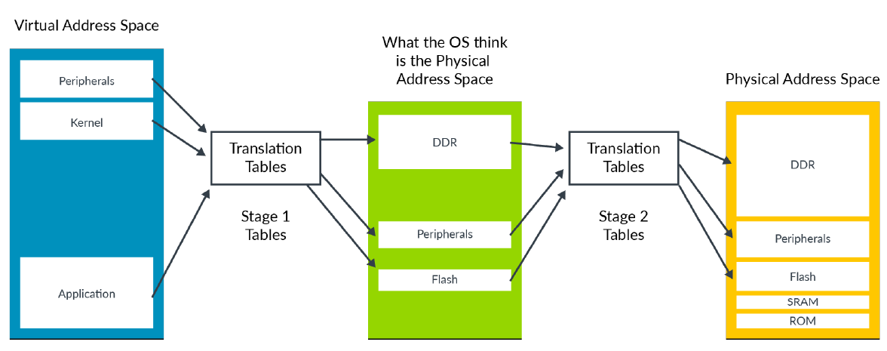
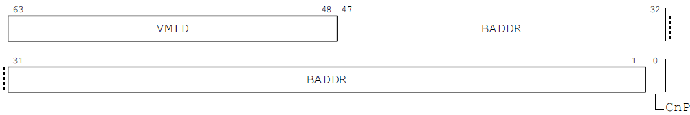
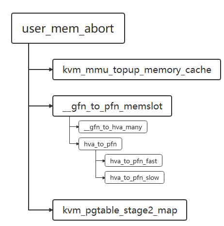
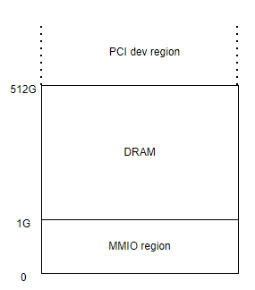

# 为什么需要内存虚拟化？
虚拟机是用来模拟真实物理机的，因此，我们希望在虚拟机中也能看到跟物理机上类似的完整的内存空间。比如在物理机上我们可以从0开始寻址。那么如何让虚拟机内也可以看到从0开始的内存地址空间呢？总不能把物理机上的让给它吧。解决这个问题就需要借助内存虚拟化。

为了让虚拟机看到一块完整的内存空间而又不会跟host或其他虚拟机产生冲突，我们需要给每一个虚拟机的物理地址空间再做一层转换，使其能够产生真实意义。这包括能够让虚拟机访问到真实的物理内存，或者能够模拟虚拟机访问某些地址的行为。对于前者，可以给虚拟机访问内存增加一层转换，使虚拟机内的物理地址映射到真实的物理内存上；对于后者，可以让虚拟机在访问到某些内存地址时trap到hypervisor，然后模拟其行为再返回虚拟机，这是IO虚拟化的基础。我们首先关注第一种情形。

给虚拟机增加一层转换可以纯软件实现，比如使用影子页表，不过现代支持虚拟化的cpu都可以硬件支持这一层转换。在arm上为stage 2转换，在intel cpu上为EPT。本书仅关注硬件支持的内存虚拟化实现，有关影子页表的实现可以参考《系统虚拟化-原理与实现》

# arm对内存虚拟化的支持
为了支持内存虚拟化，arm的mmu在设计上支持两层转换，stage 1和stage 2。这两层转换要跟页表的级数区分开来，这里每一层转换都包含多级页表的转换。stage 1负责将GVA（guest virtual address）转换为IPA（intermediate physical address)，也就是GPA（guest physical address)；stage 2将IPA转换为HPA(host physical address)。在host上一般stage 2转换是关闭的，IPA即是HPA。stage 2的开关由HCR_EL2.VM控制。下图是arm虚拟化文档中的一个示意图。



左边是虚拟机的虚拟地址空间，经过stage 1的转换得到中间的虚拟机物理地址空间，也就是IPA，再经过stage 2的转换映射到真正的物理地址空间。但是要记住，从GVA转换到HPA并非简单地将第一层转换的页表级数于第二层页表的级数相加，后面会详细解释这个问题。

对于stage1的转换，页表的入口存放在两个寄存器中：TTBR0_EL1和TTBR1_EL1，分别存放低位地址转换和高位地址转换页表基地址。对于stage 2的转换，页表基地址存放在VTTBR_EL2中。



上图是VTTBR_EL2寄存器的描述。VTTBR_EL2是一个64 bits寄存器，[47:1]存放stage 2页表基地址，arm也能支持52位IPA，也就是[47:1]可以表示52的基地址，具体可查阅arm官方手册。高16位是VMID。在stage 1的页表转换中有ASID，用来在TLB中表示一个进程。VMID也是类似的功能，用来表示一个虚拟机。有了VMID，当物理cpu从guest mode转为host运行，或者运行其他VM时无需刷TLB，这样当之前的VM切换回来之后还可以利用之前的TLB，可以缓解因虚拟机在cpu上迁移引起的访存性能下降。

虚拟机的物理地址宽度，也就是IPA的大小是有限制的。IPA大小由寄存器VTCR_EL2( Virtualization Translation Control Register)中的T0SZ(bit0-5)控制。64-T0SZ就是IPA大小对于的位宽。同时该寄存器还控制了stage 2转换的PA位宽以及page size，分别由PS(16-18)和TG0（14-15）表示。

mmu在进行页表转换中除了地址，还有属性相关的配置, 每一层转换都会涉及到页面属性，最终的属性会根据两层页表内属性综合得到一个结果。简单来说就是结果会与两层转换中页表属性要求更严格的那个相同。具体可以参考arm相关的文档。

# kvm中内存虚拟化的实现
## 与内存相关的数据结构
内存作为VM的全局资源主要的描述存在于struct kvm中。在上一章对kvm的讲解中我们忽略掉了跟内存相关的部分，下面我们看一下kvm结构体中有关内存的部分。

```plain
struct kvm {
struct mm_struct *mm; /* userspace tied to this vm */
unsigned long nr_memslot_pages;
/* The two memslot sets - active and inactive (per address space) */
struct kvm_memslots __memslots[KVM_MAX_NR_ADDRESS_SPACES][2];
/* The current active memslot set for each address space */
struct kvm_memslots __rcu *memslots[KVM_MAX_NR_ADDRESS_SPACES];
struct kvm_arch arch;
}
```

虚拟机是由用户态VMM发起创建的，因此每个VM必然关联了一个用户态VMM进程，mm就是该VMM进程的mm_struct。其余项除了arch均为memslot相关。memslot代表一块连续的内存区域。kvm_memslot表示guest中的一块连续物理内存，相当于VM的内存条。kvm_memslots代表VM中一个内存块集合。__memslots看起来是一个二维数组，其实目前KVM_MAX_NR_ADDRESS_SPACES为1，因此可视为一个一维数组。其中两个元素分别代表active memslot集合和inactive memslot集合。

```plain
struct kvm_memslots {
u64 generation;
atomic_long_t last_used_slot;
struct rb_root_cached hva_tree;
struct rb_root gfn_tree;
DECLARE_HASHTABLE(id_hash, 7);
int node_idx;
};
```

hva_tree是用户空间地址集合，由红黑树组织。gfn_tree是guest pfn集合，也由红黑树组织。哈希表id_hash存储哈希id到memslot的映射。在虚拟机内存转换当中，一块内存区域有相应的hva和gpa与之对应，kvm_memslots将它们组织到一起方便查找。

一个memslot由kvm_memory_slot表示。

```plain
struct kvm_memory_slot {
struct hlist_node id_node[2];
struct interval_tree_node hva_node[2];
struct rb_node gfn_node[2];
gfn_t base_gfn;
unsigned long npages;
unsigned long *dirty_bitmap;
struct kvm_arch_memory_slot arch;
unsigned long userspace_addr;
u32 flags;
short id;
u16 as_id;
}
```

id和id_node组成该slot对应到kvm_memslots内哈希表的键值对。hva_node是用户空间地址节点，会挂接到kvm_memslots上的hva_tree上，gfn_node是guest pfn节点，会挂接到kvm_memslots上的gfn_tree上。这三个都是有2个元素的数组，分别表示active内存块和inactive内存块。base_gfn代表该内存块在guest中的第一个pfn，npages代表该slot包含的页数，userspace_addr是该slot占据的用户空间基地址。arch在arm上是空的。

kvm_arch中与内存相关项。

```plain
struct kvm_arch {
struct kvm_s2_mmu mmu;
...
}
```

mmu为mmu stage 2相关结构。

```plain
struct kvm_s2_mmu {
struct kvm_vmid vmid;

phys_addr_t pgd_phys;
struct kvm_pgtable *pgt;
u64 vtcr;
int __percpu *last_vcpu_ran;
...
}
```

vmid包含一个原子变量，代表上文提到的vmid。pgd_phys代表stage 2转换页表的pgd host物理地址。pgt代表stage 2转换的页表。vtcr是一系列内存属性的组装，last_vcpu_ran是一个per cpu变量，表示每个cpu上一次运行的vcpu的id号。

```plain
struct kvm_pgtable {
u32 ia_bits;
s8 start_level;
kvm_pteref_t pgd;
struct kvm_pgtable_mm_ops *mm_ops;

/* Stage-2 only */
struct kvm_s2_mmu *mmu;
enum kvm_pgtable_stage2_flags flags;
kvm_pgtable_force_pte_cb_t force_pte_cb;
};
```

ia_bits代表IPA的宽度，也就是guest物理地址的宽度。start_level代表起始页表的level，决定了stage 2转换包含几级页表。pgd代表代表stage 2页表最高一级页表的首地址。mm_ops为mmu操作回调。mmu代表stage 2 mmu结构。flags为stage2页表属性。force_pte_cb为判断页表为页映射还是块映射的回调。

## 关于内存地址的几个概念
在host上我们都知道VA（virtual address）和PA（physical address）的概念。虚拟机作为物理世界的模拟自然也是有VA和PA的。为了将两者在host和guest层面区分开来，我们称host上的VA和PA为HVA和HPA，称guest上VA和PA为GVA和GPA。在arm上，GPA和IPA常常是等价的。

明白这四种地址的概念还要了解他们之间的联系。在客户机上，GVA经过mmu stage 1的转换得到GPA，为了使用物理内存还要经过stage 2转换得到HPA。为了方便VMM管理guest内存，在VMM分配内存得到HVA后会将HVA和GPA联系在一起注册到KVM中，当分配物理内存后，GPA和HVA会映射到同一块物理内存上。切记，当mmu进行两层转换时HVA是不参与的。

## 虚拟机内存的创建
第一章用一个小例子演示了一下虚拟机创建的过程：创建VM，创建内存，创建cpu等。可知内存的创建是在虚拟机启动之前，主要包括stage 2 mmu的初始化和虚拟机内存创建。

### stage 2 mmu的初始化
在创建VM时会调用kvm_arch_init_vm初始化stage 2 mmu。调用链为kvm_dev_ioctl_create_vm->kvm_create_vm->kvm_arch_init_vm->kvm_init_stage2_mmu。kvm_arch_init_vm比较长，我们分几块来看。

```plain
int kvm_init_stage2_mmu(struct kvm *kvm, struct kvm_s2_mmu *mmu, unsigned long type)
```

入参中，mmu是本函数要初始化的kvm_s2_mmu结构，type在arm64上用来表示用户对虚拟机物理地址空间请求的大小的位数，也就是log2（PA size），占用低8位。比如物理地址空间大小是2^44 byte，则type的低8位等于44。为了后向兼容，如果传入的type低8位是0则表示40。

```plain
u32 kvm_ipa_limit = get_kvm_ipa_limit();
int cpu, err;
struct kvm_pgtable *pgt;
u64 mmfr0, mmfr1;
u32 phys_shift;

if (type & ~KVM_VM_TYPE_ARM_IPA_SIZE_MASK)
return -EINVAL;

phys_shift = KVM_VM_TYPE_ARM_IPA_SIZE(type);
if (is_protected_kvm_enabled()) {
phys_shift = kvm_ipa_limit;
} else if (phys_shift) {
if (phys_shift > kvm_ipa_limit ||
phys_shift < ARM64_MIN_PARANGE_BITS)
return -EINVAL;
} else {
phys_shift = KVM_PHYS_SHIFT;
if (phys_shift > kvm_ipa_limit) {
pr_warn_once("%s using unsupported default IPA limit, upgrade your VMM\n",
current->comm);
return -EINVAL;
}
}
```

get_kvm_ipa_limit会获取硬件支持的ipa宽度。7-24行会根据硬件对ipa的限制和type参数设置guest物理地址宽度并判断type是否满足限制，对于非法的值会返回错误。

```plain
mmfr0 = read_sanitised_ftr_reg(SYS_ID_AA64MMFR0_EL1);
mmfr1 = read_sanitised_ftr_reg(SYS_ID_AA64MMFR1_EL1);
mmu->vtcr = kvm_get_vtcr(mmfr0, mmfr1, phys_shift);
```

从AA64MMFR ID寄存器中获取内存属性相关的配置信息，同时从phys_shift中得到IPA的位宽，用上面提到的T0SZ的形式组装到mmu结构的vtcr成员中，vtcr代表。

```plain
pgt = kzalloc(sizeof(*pgt), GFP_KERNEL_ACCOUNT);
if (!pgt)
return -ENOMEM;

mmu->arch = &kvm->arch;
err = kvm_pgtable_stage2_init(pgt, mmu, &kvm_s2_mm_ops);
```

给stage2 的page table分配内存并初始化。此时已经初始化的项如下：

| ia_bits | IPA位宽 |
| --- | --- |
| start_level | 起始的页表级数，决定有几级页表 |
| mm_ops | kvm_s2_mm_ops，二层转换相关的回调函数 |
| mmu | 包含此page table结构的kvm_s2_mmu结构 |
| flags | 0 |
| force_pte_cb | NULL |
| pgd | 分配一块全0的内存，大小由ia_bits和start_level计算得到 |

```plain
mmu->last_vcpu_ran = alloc_percpu(typeof(*mmu->last_vcpu_ran));
if (!mmu->last_vcpu_ran) {
err = -ENOMEM;
goto out_destroy_pgtable;
}

for_each_possible_cpu(cpu)
*per_cpu_ptr(mmu->last_vcpu_ran, cpu) = -1;
```

给last_vcpu_ran分配per cpu内存并初始化为-1。

```plain
mmu->pgt = pgt;
mmu->pgd_phys = __pa(pgt->pgd);
return 0;
```

将刚刚初始化的pgt赋值给mmu的pgt成员，pgd_phys指向上面分配pgd内存的物理地址，也就是之后用作stage 2页表转换的页表基地址。至此kvm_s2_mmu结构的初始化就完成了。

### 装载stage 2页表基地址
上面已经提到stage 2页表基地址的由来，但是页表基地址只有写入VTTBR_EL2才会起作用，kvm是什么时候将其写入寄存器的呢?

装载stage 2页表基地址的函数在__load_stage2。

```plain
static __always_inline void __load_stage2(struct kvm_s2_mmu *mmu,
struct kvm_arch *arch)
{
write_sysreg(mmu->vtcr, vtcr_el2);
write_sysreg(kvm_get_vttbr(mmu), vttbr_el2);
...
}

static __always_inline u64 kvm_get_vttbr(struct kvm_s2_mmu *mmu)
{
struct kvm_vmid *vmid = &mmu->vmid;
u64 vmid_field, baddr;
u64 cnp = system_supports_cnp() ? VTTBR_CNP_BIT : 0;

baddr = mmu->pgd_phys;
vmid_field = atomic64_read(&vmid->id) << VTTBR_VMID_SHIFT;
vmid_field &= VTTBR_VMID_MASK(kvm_arm_vmid_bits);
return kvm_phys_to_vttbr(baddr) | vmid_field | cnp;
}

```

__load_stage2将mmu中的vtcr写入vtcr_el2寄存器，将mmu的pgd_phys成员写入VTTBR_EL2。

__load_stage2会在kvm_arch_vcpu_ioctl_run函数中调用。

```plain
int kvm_arch_vcpu_ioctl_run(struct kvm_vcpu *vcpu)
{
while (ret > 0) {
...
if (kvm_arm_vmid_update(&vcpu->arch.hw_mmu->vmid) &&
has_vhe())
__load_stage2(vcpu->arch.hw_mmu,
vcpu->arch.hw_mmu->arch);
...
```

因此，每当进入guest模式之前就会判断是否需要load VTTBR_EL2。

### 内存创建
在VMM创建虚拟机的时候会根据配置将内存创建好，相当于物理机上的内存条。下面是第一章VMM的实现中有关内存创建的部分。

```plain
//将上面分配的内存组织成虚拟机可用的物理内存
struct kvm_userspace_memory_region mem = {
.slot = 0,
.guest_phys_addr = 0,
.memory_size = 0x1000,
.userspace_addr = (unsigned long)ram,
};
ret = ioctl(vmfd, KVM_SET_USER_MEMORY_REGION, &mem);
```

kvm_userspace_memory_region结构体代表一块内存条，用来从用户空间向kvm传递内存块信息。很容易观察到这些信息包括大小，起始虚拟机物理地址以及对应的用户态的虚拟地址。

```plain
struct kvm_userspace_memory_region {
__u32 slot;
__u32 flags;
__u64 guest_phys_addr;
__u64 memory_size; /* bytes */
__u64 userspace_addr; /* start of the userspace allocated memory */
};
```

该结构代表一段虚拟机内的物理地址空间和host上虚拟地址空间的映射。guest_phys_addr代表内存块在guest上的基地址，memory_size代表内存块的长度，userspace_addr代表内存卡在host上的虚拟内存基地址，然后通过KVM_SET_USER_MEMORY_REGION来注册这一块内存区域到kvm。由这个例子我们可以知道，虚拟机的内存是由用户态VMM分配的。这说明虚拟机和VMM都可以访问这段内存，这是一个很重要的特性。

先看一下kvm是如何注册虚拟机的内存的。

当对vmfd使用KVM_SET_USER_MEMORY_REGION ioctl时kernel的调用链为kvm_vm_ioctl->kvm_vm_ioctl_set_memory_region->kvm_set_memory_region->__kvm_set_memory_region

```plain
int __kvm_set_memory_region(struct kvm *kvm,
const struct kvm_userspace_memory_region2 *mem)
{
struct kvm_memory_slot *old, *new;
...
as_id = mem->slot >> 16;
id = (u16)mem->slot;
...
slots = __kvm_memslots(kvm, as_id);
old = id_to_memslot(slots, id);
...
base_gfn = (mem->guest_phys_addr >> PAGE_SHIFT);
npages = (mem->memory_size >> PAGE_SHIFT);
...
/* Allocate a slot that will persist in the memslot. */
new = kzalloc(sizeof(*new), GFP_KERNEL_ACCOUNT);
if (!new)
return -ENOMEM;

new->as_id = as_id;
new->id = id;
new->base_gfn = base_gfn;
new->npages = npages;
new->flags = mem->flags;
new->userspace_addr = mem->userspace_addr;
if (mem->flags & KVM_MEM_GUEST_MEMFD) {
r = kvm_gmem_bind(kvm, new, mem->guest_memfd, mem->guest_memfd_offset);
if (r)
goto out;
}

r = kvm_set_memslot(kvm, old, new, change);
if (r)
goto out_unbind;

return 0;
...
}
```

代码很长，但是比较容易理解。本函数的作用是将输入的有关虚拟机内存槽（slot）的信息加入kvm结构体的相关成员中保存起来。mem->slot的高16位包含as_id信息，在arm中，这个值为0，低16位是slot的id号。首先从kvm中拿到memslots，它是只有一项的数组，从中取出第一项。根据slot id在memslots[0]中查找对应项，赋给old，如果没找到old即为NULL。对于old为NULL的情形会创建一个新的memslot，即new，并根据入参赋值，信息包含虚拟机内存段的页框首地址（base_gfn），长度（npages）标志位（mem->flags）以及对应的host虚拟地址。该函数会处理创建，删除和更改等多种情况，我们仅细究创建的部分。

看一下kvm_set_memslot的实现。

```plain
static int kvm_set_memslot(struct kvm *kvm,
struct kvm_memory_slot *old,
struct kvm_memory_slot *new,
enum kvm_mr_change change)
{
struct kvm_memory_slot *invalid_slot;
int r;

if (change == KVM_MR_CREATE)
kvm_create_memslot(kvm, new);
else if (change == KVM_MR_DELETE)
k kvm_delete_memslot(kvm, old, invalid_slot);
else if (change == KVM_MR_MOVE)
kvm_move_memslot(kvm, old, new, invalid_slot);
else if (change == KVM_MR_FLAGS_ONLY)
kvm_update_flags_memslot(kvm, old, new);
else
BUG();

...
kvm_commit_memory_region(kvm, old, new, change);

return 0;
}
```

kvm_set_memslot会根据chang类型执行不同的操作，我们只关注create。

```plain
static void kvm_create_memslot(struct kvm *kvm,
struct kvm_memory_slot *new)
{
/* Add the new memslot to the inactive set and activate. */
kvm_replace_memslot(kvm, NULL, new);
kvm_activate_memslot(kvm, NULL, new);
}
```

kvm_create_memslot会调用kvm_replace_memslot创建一个新的kvm_memory_slot，然后加入到kvm的__memslots成员对应as_id的inactive项。包括三个部分：以id为键，id_node为值加入到id_hash中；hva_node加入到hva_tree；gfn_node加入到gfn_tree中，这样就可以分别通过id，hva，gfn找到对应的slot。代码如下

```plain
static void kvm_replace_memslot(struct kvm *kvm,
struct kvm_memory_slot *old,
struct kvm_memory_slot *new)
{
int as_id = kvm_memslots_get_as_id(old, new);
struct kvm_memslots *slots = kvm_get_inactive_memslots(kvm, as_id);
int idx = slots->node_idx;

// ignor old is non-null

//填充hva node的起点和终点
new->hva_node[idx].start = new->userspace_addr;
new->hva_node[idx].last = new->userspace_addr +
(new->npages << PAGE_SHIFT) - 1;

//将id和id_node键值对加入到inactive slot的id_hash上
hash_add(slots->id_hash, &new->id_node[idx], new->id);
// 将hva_node加入inactive slots的hva_tree
interval_tree_insert(&new->hva_node[idx], &slots->hva_tree);

..
//将新mem slot加入到inactive slots的gfn红黑树中
kvm_insert_gfn_node(slots, new);
}

```

在kvm_active_memslot中又会将inactive slots设置到kvm->memslots对应as_id项。

kvm_commit_memory_region会更新kvm->nr_memslot_pages以及跟脏页相关的操作。

可见，创建内存条主要是将其在kvm中管理起来，建立GPA和HVA之间的联系，方便后续查找。

### 客户机物理内存的分配
我们看到，上面只是创建了一块内存区域，并将HVA和GPA联系起来，但并没有涉及到HPA（host physical address），甚至于此时还不知道HPA在哪里。

在搞清楚这个问题之前，我们先要明白一个在linux内核中更一般的问题：物理内存是什么时候分配的。通常一个进程会使用诸如malloc或者mmap的库函数接口来分配内存。抛开库函数偷偷从它的内存池中分配内存这种情形，一般我们使用库函数接口分配内存会转换为brk或mmap系统调用，进而内核会分配一段虚拟地址空间给用户，并返回虚拟地址。这让用户误以为内存已经分配完成，但其实真实地物理内存尚未分配。当进程访问那段没有分配物理内存的地址时会发生page fault，内核进而为进程分配真实的物理内存，建立页表。有了这个背景知识，我们再来看看GPA和HPA是如何映射的。

现在kvm中只是保留了gpa和hva的映射关系，并没有建立stage 2的页表，也没有真正的分配内存。我们知道物理内存一般是在发生page fault的时候分配的，当guest访问gva时会经过尝试访问页表，此时会发生guest内的page fault，于是stage 1所需的页表就要建立起来了，也就从gva到gpa的映射，此时再访问gva就会触发stage2的转换。然而此时stage 2的页表也是空的，从而发生stage 2相关的同步异常，此异常会导致虚拟机退出到kvm，最后由kvm_handle_guest_abort处理。我们再来回顾一下该函数。

handle_exit->handle_trap_exceptions->kvm_handle_guest_abort

kvm_handle_guest_abort是处理stage 2 fault的入口函数，比较长，现在我们只分析其中关于stage 2尚未建立页表的情况。

在经过必要的检查之后user_mem_abort会被调用来处理stage 2第一次分配页表的情况。在调用user_mem_abort已经通过触发page fault的memslot，并根据发生stage 2 page fault的IPA地址，得到hva，最后作为参数传递给user_mem_abort。



_gfn_to_pfn_memslot首先通过__gfn_to_hva_many获得hva，再调用hva_to_pfn分配内存并pin住，使页面驻留，并建立hva到hpa的映射。

kvm_pgtable_stage2_map会创建gpa到hpa的映射，也就是stage 2的页表映射。可以看到，对于同样一块物理内存，会有两种映射，一类是GPA到HPA的映射，一类是HVA到HPA的映射。之所以如此是因为这块内存是为虚拟机创建，虚拟机要访问这块内存必然要建立映射，但同时该页面也属于VMM进程所有，VMM也要访问内存，因此也要建立映射。_gfn_to_pfn_memslot会分配内存并建立VMM进程的内存映射，而kvm_pgtable_stage2_map只需为虚拟机建立stage2的页表即可。所以，对于guest 内存，VMM也是可以访问的，这方便了guest和VMM共享内存，是后续很多IO设备虚拟化的基础，同时也是安全隐患，guest不能存放机密数据，否则会被VMM窥探到，为了解决这个问题才有了后来的机密计算技术。

现在我们将虚拟机内存的创建梳理了一遍。总结一下，虚拟机内存创建大致可分为三个部分：

1. 在创建VM时初始化stage 2 mmu，初始化stage 2的页表及基地址；
2. 根据用户配置，创建内存条，建立GPA和HVA的映射关系；
3. 在guest运行起来后会访问内存，此时会发生stage 2的page fault，最终分配实际物理内存，建立stage 2页表，guest就可以访问物理内存了

## 设备地址空间处理
### memory layout
64位cpu可以寻址的范围是0到2^64-1，但这些地址空间并不是同质的，而是由不同类型的地址空间构成。它可能是主内存，一般就是上文中创建的内存条，也可能是设备地址空间，更大的区域可能没有后备介质与之对应。这些区域共同构成了系统的地址空间视图，我们称之为memory layout。

一个典型的memory layout可以参考qemu arm64 virt主板。



MMIO(memory map I/O)含义是使用内存映射的方式访问IO设备，它和PCI dev region都可视为设备区域，在arm64中，设备地址空间都由MMIO方式实现的。

### kvm对MMIO的模拟
对于那些已经注册过的内存，当虚拟机去访问的时候会触发stage 1和stage2的转换，最终访问到物理内存。但是如果虚拟机访问那些没有注册过的内存会发生什么呢？

如果内存没有注册，stage2转换时必然发生同步异常，这时又会路由到我们所熟悉的handle_exit函数，紧接着会进入我们上文提到过的kvm_handle_guest_abort。前文我们只分析了正常访问物理内存的情况，下面我们看一下没有注册内存的情形。

```plain
int kvm_handle_guest_abort(struct kvm_vcpu *vcpu)
{
...
gfn = fault_ipa >> PAGE_SHIFT;
memslot = gfn_to_memslot(vcpu->kvm, gfn);
hva = gfn_to_hva_memslot_prot(memslot, gfn, &writable);
write_fault = kvm_is_write_fault(vcpu);
if (kvm_is_error_hva(hva) || (write_fault && !writable)) {
...
/*
* The IPA is reported as [MAX:12], so we need to
* complement it with the bottom 12 bits from the
* faulting VA. This is always 12 bits, irrespective
* of the page size.
*/
fault_ipa |= kvm_vcpu_get_hfar(vcpu) & ((1 << 12) - 1);
ret = io_mem_abort(vcpu, fault_ipa);

```

因为没有注册该内存条，所有kvm找不到连接ipa和hva的memslot，也得不到hva，因此会进入if块内，最终调用io_mem_abort。

```plain
int io_mem_abort(struct kvm_vcpu *vcpu, phys_addr_t fault_ipa)
{
struct kvm_run *run = vcpu->run;
...
if (is_write) {
data = vcpu_data_guest_to_host(vcpu, vcpu_get_reg(vcpu, rt),
len);

trace_kvm_mmio(KVM_TRACE_MMIO_WRITE, len, fault_ipa, &data);
kvm_mmio_write_buf(data_buf, len, data);

ret = kvm_io_bus_write(vcpu, KVM_MMIO_BUS, fault_ipa, len,
data_buf);
} else {
trace_kvm_mmio(KVM_TRACE_MMIO_READ_UNSATISFIED, len,
fault_ipa, NULL);

ret = kvm_io_bus_read(vcpu, KVM_MMIO_BUS, fault_ipa, len,
data_buf);
}
/* Now prepare kvm_run for the potential return to userland. */
run->mmio.is_write = is_write;
run->mmio.phys_addr = fault_ipa;
run->mmio.len = len;
vcpu->mmio_needed = 1;

if (!ret) {
/* We handled the access successfully in the kernel. */
if (!is_write)
memcpy(run->mmio.data, data_buf, len);
vcpu->stat.mmio_exit_kernel++;
kvm_handle_mmio_return(vcpu);
return 1;
}

if (is_write)
memcpy(run->mmio.data, data_buf, len);
vcpu->stat.mmio_exit_user++;
run->exit_reason = KVM_EXIT_MMIO;
return 0;
}

```

该函数的逻辑是首先尝试在kernel内部解决异常，如果kernel成功处理则return 1，如果kernel无法解决异常则return 0。经过上一章的讲解，大家应该知道return 1意味着回到guest，return 0会返回到用户态VMM。vcpu中的run成员保存了异常相关的信息，比如run中保存了退出原因KVM_EXIT_MMIO。这也是第一章的例子中的情形。我们在guest访问了一段未注册的地址，虚拟机退出后回到了VMM中，VMM从kvm传来的退出原因中读出了KVM_EXIT_MMIO，进而完成模拟动作。

了解了上述原理，我们就明白MMIO区域就是未主动创建内存条的物理地址空间。这在虚拟机IO模拟中非常重要。这也是虚拟机通知VMM的一种机制。如果我们想在guest中传递一些信息给VMM或者VMM想模拟某个设备的一段配置空间，可以将一段未注册到kvm的地址区域当作IO区，而guest可以向访像普通内存一样访问该区域，然后trap到host完成IO模拟。

## 一道计算题
在前面介绍stage 2地址转换时我们为了简便忽略了一些细节。现在来仔细查看一个问题，忽略TLB，当guest访问内存时 mmu最多需要经过多少次内存访问呢？在计算之前我们回顾一下host页表的访存情况。对于4级页表，拿到PFN（page frame）地址的流程是pgd->pud->pmd->pte，也就是访问4次页表即可。那么对于虚拟机，一般人可能想当然的认为是stage 1的页表级数加上stage 2的页表级数。那么事实果真如此吗？

要搞清楚这么问题，首先要知道一个事实，所有的页表都是放在真实的物理页面上的，也就是说，当mmu在进行stage 1的页表访问时，它必须拿到页表项的内容，而stage 1的页表的地址是IPA，并不指向HPA，因此必须经过stage 2的转换才能拿到stage 1的页表项，所以stage 2将发生在stage 1的每一级的页表访问中。

以stage 1和stage 2都是4级页表的情形为例。MMU读stage 1的pgd页表中的某个entry时就会发生stage 2的转换，而要想拿到pud 基地址的HPA需要经过6次内存访问（1次stage 1页表+ 4次stage 2页表+1次页内访存），那么4次 guest页表查找就要经过24次内存访问才能读出最终的结果。这个问题如果不是对虚拟机内存转换非常了解是不太容易计算的。这也侧面说明TLB对于虚拟机的重要性，如果每次访存都要遍历页表，性能会出现较大的下降，尤其页表于当前cpu不在同一个numa上。

# 总结
本章我们主要讲述有关内存虚拟化几个方面的问题。在硬件层，arm64的MMU提供了stage 1和stage 2的两层地址转换的机制支持内存虚拟化。在KVM层面，kvm保存并维护虚拟机所有的memory slot和GPA和HVA的关系，在stage 2发生page fault时，如果时已注册的内存则建立页表，否则当作MMIO处理。
