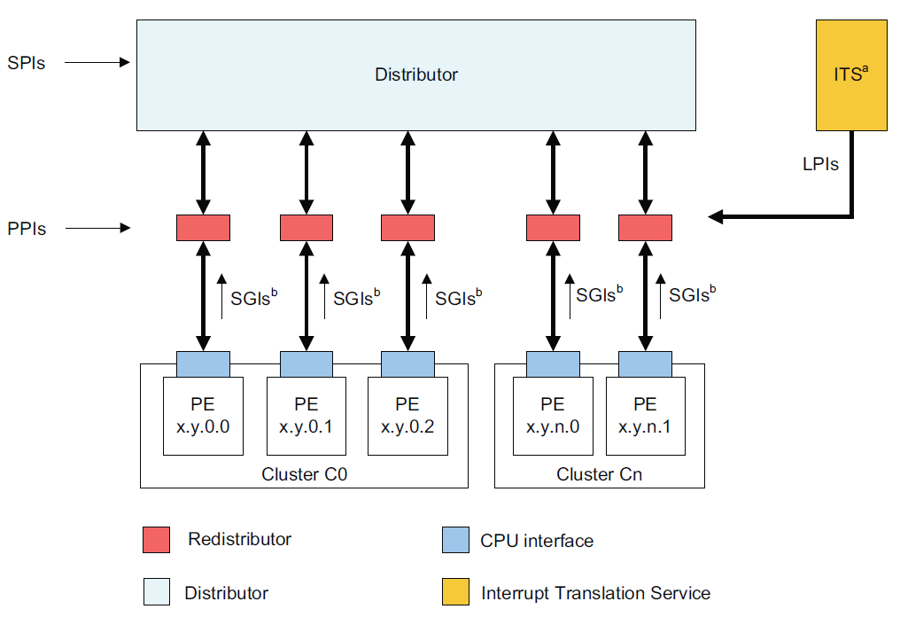
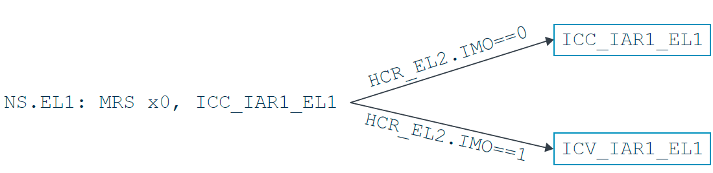
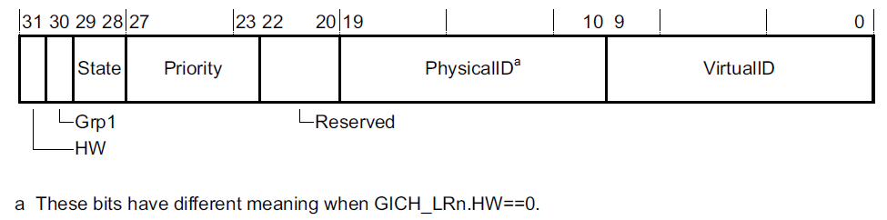
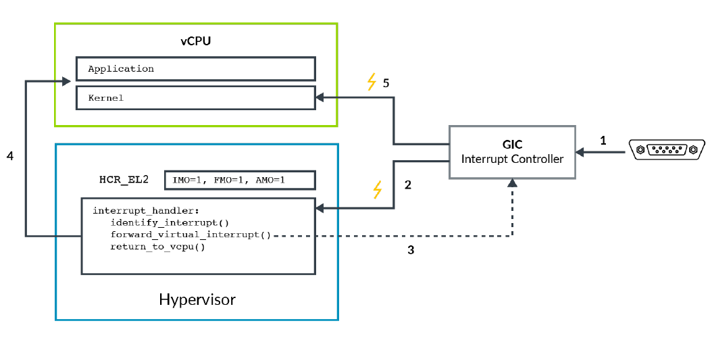
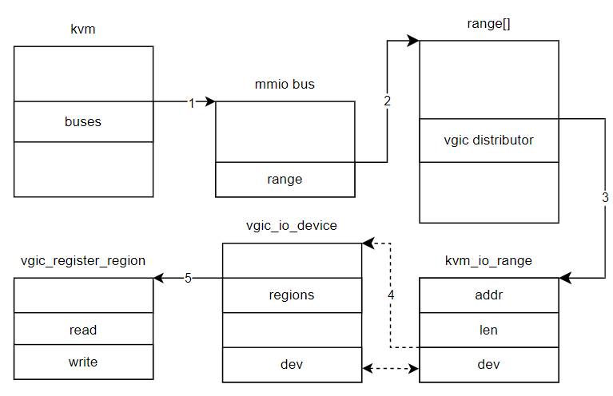
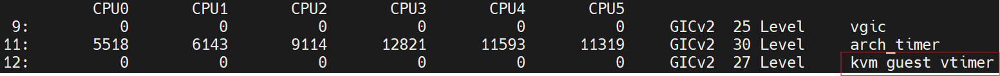

中断在软硬件系统中有重要作用，完整的系统模拟也需要中断的支持。那么虚拟机的中断是从哪里来的呢？

在物理机上，中断都是由中断控制器发送到cpu上的。那么可否让中断控制器直接将中断发送给vcpu呢？在回答这个问题之前我们要了解一个事实，中断之所以能够发送给物理cpu是因为物理cpu一直都在那里。可以将cpu比作一个有确定地址的坚固的房屋，中断就是快递。快递可以在任何时候送到某个代表cpu的房屋，因为房子不会移动灭失（不考虑hotplug/hotunplug）。对于vcpu，情况有所不同。根据前几章的讲解，我们知道vcpu不过是运行在物理cpu上的一个线程。可以将vcpu比作房屋的住户，虽然房子不可移动，但是里面住的人是一直在换的。如果要想把中断投递给vcpu，那就得确信现在vcpu就住在那所cpu之内，否则快递可能送给别人。由此可见要把中断直接投递给vcpu是不可行的。得找一个能够联系上vcpu的人，让他转交。而这个能够认识所有VM中的所有vcpu的人非hypervisor，也就是kvm莫属。于是我们就明白了，中断首先交给物理cpu，然后由kvm接管，再转交给目标vcpu。但是这个转交的中断其实已经不是第一次收到那个了，中断生命就是在一旦被接收就结束了，转交的那个人只能提供一个假的给vcpu用。不过vcpu并不在乎这些，只要他能收到通知就行，至于是谁来通知并不重要。kvm接管物理中断再转发给vcpu的这个过程可称之为中断虚拟化。转发中断常常被叫做中断注入。

# arm对中断虚拟化的支持
中断虚拟化需要硬件的支持才能实现。试想中断本来只有中断控制器可以发送，现在kvm一个软件也想发中断，如果不是硬件加持它怎么会有这本事。为了区别物理中断，vcpu收到的这个是虚拟中断。在arm上中断包括fiq，irq和serror。本文只讨论irq。相应地，有vfiq，virq，vserror。虚拟中断行为跟物理中断一致，但是只能在EL0/EL1注入。kvm运行在EL2，arm提供了HCR_EL2.IMO来使物理中断路由到EL2，从而让kvm接管中断。为了让kvm能够注入中断，arm提供了两种机制。一种是通过设置HCR_EL2的VI,VF,VSE位，另一种是更为流行的gic支持。

## arm中断控制器
GIC（generic interrupt controller）是arm设计的中断控制器。从gicv2开始支持虚拟化，目前比较流行的是gicv3。下面简单介绍一下gicv3。

### gic partition
gicv3分为三个部分，Distributor，Redistributor和cpu interface。



大部分的外设中断都会发送到distributor，然后由其分发投递给cpu。Distributor也是gic的总控，可以使能或关闭gic，设置中断的优先级，屏蔽某些中断，配置spi等。Redistributor负责配置sgi和ppi。cpu interface是cpu与gic交互的接口，cpu通过读cpu interface寄存器读取中断号，acknowledge中断或deactive中断。一个gic只有一个Distributor，而Redistributor和cpu interface是每个cpu都有一个。cpu interface在cpu内部，cpu可以直接读写寄存器访问它，而Distributor和Redistributor在片上，需要通过memory map来访问。

### 中断类型
GIC将中断分为四类，sgi，ppi，spi和lpi。sgi(Software Generated Interrupt)，由cpu写寄存器产生，用于cpu间通信，linux内核中的ipi中断就是由sgi实现的。ppi（Private Peripheral Interrupt）是片上设备，如system counter，发出的中断。spi（Shared Peripheral Interrupt） 是主板上的外设发送到Distributor的中断。lpi（Locality-specific Peripheral Interrupt）是为了支持msi中断而开发的新特性，是基于消息的中断。这四种中断拥有自己独立的中断号段。中断号0-15为sgi，16-31为ppi，32-1019为spi，8192及以上是lpi 。

### 中断处理
外设产生中断后，distributor分发给某个或某些cpu，也就路由到cpu interface。此时中断就由inactive状态变为pending状态，等待cpu响应。cpu通过读cpu interface的IAR寄存器获取中断号，同时中断状态会变为active状态。当cpu处理完中断后会写EOI寄存器，中断状态会变为inactive。

### 虚拟化支持
为了在硬件层面支持虚拟化，gic增加了cpu interface虚拟化的支持，但是redistributor和distributor仍然需要软件模拟。

cpu interface的寄存器分为三个部分：

以ICC开头的寄存器负责处理物理中断；

以ICH开头的寄存器供hypervisor使用，负责控制虚拟中断控制器的开关，向虚拟机注入中断等；

以ICV开头的寄存器供guest使用，但在guest内部仍使用ICC开头的寄存器，也就是说ICV的存在对guest是透明的，guest无需改动来适配ICV。HCR_EL2控制了在EL1读写ICC寄存器会定向到哪个寄存器，如下图所示：



在EL1读写ICC_IAR1_EL1，如果HCR_EL2.IMO为0不会发生重定向，如果HCR_EL2.IMO为1则重定向到ICV_IAR1_EL1。如此guest在读写ICC_*寄存器时就无需trap，提高了虚拟化性能。

### 中断注入
中断注入对于中断虚拟化至关重要。gic提供了ICH_LR<n>_EL2寄存器来实现中断的注入。下图展示了该寄存器



virtualID代表虚拟中断号，PhysicalID代表与之关联的物理中断号，State代表中断的状态，HW表示是否将虚拟中断和物理中断关联起来，这样如果deactive虚拟中断，相应的物理中断也会被deactive。hypervisor通过写该寄存器将中断注入给虚拟机，当vcpu开始执行就会接收到中断。

### 虚拟中断处理流程


上图展示了虚拟中断处理流程。

1. 外设将中断发送给gic；
2. gic将中断路由到cpu的EL2；
3. 如果此时vcpu正在运行会trap到EL2，hypervisor收到中断并开始处理，写LR寄存器，注入中断；
4. cpu返回guest继续执行；
5. 运行在EL0/EL1的vcpu接收到来自gic的虚拟中断；

上述步骤的关键在于hypervisor如何判断一个中断是属于虚拟机还是物理机？一个可能的方案是根据中断号来区分。但事实上除了极少数设备（比如timer）硬件设备中断对虚拟机和物理机是没有什么不同，更确切地讲，中断都是要由kernel/hypervisor设置的中断向量表来路由，最终由注册该中断的处理函数来处理，而这个处理函数并没有区分物理机还是虚拟机。因此，上述模拟在实际应用中并没有太多的参考意义。对于具体的中断处理流程，我们会在后文中详述。

# 中断虚拟化在kvm中的实现
由于只有cpu interface组件在硬件中虚拟化，Distributor和Redistributor还是要由软件来模拟的。这部分模拟由用户态VMM和kvm共同来完成。Distributor和Redistributor寄存器需要mmap来访问，因此mmio内存区域的选取需要由用户态来完成，而主要的功能要在kvm中实现。

在分析代码之前有必要先了解中断及gic在kvm中的描述。

### vgic相关的描述
gic的资源可以分为两类，跟vm相关的放在struct kvm之下，比如gic distributor，跟vcpu相关的放在struct kvm_vcpu之下，再加上中断的表示，共有三类资源，下面分别介绍。

#### GIC distributor
gic distributor由kvm->arch->vgic表示。

```plain
struct kvm {
...
struct kvm_arch arch;
...
}

struct kvm_arch {
...
struct vgic_dist vgic;
...
}
```

```plain
struct vgic_dist {
...
int nr_spis;
gpa_t vgic_dist_base;
struct vgic_irq *spis;
struct vgic_io_device dist_iodev;
...
}
```

vgic_dist中，nr_spis表示spi的数量，vgic_dist_base表示distributor的基地址，spis表示串联所有的spi的链表。gic三个组件中只有cpu interface是提供硬件支持的，distributor和redistributor都需要软件模拟guest的读写操作，vgic_io_device描述这些需要mmio的组件，包括所有寄存器的读写操作模拟。dist_iodev是distributor的mmio设备模拟。

```plain
struct vgic_io_device {
gpa_t base_addr;
union {
struct kvm_vcpu *redist_vcpu;
struct vgic_its *its;
};
const struct vgic_register_region *regions;
enum iodev_type iodev_type;
int nr_regions;
struct kvm_io_device dev;
};
```

gic由多个组件构成，包括cpuif，distributor，redistributor和its，每个vgic_io_device代表其中一种组件，iodev_type标识了该组件的名称。每种组件由一系列寄存器组成，vgic_register_region描述组件内的寄存器属性，包括偏移地址，读写操作回调等。nr_regions表示寄存器数量。kvm_io_device是该组件操作回调集合的封装，它是连接kvm io bus和vgic io device的桥梁，下文我们会看到它的作用。

#### irq的表示
```plain
struct vgic_irq {
...
struct list_head ap_list;
struct kvm_vcpu *vcpu;
u32 intid;
bool hw;
u32 hwintid;
...
}
```

vgic_irq可以表示任何一种irq类型，sgi，ppi，spi或lpi。ap_list是一个重要的成员，a代表active，p代表pending，用于将当前irq链接到某ap_list_head上，这条链表上的irq会被注入到guest中。vcpu代表ap_list会挂接到哪个vcpu上。intid代表irq在guest中的中断号。hw代表该irq是否与硬件中断相关联，hwintid代表与之相连的硬件中断号。

#### vcpu相关项
vgic_cpu表示跟vcpu相关的gic部分。

```plain
struct kvm_vcpu {
...
struct kvm_vcpu_arch arch;
...
}

struct kvm_vcpu_arch {
...
struct vgic_cpu vgic_cpu;
...
}
```

vgic_cpu作为kvm_vcpu的成员包含属于该vcpu有关gic的信息，包括cpu interface，redistributor，ppi的描述等。

```plain
struct vgic_cpu {
/* CPU vif control registers for world switch */
union {
struct vgic_v2_cpu_if vgic_v2;
struct vgic_v3_cpu_if vgic_v3;
};

struct vgic_irq *private_irqs;

struct list_head ap_list_head;

/*
* Members below are used with GICv3 emulation only and represent
* parts of the redistributor.
*/
struct vgic_io_device rd_iodev;
struct vgic_redist_region *rdreg;
u32 rdreg_index;
```

vgic_v3表示gicv3的cpu interface，由于vcpuif已经在硬件层面实现，这部分结构只是用来保存上下文。private_irqs表示ppi相关描述。ap_list_head是将要注入该vcpu的irq链表，vgic_irq中的ap_list成员会挂到ap_list_head上完成将irq串联起来的动作。rd_iodev对应上文中的dist_iodev成员，用于redistributor的mmio设备模拟。rdreg代表redistributor。rdreg_index表示该redistributor的标号。

## vGIC的创建
在深入到代码之前，可以先读一读有关vGIC创建的文档，位于linux/Documentation/virt/kvm/devices。有三篇是关于gic的，arm-vgic-its.rst，arm-vgic.rst和arm-vgic-v3.rst。这里只简单梳理一下arm-vgic-v3.rst。

该文档描述了有关vGIC创建的API。设备的创建可以分为三个层次，type，groups和attribute。type是设备类型，对于每一种设备只有一个标识，对于GICv3就是KVM_DEV_TYPE_ARM_VGIC_V3。GICv3有多个group，KVM_DEV_ARM_VGIC_GRP_ADDR，KVM_DEV_ARM_VGIC_GRP_DIST_REGS等。每种group可能有多个attribute，比如KVM_DEV_ARM_VGIC_CRP_ADDR就有KVM_VGIC_V3_ADDR_TYPE_DIST，KVM_VGIC_V3_ADDR_TYPE_REDIST等。下表总结了所有文档中列举的groups和attribut。

| Groups | Attributes | |
| --- | --- | --- |
| KVM_DEV_ARM_VGIC_GRP_ADDR | KVM_VGIC_V3_ADDR_TYPE_DIST，KVM_VGIC_V3_ADDR_TYPE_REDIST，KVM_VGIC_V3_ADDR_TYPE_REDIST_REGION | 设置/获取组件基地址，包括distributor，redistributor。每个redistributor拥有两个64k的页面，所有redistributor的页面都连续。KVM_VGIC_V3_ADDR_TYPE_REDIST设置/获取所有页面的基地址，设置指定redistributor页面基地址。 |
| KVM_DEV_ARM_VGIC_GRP_DIST_REGS，KVM_DEV_ARM_VGIC_GRP_REDIST_REGS | | 设置/获取vGIC distributor或者redistributor寄存器 |
| KVM_DEV_ARM_VGIC_GRP_CPU_SYSREGS | | 设置/获取vGIC cpu系统寄存器，指cpu interface的系统寄存器 |
| KVM_DEV_ARM_VGIC_GRP_NR_IRQS | | 设置中断数量（lpi除外） |
| KVM_DEV_ARM_VGIC_GRP_CTRL | KVM_DEV_ARM_VGIC_CTRL_INIT，KVM_DEV_ARM_VGIC_SAVE_PENDING_TABLES | 所有vcpu创建完成后需要使用KVM_DEV_ARM_VGIC_CTRL_INIT初始化gic |
| KVM_DEV_ARM_VGIC_GRP_LEVEL_INFO | | 设置/获取某些irq的属性，例如设置某些中断为水平触发。 |

下面我们通过分析创建vGICv3并设置distributor基地址来了解vGIC创建的流程，其他信息的设置读者可自行查看代码和文档。

### 创建vGIC
vGIC的创建由用户态在vmfd上调用KVM_CREATE_DEVICE ioctl发起。我们以qemu创建gicv3为例。

```plain
static void kvm_arm_gicv3_realize(DeviceState *dev, Error **errp)
{
...
s->dev_fd = kvm_create_device(kvm_state, KVM_DEV_TYPE_ARM_VGIC_V3, false);
...
}

int kvm_create_device(KVMState *s, uint64_t type, bool test)
{
int ret;
struct kvm_create_device create_dev;

create_dev.type = type;
...
ret = kvm_vm_ioctl(s, KVM_CREATE_DEVICE, &create_dev);
...
}

int kvm_vm_ioctl(KVMState *s, int type, ...)
{
...
ret = ioctl(s->vmfd, type, arg);
...
}
```

qemu会在vmfd上调用ioctl，type为KVM_CREATE_DEVICE，同时将create_dev作为参数传递过去，里面包含了要创建的设备类型，本例中为KVM_DEV_TYPE_ARM_VGIC_V3。kernel中的kvm_vm_ioctl是该ioctl的处理函数。

```plain
static long kvm_vm_ioctl(struct file *filp,
unsigned int ioctl, unsigned long arg)
{
...
case KVM_CREATE_DEVICE: {
struct kvm_create_device cd;

r = -EFAULT;
if (copy_from_user(&cd, argp, sizeof(cd)))
goto out;

r = kvm_ioctl_create_device(kvm, &cd);
if (r)
goto out;

r = -EFAULT;
if (copy_to_user(argp, &cd, sizeof(cd)))
goto out;

r = 0;
break;
}
...
```

首先将从用户态传来的参数copy到kvm_create_device结构体中，然后调用kvm_ioctl_create_device创建设备，最后将结果返回用户态。

```plain
static int kvm_ioctl_create_device(struct kvm *kvm,
struct kvm_create_device *cd)
{
struct kvm_device *dev;
...
type = array_index_nospec(cd->type, ARRAY_SIZE(kvm_device_ops_table));
ops = kvm_device_ops_table[type];
...
dev = kzalloc(sizeof(*dev), GFP_KERNEL_ACCOUNT);
if (!dev)
return -ENOMEM;

dev->ops = ops;
dev->kvm = kvm;

mutex_lock(&kvm->lock);
ret = ops->create(dev, type);
..
list_add_rcu(&dev->vm_node, &kvm->devices);
mutex_unlock(&kvm->lock);

if (ops->init)
ops->init(dev);

kvm_get_kvm(kvm);
ret = anon_inode_getfd(ops->name, &kvm_device_fops, dev, O_RDWR | O_CLOEXEC);
..
cd->fd = ret;
return 0;
}
```

我们最终要创建的是一个kvm device，由kvm_device结构表示。

```plain
struct kvm_device {
const struct kvm_device_ops *ops;
struct kvm *kvm;
void *private;
struct list_head vm_node;
};
```

kvm_device很简单，包含四个成员，ops是设备操作集，kvm代表该设备所在的vm，private是私有数据，vm_node用于将该设备串联起来。

回到kvm_ioctl_create_device，该函数首先定义一个kvm_device结构，拿到要创建的type，kvm已经为可以创建的设备准备了操作集，从设备操作集表中找到对应的操作集，设置到dev成员，之后调用create操作完成进一步的创建工作。kvm还会将创建好的dev加入到kvm的devices链表中。系统在初始化阶段将gicv3的操作集注册为kvm_arm_vgic_v3_ops。初始化调用链为init_subsystems->kvm_vgic_hyp_init->vgic_v3_probe->kvm_register_vgic_device

```plain
int kvm_register_vgic_device(unsigned long type)
{
...
switch (type) {
...
case KVM_DEV_TYPE_ARM_VGIC_V3:
ret = kvm_register_device_ops(&kvm_arm_vgic_v3_ops,
KVM_DEV_TYPE_ARM_VGIC_V3);
...
}
```

```plain
struct kvm_device_ops kvm_arm_vgic_v3_ops = {
.name = "kvm-arm-vgic-v3",
.create = vgic_create,
.destroy = vgic_destroy,
.set_attr = vgic_v3_set_attr,
.get_attr = vgic_v3_get_attr,
.has_attr = vgic_v3_has_attr,
};
```

create回调为vgic_create。vgic_create会调用kvm_vgic_create。

```plain
int kvm_vgic_create(struct kvm *kvm, u32 type)
{
...
kvm->max_vcpus = VGIC_V3_MAX_CPUS;
kvm->arch.vgic.in_kernel = true;
kvm->arch.vgic.vgic_model = type;
kvm->arch.vgic.vgic_dist_base = VGIC_ADDR_UNDEF;
...
}
```

create vgic仅仅初始化了kvm->arch.vgic的几个成员。max_vcpus设置vgic能支持的最大cpu数量，当前VGIC_V3_MAX_CPUS为512。in_kernel为true表示gic在kernel中实现，irqchip_in_kernel宏以该成员作为gic是否在kernel中实现的依据。vgic_model标识gic的版本。由于vgic distributor的基地址是由用户态分配，此时会设置为undefine。那gic distributor的基地址要在哪里设置呢？

### 设置vGIC distributor基地址
我们回到kvm_ioctl_create_device，函数的最后会创建一个匿名inode，并返回一个fd给用户态，以下称devfd。用户态可以在这个devfd上是调用ioctl做相应操作，包括SET,GET和HAS三种，SET代表设置属性，GET代表获取属性，HAS的含义是判断该设备是否有某种属性。三种操作对应三个ioctl：KVM_SET_DEVICE_ATTR，KVM_GET_DEVICE_ATTR， KVM_HAS_DEVICE_ATTR。伴随这三个操作的是一个描述属性信息的结构体kvm_device_attr，作为参数传递到kvm。比如要设置distributor的基地址，就可以用如下代码。

```plain
struct kvm_device_attr attr;
u64 addr = 0x12345678;
attr.group = KVM_DEV_ARM_VGIC_GRP_ADDR;
attr.attr = KVM_VGIC_V3_ADDR_TYPE_DIST;
attr.addr = (u64)&addr;

ioctl(dev_fd, KVM_SET_DEVICE_ATTR, &attr);
```

在上述属性描述中包含了三个信息，group和attr是前文提到的GIC API，group标识要进行的操作是地址相关，attr表示对distributor操作，addr表示基地址。

device fd的ioctl回调为：kvm_device_ioctl。

```plain
static long kvm_device_ioctl(struct file *filp, unsigned int ioctl,
unsigned long arg)
{
...
switch (ioctl) {
switch (ioctl) {
case KVM_SET_DEVICE_ATTR:
return kvm_device_ioctl_attr(dev, dev->ops->set_attr, arg);
case KVM_GET_DEVICE_ATTR:
return kvm_device_ioctl_attr(dev, dev->ops->get_attr, arg);
case KVM_HAS_DEVICE_ATTR:
return kvm_device_ioctl_attr(dev, dev->ops->has_attr, arg);
...
}
}
```

这里的dev就是kvm_ioctl_create_device中创建的kvm_device，它的ops成员就是kvm_arm_vgic_v3_ops。于是我们就找到set_attr回调指向的函数是vgic_v3_set_attr。

```plain
static int kvm_device_ioctl_attr(struct kvm_device *dev,
int (*accessor)(struct kvm_device *dev,
struct kvm_device_attr *attr),
unsigned long arg)
{
struct kvm_device_attr attr;
...
if (copy_from_user(&attr, (void __user *)arg, sizeof(attr)))
return -EFAULT;

return accessor(dev, &attr);
}
```

accessor此处为vgic_v3_set_attr。最终会调用vgic_set_common_attr。

```plain
static int vgic_set_common_attr(struct kvm_device *dev,
struct kvm_device_attr *attr)
{
int r;

switch (attr->group) {
case KVM_DEV_ARM_VGIC_GRP_ADDR:
r = kvm_vgic_addr(dev->kvm, attr, true);
...
```

kvm_vgic_addr最终设置distributor的基地址。

```plain
static int kvm_vgic_addr(struct kvm *kvm, struct kvm_device_attr *attr, bool write)
{
u64 __user *uaddr = (u64 __user *)attr->addr;
struct vgic_dist *vgic = &kvm->arch.vgic;
phys_addr_t *addr_ptr, alignment, size;
u64 undef_value = VGIC_ADDR_UNDEF;
u64 addr;
int r;

/* Reading a redistributor region addr implies getting the index */
if (write || attr->attr == KVM_VGIC_V3_ADDR_TYPE_REDIST_REGION)
if (get_user(addr, uaddr))
return -EFAULT;
switch (attr->attr) {
...
case KVM_VGIC_V3_ADDR_TYPE_DIST:
r = vgic_check_type(kvm, KVM_DEV_TYPE_ARM_VGIC_V3);
addr_ptr = &vgic->vgic_dist_base;
alignment = SZ_64K;
size = KVM_VGIC_V3_DIST_SIZE;
break;
...
}
if (write) {
r = vgic_check_iorange(kvm, *addr_ptr, addr, alignment, size);
if (!r)
*addr_ptr = addr;
...
```

该函数首先从入参attr中得到addr赋给uaddr，然后通过get_user解引用获得distributor基地址。接下来获得kvm中存放distributor基地址的成员vgic_dist_base，并最终将distributor基地址设置到vgic_dist_base中。

上面的流程有点繁琐，总结一下创建并设置gic设备的步骤。

1. 创建设备。在vmfd上调用KVM_CREATE_DEVICE同时携带要创建的设备type，本例为KVM_DEV_TYPE_ARM_VGIC_V3。kvm会创建代表该设备的kvm_device结构体，并初始化，其中最重要的是设备的操作回调。创建好后会返回devfd。
2. 属性操作。在devfd上调用KVM_SET_DEVICE_ATTR或其他 ioctl，携带groups和attributes信息。kvm最终会调用第一步中给设备设置的回调函数来实现set，get或has操作。

除了设置distributor基地址，还有对redistributor，irq的设置，流程与上述相似，不再赘述。

为了让guest可以获得gic的信息，用户态VMM还需要将gic信息设置到device tree或者ACPI表中，这样guest就获得该信息完成初始化。

## 将vGIC注册到kvm io bus
### kvm模拟总线
在物理机上，设备一般是挂在某个总线上的，之后通过总线发现，配置设备。虽然vGIC在kernel中是模拟出来的，但也要挂到虚拟总线上才方便去找到它。在kvm结构体中包含了一个模拟的bus用来将设备串联起来。

```plain
struct kvm {
...
struct kvm_io_bus __rcu *buses[KVM_NR_BUSES]
...
}

struct kvm_io_bus {
int dev_count;
int ioeventfd_count;
struct kvm_io_range range[];
};

enum kvm_bus {
KVM_MMIO_BUS,
KVM_PIO_BUS,
KVM_VIRTIO_CCW_NOTIFY_BUS,
KVM_FAST_MMIO_BUS,
KVM_NR_BUSES
};
```

buses是一个代表虚拟机内所有总线的指针数组，虽然kvm可以表示多种bus，但在arm上只有KVM_MMIO_BUS。kvm_io_bus结构表示kvm模拟的总线。dev_count表示总线上的设备数量。不同的设备占据一段区域，由kvm_io_range表示。

```plain
struct kvm_io_range {
gpa_t addr;
int len;
struct kvm_io_device *dev;
};
```

addr为设备在guest中的其实物理地址，len为长度。kvm_io_device是设备操作集的封装，它也同在于代表gic组件的vgic_io_dev结构中，成为两者的联结点。

```plain
struct kvm_io_device {
const struct kvm_io_device_ops *ops;
};

struct kvm_io_device_ops {
int (*read)(struct kvm_vcpu *vcpu,
struct kvm_io_device *this,
gpa_t addr,
int len,
void *val);
int (*write)(struct kvm_vcpu *vcpu,
struct kvm_io_device *this,
gpa_t addr,
int len,
const void *val);
void (*destructor)(struct kvm_io_device *this);
};
```

### 注册vGIC到io bus
vGIC distributor会在vcpu第一次运行的时候注册到io bus上，代码路径为kvm_arch_vcpu_run_pid_change->kvm_vgic_map_resources->vgic_register_dist_iodev。

```plain
int vgic_register_dist_iodev(struct kvm *kvm, gpa_t dist_base_address,
enum vgic_type type)
{
struct vgic_io_device *io_device = &kvm->arch.vgic.dist_iodev;
...
len = vgic_v3_init_dist_iodev(io_device);
...
return kvm_io_bus_register_dev(kvm, KVM_MMIO_BUS, dist_base_address,
len, &io_device->dev);
}
```

vgic_v3_init_dist_iodev初始化代表distributor的io device结构。

```plain
unsigned int vgic_v3_init_dist_iodev(struct vgic_io_device *dev)
{
dev->regions = vgic_v3_dist_registers;
dev->nr_regions = ARRAY_SIZE(vgic_v3_dist_registers);

kvm_iodevice_init(&dev->dev, &kvm_io_gic_ops);

return SZ_64K;
}
```

vgic_v3_dist_registers是vgic distributor寄存器组，表示在kvm中模拟的distributor寄存器。kvm_io_gic_ops代表为gic distributor的操作集。

接下来kvm_io_bus_register_dev会将gic组件注册到KVM_MMIO_BUS上，也就是将入参中的gic mmio起始地址，长度，gic操作集加入到bus对应位置。该函数首先分配一个新的bus，然后遍历旧bus上的range数组，寻找与入参对一个的idx，如果找到，该设备对应在新bus上的的range就会被按照入参重新赋值，如果没有则会在新bus range数组的末尾赋值。旧bus的其余部分会copy到新bus上，最后新bus会替换旧的bus，将旧bus释放掉，注册就完成了。

对于gicv3，redistributor也是要模拟的，也需要一段mmio空间并注册到kvm mmio bus上。与distributor注册的时机不同，redistributor是在设置基地址的时候注册到kvm mmio bus的。调用链为vgic_v3_set_attr->vgic_set_common_attr->kvm_vgic_addr->vgic_v3_set_redist_base->vgic_register_all_redist_iodevs->vgic_register_redist_iodev。

```plain
int vgic_register_redist_iodev(struct kvm_vcpu *vcpu)
{
...
vgic_cpu->rdreg = rdreg;
vgic_cpu->rdreg_index = rdreg->free_index;

rd_base = rdreg->base + rdreg->free_index * KVM_VGIC_V3_REDIST_SIZE;

kvm_iodevice_init(&rd_dev->dev, &kvm_io_gic_ops);
rd_dev->base_addr = rd_base;
rd_dev->iodev_type = IODEV_REDIST;
rd_dev->regions = vgic_v3_rd_registers;
rd_dev->nr_regions = ARRAY_SIZE(vgic_v3_rd_registers);
rd_dev->redist_vcpu = vcpu;

ret = kvm_io_bus_register_dev(kvm, KVM_MMIO_BUS, rd_base,
2 * SZ_64K, &rd_dev->dev);
...
}
```

与distributor不同的是，redistributor是per cpu的，于是上述函数是给每个redistributor设置基地址。其基地址是随其index发生偏移的。其余项的设置与distributor类似，不再赘述。

上述注册流程比较复杂，下面我们通过分析读写gic寄存器的模拟进一步理解gic和kvm mmio bus之间的关系。

## guest读写gic配置模拟
上文中我们看到，在创建gic时用户态VMM和kvm都参与了，如果guest对gic distributor寄存器进行读写时是谁进行模拟的呢？对于irqchip in kernel的情形答案是kvm。当guest对gic distributor进行配置时会发生trap，kvm处理路径为handle_exit->handle_trap_exceptions->kvm_handle_guest_abort。这个函数我们在内存虚拟化中提到过。之前是分析stage 2页表转换，这次我们来看一下另外一条路径，看一下kvm如何从发生异常的地址找到guest要写的寄存器。

```plain
int kvm_handle_guest_abort(struct kvm_vcpu *vcpu)
{
...
if (kvm_is_error_hva(hva) || (write_fault && !writable)) {
...
ret = io_mem_abort(vcpu, fault_ipa);
goto out_unlock;
}
...
}
```

gic distributor没有分配具体内存，因此没有对应的hva，由io_mem_abort来处理。

```plain
int io_mem_abort(struct kvm_vcpu *vcpu, phys_addr_t fault_ipa)
{
...
ret = kvm_io_bus_write(vcpu, KVM_MMIO_BUS, fault_ipa, len,
data_buf);
...
}
```

完成数据的读写先决条件是找到gic设备，然后调用对应的回调函数。我们只有一条线索可以寻找到gic设备即引发异常的ipa。以写寄存器为例，kvm_io_bus_write会根据ipa在KVM_MMIO_BUS上找到gic组件并完成写操作。

```plain
int kvm_io_bus_write(struct kvm_vcpu *vcpu, enum kvm_bus bus_idx, gpa_t addr,
int len, const void *val)
{
struct kvm_io_bus *bus;
struct kvm_io_range range;
int r;

range = (struct kvm_io_range) {
.addr = addr,
.len = len,
};

bus = srcu_dereference(vcpu->kvm->buses[bus_idx], &vcpu->kvm->srcu);
if (!bus)
return -ENOMEM;
r = __kvm_io_bus_write(vcpu, bus, &range, val);
return r < 0 ? r : 0;
}
```

根据ipa和长度信息构造一个range结构，在kvmbus数组中拿到mmio bus，之后调用__kvm_io_bus_write。

```plain
static int __kvm_io_bus_write(struct kvm_vcpu *vcpu, struct kvm_io_bus *bus,
struct kvm_io_range *range, const void *val)
{
int idx;

idx = kvm_io_bus_get_first_dev(bus, range->addr, range->len);

while (idx < bus->dev_count &&
kvm_io_bus_cmp(range, &bus->range[idx]) == 0) {
if (!kvm_iodevice_write(vcpu, bus->range[idx].dev, range->addr,
range->len, val))
return idx;
idx++;
}
}
```

__kvm_io_bus_write在mmio bus中找到能包含该range的第一个设备idx，尝试使用kvm_iodevice_write在找到的设备上调用回调完成写操作。

```plain
static inline int kvm_iodevice_write(struct kvm_vcpu *vcpu,
struct kvm_io_device *dev, gpa_t addr,
int l, const void *v)
{
return dev->ops->write ? dev->ops->write(vcpu, dev, addr, l, v)
: -EOPNOTSUPP;
}
```

对于gic distributor，bus->range[idx].dev对应的就是gic distributor的操作集的封装，它是vgic_io_device的成员，同时又赋给了bus下对应的range的dev成员，因此可以通过bus中找到的dev成员找到它的另一个父结构vgic_io_device。

```plain
const struct kvm_io_device_ops kvm_io_gic_ops = {
.read = dispatch_mmio_read,
.write = dispatch_mmio_write,
};
```

看一下write回调是如何完成写操作的。

```plain
static int dispatch_mmio_write(struct kvm_vcpu *vcpu, struct kvm_io_device *dev,
gpa_t addr, int len, const void *val)
{
struct vgic_io_device *iodev = kvm_to_vgic_iodev(dev);
const struct vgic_register_region *region;

region = vgic_get_mmio_region(vcpu, iodev, addr, len);

switch (iodev->iodev_type) {
case IODEV_DIST:
region->write(vcpu, addr, len, data);
break;
...
```

首先根据gic组件的操作集找到vgic_io_deivce结构，该结构代表了gic的某个组件。我们最终想要写的是一个寄存器，于是vgic_get_mmio_region会根据addr从register region数组中找到对应的register region，于是我们终于找到了要写的寄存器。再调用寄存器的write回调。对于gic distributor，该register region数组为上文提到的vgic_v3_dist_registers。

```plain
static const struct vgic_register_region vgic_v3_dist_registers[] = {
REGISTER_DESC_WITH_LENGTH_UACCESS(GICD_CTLR,
vgic_mmio_read_v3_misc, vgic_mmio_write_v3_misc,
NULL, vgic_mmio_uaccess_write_v3_misc,
16, VGIC_ACCESS_32bit),
...
```

比如写GICD_CTLR就会调用vgic_mmio_write_v3_misc完成最终的写操作模拟。上述流程比较复杂，下面用一张图总结一下。



1. 在kvm的buses成员中找到mmio bus；
2. bus中的range数组中包含了安装在该bus上的设备或者设备的某个组件；
3. 在range数组中找到gic distributor对应kvm_io_range结构；
4. vgic组件在注册时将vgic_io_device中的dev成员赋给kvm_io_range结构中的dev成员，因此可以根据kvm_io_range的dev找到vgic_io_device结构；
5. vgic_io_device结构中的regions成员表示该组件中的所有寄存器，根据ipa找到对应寄存器的vgic_register_region结构，最终调用回调完成模拟。

## kvm对中断的模拟
### 虚拟中断的分类
前文提到arm架构中，中断分为sgi，ppi，spi和lpi。但是可以大致分为两类，除了sgi是软件产生的中断，其余都是设备产生的。

对于设备中断的模拟可以分为两类：

硬件中断分配给虚拟机，如vtimer;

中断由模拟设备产生，virtio设备中断；

再加上sgi，中断模拟可以分成三类。但是我们知道虚拟中断的注入除了不常用的写HCR寄存器，只有写gic的LR寄存器这一条路。因此我们可以将中断模拟分成两个阶段。第一阶段是hyperivisor收到注入虚拟中断的请求，第二阶段是hypervisor注入中断，同时第二个阶段还可以再细分成两个阶段。对于不同种类的中断仅仅是在第一阶段上有差异。

### 硬件中断分配给虚拟机
将硬件中断分配给虚拟机是指那些虚拟中断与硬件中断关联的中断。

guest在运行期间如果HCR_EL2.IMO置1，中断会route到EL2，并从vbar_el1指向的异常表找到处理中断的入口。在进入guest之前会调用__activate_traps，将vbar_el1设置为kvm_hyp_vector，该变量被一般会设置为__kvm_hyp_vector[1]

```plain
SYM_CODE_START(__kvm_hyp_vector)
invalid_vect el2t_sync_invalid // Synchronous EL2t
...

valid_vect el2_sync // Synchronous EL2h
...

valid_vect el1_sync // Synchronous 64-bit EL1
valid_vect el1_irq // IRQ 64-bit EL1
valid_vect el1_fiq // FIQ 64-bit EL1
valid_vect el1_error // Error 64-bit EL1

valid_vect el1_sync // Synchronous 32-bit EL1
...
SYM_CODE_END(__kvm_hyp_vector)
```

对于从el0/el1退出el2的情形会调用第三组表，对于irq也就是el1_irq。

```plain
el1_irq:
el1_fiq:
get_vcpu_ptr x1, x0
mov x0, #ARM_EXCEPTION_IRQ
b __guest_exit
```

可以看到el1_irq只是调用__guest_exit完成虚拟机到host模式的切换并没有做跟中断处理相关的事情。那中断究竟是在哪里处理的？我们继续追踪。在guest exit完成后会调用__deactivate_traps，该函数会将vbar_el1的内容恢复成host_vectors，这样中断又可以正常处理了。之后会退出到kvm_arch_vcpu_ioctl_run的大循环中。

```plain
int kvm_arch_vcpu_ioctl_run(struct kvm_vcpu *vcpu)
{
...
while (ret > 0) {
...
local_irq_disable();
...
ret = kvm_arm_vcpu_enter_exit(vcpu);
...
local_irq_enable();
...
ret = handle_exit(vcpu, ret);
```

此时尚处于关中断的状态。之前导致guest退出的中断没有acknowlege，中断仍然处于pending状态，当中断enable之后会再次触发。此时的vbar_el1已经指向host_vector，所以可以经过中断处理函数正常响应中断。中断处理完成后会进入到handle_exit中，而入参中的ret已经在kvm_arm_vcpu_enter_exit得到，对于irq导致的退出，ret值为ARM_EXCEPTION_IRQ。

```plain
int handle_exit(struct kvm_vcpu *vcpu, int exception_index)
{
...
exception_index = ARM_EXCEPTION_CODE(exception_index);

switch (exception_index) {
case ARM_EXCEPTION_IRQ:
return 1;
```

handle_exit对irq异常的没有处理，只是返回1，也就是由kvm内部处理。至此有关irq的处理似乎已经完成，但我们没有看到跟中断注入相关的代码。那中断是在哪里注入的呢？我们似乎犯了一个错误，为了找到物理中断虚拟化的实现预先设立了导致虚拟机退出的这个中断是一个分配给虚拟机的中断，但其实这是不对的，这个中断也许跟虚拟机毫无瓜葛，只是萍水相逢而已。那到底是谁决定了这个中断是否是分配给虚拟机的呢？这个信息只能来自中断的处理函数，只有它能决定中断的行为。现在我们去找一个分配给虚拟机的中断处理函数验证一下猜想，至于那些普通的中断处理函数，想必跟虚拟机没啥关系。vtimer是个好例子。

```plain
int kvm_timer_hyp_init(bool has_gic)
{
...
err = request_percpu_irq(host_vtimer_irq, kvm_arch_timer_handler,
"kvm guest vtimer", kvm_get_running_vcpus());
```

在kvm_timer_hyp_init中将kvm_arch_timer_handler注册为guest vtimer的中断处理函数。我们可以在host上的/proc/interrupt文件找到该中断条目。



上图是一块arm开发板中截取到的/proc/interrupt，irq为27的中断显示为"kvm_guest_vtimer"即是上述中断请求函数注册的。在没有启动虚拟机时所有cpu上都没有相关的中断。

```plain
static irqreturn_t kvm_arch_timer_handler(int irq, void *dev_id)
{
...
if (kvm_timer_should_fire(ctx))
kvm_timer_update_irq(vcpu, true, ctx);
```

我们只看跟注入中断相关的部分。kvm_timer_should_fire会判断当前是否应该发送中断。

```plain
static void kvm_timer_update_irq(struct kvm_vcpu *vcpu, bool new_level,
struct arch_timer_context *timer_ctx)
{
...
if (!userspace_irqchip(vcpu->kvm)) {
ret = kvm_vgic_inject_irq(vcpu->kvm, vcpu,
timer_irq(timer_ctx),
timer_ctx->irq.level,
timer_ctx);
WARN_ON(ret);
}
}
```

kvm_timer_update_irq会调用kvm_vgic_inject_irq向vgic注入中断。我们可以认为调用kvm_vgic_inject_irq是中断注入的第二个阶段。

```plain
int kvm_vgic_inject_irq(struct kvm *kvm, struct kvm_vcpu *vcpu,
unsigned int intid, bool level, void *owner)
{
...
irq = vgic_get_irq(kvm, vcpu, intid);
...
vgic_queue_irq_unlock(kvm, irq, flags);
vgic_put_irq(kvm, irq);

return 0;
}
```

vgic_get_irq会找到跟中断号相关的vgic_irq结构，vgic_queue_irq_unlock会将该结构加入到vcpu相关的ap_list中。

```plain
bool vgic_queue_irq_unlock(struct kvm *kvm, struct vgic_irq *irq,
unsigned long flags)
{
...
list_add_tail(&irq->ap_list, &vcpu->arch.vgic_cpu.ap_list_head);
irq->vcpu = vcpu;
...
kvm_make_request(KVM_REQ_IRQ_PENDING, vcpu);
kvm_vcpu_kick(vcpu);
...
```

kvm给对于vcpu设置irq请求。需要被注入中断的vcpu可能不在运行状态，所以可能需要唤醒该vcpu线程，kvm_vcpu_kick会去做相关操作。

现在我们完成了中断注入的第二个阶段，将irq结构插入到vcpu的ap_list中。但是仍然没有注入虚拟中断。

在handle_exit中对irq没有做任何事，只是返回1，于是我们又回到vcpu run大循环中。

```plain
while (ret > 0) {
...
kvm_vgic_flush_hwstate(vcpu);
```

在进入guest之前有一个kvm_vgic_flush_hwstate跟gic有关，看一下它在做了什么。

```plain
/* Flush our emulation state into the GIC hardware before entering the guest. */
void kvm_vgic_flush_hwstate(struct kvm_vcpu *vcpu)
{
...
if (!list_empty(&vcpu->arch.vgic_cpu.ap_list_head)) {
raw_spin_lock(&vcpu->arch.vgic_cpu.ap_list_lock);
vgic_flush_lr_state(vcpu);
raw_spin_unlock(&vcpu->arch.vgic_cpu.ap_list_lock);
}

...
}
```

该函数会将之前加入到ap_list中的irq状态通过vgic_flush_lr_state刷新到vgic硬件中。

```plain
static void vgic_flush_lr_state(struct kvm_vcpu *vcpu)
{
...
list_for_each_entry(irq, &vgic_cpu->ap_list_head, ap_list) {
if (likely(vgic_target_oracle(irq) == vcpu)) {
vgic_populate_lr(vcpu, irq, count++);
}
}
if (can_access_vgic_from_kernel())
vgic_restore_state(vcpu);
...
}
```

vgic_flush_lr_state会遍历ap_list并将irq通过vgic_populate_lr写入到vcpu结构中，vgic_restore_state会从vcpu的记录中恢复到vgic硬件上，包含写lr寄存器。

```plain
static inline void vgic_populate_lr(struct kvm_vcpu *vcpu,
struct vgic_irq *irq, int lr)
{
...
vgic_v3_populate_lr(vcpu, irq, lr);
}
```

```plain
void vgic_v3_populate_lr(struct kvm_vcpu *vcpu, struct vgic_irq *irq, int lr)
{
u64 val = irq->intid;
...
vcpu->arch.vgic_cpu.vgic_v3.vgic_lr[lr] = val;
}
```

这样vcpu中就包含了要注入的虚拟中断信息。irq中的intid指的是虚拟中断号。这个写入vgic_lr中的值最终会写入vgic LR寄存器，前文我们提到过LR寄存器的格式，除了虚拟中断号还包含了可选的物理中断号，优先级等信息。在本函数中会判断是否需要添加除虚拟中断号之外的信息（此处没有完全展示出来）。因此val值可能不仅仅包含虚拟中断号。

```plain
static inline void vgic_restore_state(struct kvm_vcpu *vcpu)
{
...
__vgic_v3_restore_state(&vcpu->arch.vgic_cpu.vgic_v3);
}
```

```plain
void __vgic_v3_restore_state(struct vgic_v3_cpu_if *cpu_if)
{
u64 used_lrs = cpu_if->used_lrs;
for (i = 0; i < used_lrs; i++)
__gic_v3_set_lr(cpu_if->vgic_lr[i], i);
```

```plain
static void __gic_v3_set_lr(u64 val, int lr)
{
switch (lr & 0xf) {
case 0:
write_gicreg(val, ICH_LR0_EL2);
break;
case 1:
write_gicreg(val, ICH_LR1_EL2);
break;
case 2:
...
```

最终__gic_v3_set_lr将irq信息写入ICH_LR<n>_EL2寄存器中。当vcpu返回到guest就会收到虚拟中断了。从第二阶段结束到现在可以称为第三阶段。于是我们可以总结一下中断注入的三个阶段：

第一阶段，运行在guest模式的cpu收到物理中断退出到hypervisor，由kvm设置的中断向量处理中断；

第二阶段，kvm将vbar切换回host vector，使能中断，调用中断处理函数，如果该中断与虚拟机无关则无需进行下一步，否则调用kvm_vgic_inject_irq将中断信息添加到ap_list中；

第三阶段，handle_exit返回到while循环，在进入guest之前调用kvm_vgic_flush_hwstate将中断写入vgic的ICH_LR<n>_EL2寄存器中。

cpu在返回guest时会检查LR寄存器，以此判断是否有中断到来。当guest写eoi寄存器来deactive中断时，如果该中断关联了物理中断，eoi的操作也会同时作用到相应的物理中断上。

### 模拟中断
模拟设备都是VMM模拟的方式触发中断的，比如常见的virtio设备。kvm提供了两种ioctl来实现用户态注入模拟中断，KVM_IRQ_LINE和KVM_IRQFD，前者是legacy的方式，比较低效，后者是较为高效的一种方式。下面分析一下KVM_IRQ_LINE的实现。

VMM通过以下方式在用户态设置irq。

```plain
struct kvm_irq_level event;

event.level = 0;
event.irq = 32 | 1 << 24;
ioctl(vmfd, KVM_IRQ_LINE, &event);
```

其中irq的格式如下：

> bits: | 31 ... 28 | 27 ... 24 | 23 ... 16 | 15 ... 0 |
>
> field: | vcpu2_index | irq_type | vcpu_index | irq_id |
>

可以看出，irq包含了中断号，想要路由的vcpu id，irq类型等信息。更多信息可以参考Documentation/virt/kvm/api.rst

kvm中的处理函数。

```plain
static long kvm_vm_ioctl(struct file *filp,
unsigned int ioctl, unsigned long arg)
{
...
case KVM_IRQ_LINE_STATUS:
case KVM_IRQ_LINE: {
struct kvm_irq_level irq_event;

r = -EFAULT;
if (copy_from_user(&irq_event, argp, sizeof(irq_event)))
goto out;

r = kvm_vm_ioctl_irq_line(kvm, &irq_event,
ioctl == KVM_IRQ_LINE_STATUS);
```

从用户空间得到irq_event后调用kvm_vm_ioctl_irq_line。

```plain
int kvm_vm_ioctl_irq_line(struct kvm *kvm, struct kvm_irq_level *irq_level,
bool line_status)
{
u32 irq = irq_level->irq;
unsigned int irq_type, vcpu_id, irq_num;
struct kvm_vcpu *vcpu = NULL;
bool level = irq_level->level;

irq_type = (irq >> KVM_ARM_IRQ_TYPE_SHIFT) & KVM_ARM_IRQ_TYPE_MASK;
vcpu_id = (irq >> KVM_ARM_IRQ_VCPU_SHIFT) & KVM_ARM_IRQ_VCPU_MASK;
vcpu_id += ((irq >> KVM_ARM_IRQ_VCPU2_SHIFT) & KVM_ARM_IRQ_VCPU2_MASK) * (KVM_ARM_IRQ_VCPU_MASK + 1);
irq_num = (irq >> KVM_ARM_IRQ_NUM_SHIFT) & KVM_ARM_IRQ_NUM_MASK;

switch (irq_type) {
...
case KVM_ARM_IRQ_TYPE_SPI:
if (!irqchip_in_kernel(kvm))
return -ENXIO;

if (irq_num < VGIC_NR_PRIVATE_IRQS)
return -EINVAL;

return kvm_vgic_inject_irq(kvm, NULL, irq_num, level, NULL);
}
}
```

从irq中得到irq number，type，vcpu id，调用kvm_vgic_inject_irq进行第二阶段的操作，不再赘述。可以看出模拟中断相对要简单一些。

### SGI模拟
根据gic的官方文档，sgi是通过写ICC_SGI<n>_EL1产生的。联想到第二章讲到的指令模拟的原理中有一项是关于读写寄存器模拟的，我们很容易想到sgi模拟的方法。也就是当guest在写该寄存器的时候trap到hypervisor，之后由hypervisor完成模拟。那有没有可能通过增加虚拟寄存器，使得访问重定向到该虚拟寄存器从而避免trap提升性能呢？答案是否定的。要知道sgi的含义是通知其他cpu，对于虚拟机就是通知其他vcpu线程。而要找到这些vcpu必须要通过hypervisor的帮助。

访问系统寄存器引起的退出属于同步异常，会由handle_exit中的handle_trap_exceptions处理。该函数会根据退出原因在handle列表中找到对应的handler。对于访问寄存器产生的异常handler为kvm_handle_sys_reg。

```plain
int kvm_handle_sys_reg(struct kvm_vcpu *vcpu)
{
...
if (triage_sysreg_trap(vcpu, &sr_idx))
return 1;
...
desc = &sys_reg_descs[sr_idx];
...
perform_access(vcpu, &params, desc);
...
}
```

triage_sysreg_trap根据esr找到发生访问异常的寄存器在sys_reg_descs表中的下标，然后从中得到该寄存器的描述结构体。

```plain
struct sys_reg_desc {
/* Sysreg string for debug */
const char *name;

enum {
AA32_DIRECT,
AA32_LO,
AA32_HI,
} aarch32_map;

/* MRS/MSR instruction which accesses it. */
u8 Op0;
u8 Op1;
u8 CRn;
u8 CRm;
u8 Op2;

/* Trapped access from guest, if non-NULL. */
bool (*access)(struct kvm_vcpu *,
struct sys_reg_params *,
const struct sys_reg_desc *);
...
}
```

```plain
static const struct sys_reg_desc sys_reg_descs[] = {
...
{ SYS_DESC(SYS_ICC_SGI1R_EL1), access_gic_sgi },
{ SYS_DESC(SYS_ICC_ASGI1R_EL1), access_gic_sgi },
{ SYS_DESC(SYS_ICC_SGI0R_EL1), access_gic_sgi },
...
}
```

perform_access会调用寄存器描述结构的access回调，也就是access_gic_sgi。

```plain
static void perform_access(struct kvm_vcpu *vcpu,
struct sys_reg_params *params,
const struct sys_reg_desc *r)
{
...
if (likely(r->access(vcpu, params, r)))
kvm_incr_pc(vcpu);
}
```

access_gic_sgi调用vgic_v3_dispatch_sgi做分发。

```plain
static bool access_gic_sgi(struct kvm_vcpu *vcpu,
struct sys_reg_params *p,
const struct sys_reg_desc *r)
{
...
vgic_v3_dispatch_sgi(vcpu, p->regval, g1);

return true;
}
```

vgic_v3_dispatch_sgi会判断是哪种模式的sgi，广播还是发送到特定vcpu，然后通过vgic_v3_queue_sgi注入中断。

```plain
void vgic_v3_dispatch_sgi(struct kvm_vcpu *vcpu, u64 reg, bool allow_group1)
{
...
for_each_set_bit(aff0, &target_cpus, hweight_long(ICC_SGI1R_TARGET_LIST_MASK)) {
c_vcpu = kvm_mpidr_to_vcpu(kvm, mpidr | aff0);
if (c_vcpu)
vgic_v3_queue_sgi(c_vcpu, sgi, allow_group1);
}
}
```

vgic_v3_queue_sgi会调用vgic_queue_irq_unlock。

```plain
bool vgic_queue_irq_unlock(struct kvm *kvm, struct vgic_irq *irq,
unsigned long flags) __releases(&irq->irq_lock)
{
...
list_add_tail(&irq->ap_list, &vcpu->arch.vgic_cpu.ap_list_head);
irq->vcpu = vcpu;
...
kvm_make_request(KVM_REQ_IRQ_PENDING, vcpu);
kvm_vcpu_kick(vcpu);

return true;
}
```

vgic_queue_irq_unlock会将irq加入到vcpu下的ap_list，相当于完成了中断注入的第二阶段。如果一切顺利，kvm_handle_sys_reg会返回1，从而再次进入while循环，第三阶段的流程跟模拟中断和硬件中断虚拟化相当。

### 关中断的疑问
首先我们要回顾一下kvm_arch_vcpu_ioctl_run这个函数。

```plain
int kvm_arch_vcpu_ioctl_run(struct kvm_vcpu *vcpu)
{
...
local_irq_disable();
...
ret = kvm_arm_vcpu_enter_exit(vcpu);
...
local_irq_enable();
...
}
```

不知读者会不会对这段代码产生疑问。如果在guest运行期间是关中断状态，那么如果guest不主动trap是不是就没有办法打断它？我们可以通过编写一个只含有死循环的binary来测试（无OS），结果是该cpu可以调度，也就是说它可以接收到中断，那关中断失效了吗？

我们可以从arm的虚拟化文档中找到答案。

> For example, for IRQs we have already seen that setting HCR_EL2.IMO does two things:
> • Routes physical IRQs to EL2
> • Enables signaling of vIRQs in EL0 and EL1
> This setting also changes the way that the PSTATE.I mask is applied. While in EL0 and EL1, if HCR_E2.IMO==1, PSTATE.I operates on vIRQs not pIRQs.

也就是说如果HCR_EL2.IMO置1，物理中断都会路由到EL2，vIRQ会route到EL0/EL1。同时它还有一个副作用，如果通过PSTATE.I关中断，在EL0/EL1是不会屏蔽物理中断的。

但是问题是如果关中断会影响vIRQ，那虚拟机是如何收到中断的呢？我的理解是，关中断的意思是distributor不会再向cpu发送中断，而此时virtual cpu interface已经收到了中断，这部分中断相当于已经投递处在被禁止中断的流程之外了。

# 高阶内容
## msi中断的模拟
msi/msix是pcie设备常用的中断类型。它在arm上的实现逻辑与上面的模拟中断类似，只是理解它可能需要一点点有关LPI的知识。

### LPI和ITS

### kvm中msi/msix的注入
kvm提供相应的ioctl用来触发msi/msix中断。

```plain
static long kvm_vm_ioctl(struct file *filp,
unsigned int ioctl, unsigned long arg)
{
...
#ifdef CONFIG_HAVE_KVM_MSI
case KVM_SIGNAL_MSI: {
struct kvm_msi msi;

r = -EFAULT;
if (copy_from_user(&msi, argp, sizeof(msi)))
goto out;
r = kvm_send_userspace_msi(kvm, &msi);
break;
}
#endif
...
}
```

因此用户态VMM可以通过对vmfd使用KVM_SIGNAL_MSI ioctl来向虚拟机发送msi/msix中断。

## GICv4的新特性
