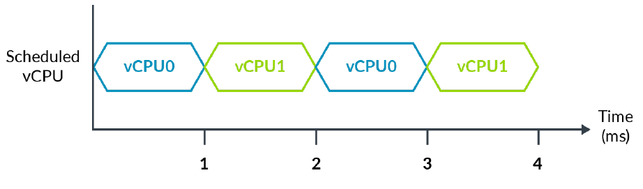
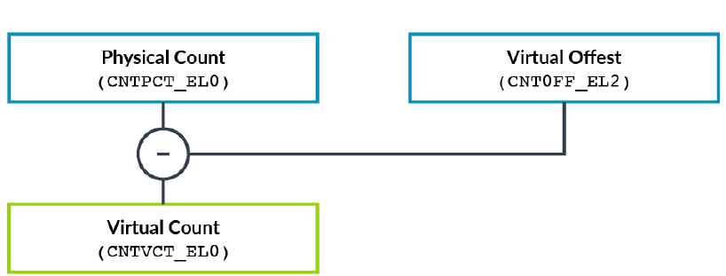
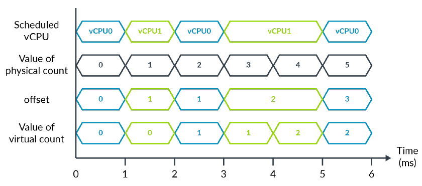

在计算机中，与时间相关的概念通常包含了两部分内容，一是我们通常认知中的时间概念，绝对时间，比如我们通过钟表得到的时间；相对时间，两个时间点的差。二是定时器，比如设置一个闹铃，等时间到了发出一个中断。

# 虚拟机中的时间问题
我们有时候需要知道当前的真实时间，在现实世界我们可以抬头卡看挂在墙上的钟表，所以这个时间又常常称之为wall time。或者需要一个固定的时延，比如五分钟后去做饭，这时候我们需要一个相对时间。再或者需要一个闹钟去叫我们起床，在计算机中可以通过时钟中断完成。在物理机上，通常计算机中的时间概念跟我们在现实生活中的认知没什么不同，但是在虚拟机中并非如此。引用arm虚拟化文档中的一个例子来说明。

下面是一个hypervisor管理2个vcpu的情形。



vcpu0和vcpu1在4秒的时间里交替运行，在第4秒结束时两者都执行了2秒，但是真实的世界中已经经过了4秒。这就产生两种时间概念：真实时间和运行时间。现实中这两种时间都是需要的。比如测量一个进程的执行时间就需要用到运行时间；想要得到墙上时间那就要用到真实时间。

# arm对timer的支持
arm64上的定时器叫做Generic Timer（通用定时器）。现代的计算机系统一般都是在一块SOC（system on chip）上。一块SOC通常包含了多个cpu和一些片上外设。计算机系统需要一个统一的时间，为了实现这一点需要在整个系统上提供一个时间基准，又为了使每个cpu都能在内部访问到时间，cpu内部也要提供相应的时间组件。arm64对timer的支持即是按照这样的思想设置的。

Generic Timer包含三个部分：

1. system counter，存在于片上，提供系统级的统一时间视图；
2. pe implement generic timer，cpu本地的通用定时器，包含三类组件：
   1. physical counter，物理计数器，在cpu内部提供对system counter计数的访问；
   2. virtual counter，虚拟计数器，于physical counter存在一个偏移，该偏移由CNTVOFF_EL2提供，用于虚拟机时间的测量；
   3. 一组定时器，包括安全世界/非安全世界的物理/虚拟在EL1、EL2、EL3上的定时器。目前armv8架构每个cpu中支持最多7个timer，我们只需关心EL1的physical timer和EL1 virtual timer；
3. Generic Timer memory mapped寄存器。cpu本地只是提供了对system counter访问的能力，如果要访问更多有关Generic Timer的寄存器必须要通过内存映射的方式。

## 定时器寄存器
定时器寄存器包括两类：virtual timer寄存器和physical timer寄存器。每种寄存器又包含三种寄存器：CompareValue寄存器，TimerValue寄存器和相应的控制寄存器。compare value寄存器的含义是通过比较compare value寄存器的值与相应counter的值对比，当counter的值大于等于compare value的值时相应timer就会发出ppi中断给gic。timer value寄存器可视为倒计时寄存器，每当counter加1，相应TimerValue寄存器会减一。当TimerValue寄存器等于0时相应timer会发送ppi中断给gic。EL1，EL2，EL3都有相应的physical timer寄存器，EL1，EL2都有virtual timer，导致timer相关寄存器数量较多。相应的控制寄存器可以控制对应timer的使能和关闭。

## timer对虚拟化的支持
### 寄存器读写控制
如果按照字面理解，似乎virtual timer是给虚拟机用的，physical timer是给host用的。其实arm架构并未限制虚拟机如何使用这两种寄存器。也就是虚拟机既可以使用virtual timer也可以使用physical timer。arm提供了timer相关的虚拟化控制寄存器CNTHCTL_EL2来控制虚拟机读写timer寄存器时的行为。例如，在虚拟机中读写physical timer寄存器是否会trap就由CNTHCTL_EL2.{EL1PTEN,EL1PCTEN}控制，需要注意的是HCR_EL2影响了该控制行为。如果HCR_EL2.TGE=1，则在虚拟机中读写physical timer无需trap。同样读写virtual timer寄存器是否trap也受到HCR_EL2和CNTHCTL_EL2的双重影响，而当HCR_EL2.{H2E, TGE} = {1, 1}时，虚拟机读写virtual timer寄存器无需trap到EL2。

### timer中断
timer中断属于ppi，一般physical timer占据30号中断，virtual timer占据27号中断。

读写timer可以无需trap，提高了虚拟机操作timer的效率，但是timer产生的中断还是要受控于EL2的。在中断虚拟化章节已经介绍过timer中断断虚拟化的流程。

### physical counter & virtual counter
physical counter提供了system counter的计数值，通过mrs读CNTPCT_EL0可以得到该值。由于physical counter是单调递增的，它可以用来表示真实时间。virtual counter提供了虚拟的计数器，它与physical counter的差异仅仅是一个由CNTVOFF_EL2提供的偏移，通过访问CNTVCT_EL0得到虚拟计数器值。也就是 CNTVCT_EL0的值等于CNTPCT_EL0减去CNTVOFF_EL2。hypervisor可以通过设置offset值来隐藏掉vcpu没有在cpu上运行的时间，从而使virtual counter表示vcpu的运行时间。



现在可以回答前面提到的有关虚拟机时间的疑问。借用arm虚拟化文档的图来说明这个问题。



vcpu0和vcpu1在一个物理cpu上交替执行，physical counter随着真实时间递增，offset表示vcpu没有调度执行的时间，virtual counter表示vcpu在cpu上运行的时长。

注：后面的分析可知，kvm并未使用该功能。

# kvm对timer虚拟化的支持
## timer相关的数据结构
kvm->arch中包含了跟timer相关的arch_timer_vm_data结构。

```plain
struct arch_timer_vm_data {
/* Offset applied to the virtual timer/counter */
u64 voffset;
/* Offset applied to the physical timer/counter */
u64 poffset;

/* The PPI for each timer, global to the VM */
u8 ppi[NR_KVM_TIMERS];
};
```

保存timer的offset和中断号。vitmer是有偏移的，一般ptimer的offset为0，这里的offset是vm级别的，每个vcpu看到的都是一样。

timer是per cpu的，因此代表vcpu的kvm_vcpu结构体必然包含了表示timer的结构。

kvm_vcpu->arch->timer_cpu

```plain
struct arch_timer_cpu {
struct arch_timer_context timers[NR_KVM_TIMERS];

/* Background timer used when the guest is not running */
struct hrtimer bg_timer;

/* Is the timer enabled */
bool enabled;
};
```

timers是一个arch_timer_context数组，NR_KVM_TIMERS代表timer的种类。目前kvm支持4种timer：physical timer，virtual timer，physical hypervisor timer，virtual hypervisor timer。bg_timer表示在guest没有运行时的时间。

arch_timer_context包含的主要成员

| struct kvm_vcpu *vcpu; | 指向timer所属的vcpu结构 |
| --- | --- |
| struct arch_timer_offset offset; | vcpu级别的timer的offset，每个vcpu有不同的offset |
| struct {bool level} irq | timer是否是水平触发 |
| u32 host_timer_irq | ? |

arch_timer_offset包含了标识vm和vcpu的offset。

| u64 *vm_offset | 指向kvm中的timer offset |
| --- | --- |
| u64 *vcpu_offset | 指向vcpu中的timer offset |

```plain
struct arch_timer_kvm_info {
struct timecounter timecounter;
int virtual_irq;
int physical_irq;
};
```

与上面timer_cpu代表per-cpu的timer信息不同，arch_timer_kvm_info包含了timer的通用的信息。timercounter是linux种架构无关的表示counter的结构，virtual_irq和physical_irq分别代表虚拟timer的irq号和物理timer的irq号。

```plain
struct timecounter {
const struct cyclecounter *cc;
u64 cycle_last;
u64 nsec;
u64 mask;
u64 frac;
};
```

cyclecounter代表一个counter的抽象，timercounter是cycecounter的更高一层的封装。cycle_last是上一次记录的counter的数值，nsec是一个持续增长的纳秒值，mask与frac配合使用，frac表示nsec mask后的余数部分。

## kvm init中的timer初始化
arm timer相关的代码包含两个部分，timer驱动部分在drivers/clocksource/arm_arch_timer.c，与虚拟化相关的部分在arch/arm64/kvm/arch_timer.c

在kvm模块初始化的时候会做timer相关的初始化，调用链为：kvm_init->kvm_arch_init->init_subsystems->kvm_timer_hyp_init。

```plain
int __init kvm_timer_hyp_init(bool has_gic)
{
...
info = arch_timer_get_kvm_info();
timecounter = &info->timecounter;
err = kvm_irq_init(info);
...
err = request_percpu_irq(host_vtimer_irq, kvm_arch_timer_handler,
"kvm guest vtimer", kvm_get_running_vcpus());
...
if (has_gic) {
err = irq_set_vcpu_affinity(host_vtimer_irq,
kvm_get_running_vcpus());
...
}
...
if (info->physical_irq > 0) {
err = request_percpu_irq(host_ptimer_irq, kvm_arch_timer_handler,
"kvm guest ptimer", kvm_get_running_vcpus());
if (err) {
kvm_err("kvm_arch_timer: can't request ptimer interrupt %d (%d)\n",
host_ptimer_irq, err);
goto out_free_vtimer_irq;
}

if (has_gic) {
err = irq_set_vcpu_affinity(host_ptimer_irq,
kvm_get_running_vcpus());
...
}
...
}
```

在上文中我们已经介绍过了arch_timer_kvm_info结构。arch_timer_get_kvm_info仅仅返回一个全局数据结构。

```plain
struct arch_timer_kvm_info *arch_timer_get_kvm_info(void)
{
return &arch_timer_kvm_info;
}
```

我们已经直到arch_timer_kvm_info包含了两类信息，counter和irq号。irq会在arch_timer_populate_kvm_info中初始化。

```plain
static void __init arch_timer_populate_kvm_info(void)
{
arch_timer_kvm_info.virtual_irq = arch_timer_ppi[ARCH_TIMER_VIRT_PPI];
if (is_kernel_in_hyp_mode())
arch_timer_kvm_info.physical_irq = arch_timer_ppi[ARCH_TIMER_PHYS_NONSECURE_PPI];
}
```

这里会从arch_timer_ppi中找到对应的irq号赋给virtual_irq和physical_irq。对于vtimer，irq填充是无条件的，对于ptimer，只有支持vhe才会填充。

counter相关信息会在arch_counter_register中初始化。

在timer probe时会调用arch_timer_of_init或arch_timer_acpi_init，以arch_timer_acpi_init为例：

```plain
static int __init arch_timer_acpi_init(struct acpi_table_header *table)
{
...
arch_timers_present |= ARCH_TIMER_TYPE_CP15;
...
}
```

arch_timers_present会被赋予ARCH_TIMER_TYPE_CP15标识。在arch_timer_common_init会调用arch_counter_register。

```plain
static int __init arch_timer_common_init(void)
{
...
arch_counter_register(arch_timers_present);
...
}
```

```plain
static void __init arch_counter_register(unsigned type)
{
...
/* Register the CP15 based counter if we have one */
if (type & ARCH_TIMER_TYPE_CP15) {
u64 (*rd)(void);

if ((IS_ENABLED(CONFIG_ARM64) && !is_hyp_mode_available()) ||
arch_timer_uses_ppi == ARCH_TIMER_VIRT_PPI) {
if (arch_timer_counter_has_wa()) {
rd = arch_counter_get_cntvct_stable;
scr = raw_counter_get_cntvct_stable;
} else {
rd = arch_counter_get_cntvct;
scr = arch_counter_get_cntvct;
}
} else {
...
}

} else {
...
}
start_count = arch_timer_read_counter();
clocksource_register_hz(&clocksource_counter, arch_timer_rate);
cyclecounter.mult = clocksource_counter.mult;
cyclecounter.shift = clocksource_counter.shift;
timecounter_init(&arch_timer_kvm_info.timecounter,
&cyclecounter, start_count);
...
```

对于arm64且没有hyp mode（在没有嵌套虚拟化的guest就是这种情况）会选择virtual counter。

在counter注册的时候获取counter起始值，这里的值是从arch_timer_read_counter中得到，而它是一个函数指针，在上面的if语句中赋值，指向，从名字即可看出它读取的是virtual counter，timercounter_init会调用timercounter的read回调去get virtual counter。

```plain
void timecounter_init(struct timecounter *tc,
const struct cyclecounter *cc,
u64 start_tstamp)
{
tc->cc = cc;
tc->cycle_last = cc->read(cc);
tc->nsec = start_tstamp;
tc->mask = (1ULL << cc->shift) - 1;
tc->frac = 0;
}
```

其中的read回调在cyclecounter定义时赋值给arch_counter_read_cc。

```plain
static struct cyclecounter cyclecounter __ro_after_init = {
.read = arch_counter_read_cc,
};
```

而arch_counter_read_cc会调用arch_timer_read_counter，该函数指向arch_counter_get_cntvct或arch_counter_get_cntvct_stable。

回到kvm_timer_hyp_init，拿到timer的irq信息和counter设备相关的信息后接下会做跟中断相关的事。

kvm_irq_init会初始化timer的irq domain。

接下来会分别给vtimer和ptimer注册中断，设置中断cpu亲和性。vtimer和ptimer注册的handler都是kvm_arch_timer_handler。这里注册中断使用的接口是request_percpu_irq而不是通常的request_irq。之所以使用该接口是因为在多个vcpu可能同时运行在同一个物理cpu上，可以通过percpu的dev_id标识不同的vcpu。

```plain
request_percpu_irq(unsigned int irq, irq_handler_t handler,
const char *devname, void __percpu *percpu_dev_id)
```

request_percpu_irq的最后一个参数percpu_dev_id是一个percpu变量，dev_id在中断申请接口中通常指定共享irq的所需的额外信息。在kvm timer的中断注册中percpu_dev_id设置为kvm_get_running_vcpus()，它会返回一个percpu全局变量kvm_running_vcpu，表示正运行在该cpu上的kvm_vcpu。该变量会在vcpu调度到该cpu上是填充vcpu的kvm_vcpu结构，当vcpu调度出去时清除。request_percpu_irq会将irq与一个irq_desc结构联系起来，handler和dev_id会装进一个irq_action结构中，该irq_action结构也是irq_desc的成员。因此，可以通过irq找到handler和dev_id。如果当前机器使能vhe，ptimer也会被kvm注册，handler与vtimer一致。

根据前一章的讲解，vcpu在运行时vtimer中断到了，首先会route到EL2，之后会在中断使能时响应中断。中断调用框架会根据中断号找到对应的irq_desc，然后可以得到irq_action进而找到handler和dev_id。对于vtimer，handler就是这里注册的kvm_arch_timer_handler，而dev_id就是percpu变量kvm_running_vcpu内包含的运行在当前cpu上的vcpu对应的kvm_vcpu结构，然后以kvm_vcpu为入参，调用kvm_arch_timer_handler处理vtimer中断。

一个问题，如果当前运行vcpu被调度出去，此时恰好vtimer中断到来，cpu如何处理这个中断呢？说一下我的理解。如果timer中断只是在被kvm注册那应该不会出现这种情况，因为virtual counter在虚拟机调度出去后就不会再增加计数，也就是中断只会在vcpu运行的时候发生。对于ptimer问题有点复杂，host和kvm都注册了该中断，对于共享中断的处理，中断处理框架会调用所有注册的irq handler，handler内部会判断是否是定时是否真的到来。请看kvm_arch_timer_handler的实现：

```plain
static irqreturn_t kvm_arch_timer_handler(int irq, void *dev_id)
{
...
if (kvm_timer_should_fire(ctx))
kvm_timer_update_irq(vcpu, true, ctx);
...
}
```

timer中断的到来并不一定意味着定时器已经超时，所以会判断一下再做下一步。

## vcpu init中的timer初始化
在kvm init中主要是给timer注册了中断，但是如果没有vcpu的创建，上面的操作是不会生效的。timer和vcpu息息相关，在vcpu的生命周期里一直伴随着timer相关的处理。下面看一下在vcpu创建时timer的初始化。

kvm_ioctl_create_vcpu->kvm_arch_vcpu_create->kvm_timer_vcpu_init

```plain
void kvm_timer_vcpu_init(struct kvm_vcpu *vcpu)
{
struct arch_timer_cpu *timer = vcpu_timer(vcpu);

for (int i = 0; i < NR_KVM_TIMERS; i++)
timer_context_init(vcpu, i);

/* Synchronize offsets across timers of a VM if not already provided */
if (!test_bit(KVM_ARCH_FLAG_VM_COUNTER_OFFSET, &vcpu->kvm->arch.flags)) {
timer_set_offset(vcpu_vtimer(vcpu), kvm_phys_timer_read());
timer_set_offset(vcpu_ptimer(vcpu), 0);
}

hrtimer_init(&timer->bg_timer, CLOCK_MONOTONIC, HRTIMER_MODE_ABS_HARD);
timer->bg_timer.function = kvm_bg_timer_expire;
}
```

1. 从vcpu中获取arch_timer_cpu结构；
2. timer_context_init初始化vcpu中的各个timer的arch_timer_context结构，包括vtimer所属的vcpu，将vm_offset指向kvm->arch.timer_data下的offset用于接下来的offset初始化，初始化高精度时钟，irq号；
3. 如果设置了COUNTER_OFFSET相关标志，设置vtimer和ptimer的offset，vtimer的offset等于当前的physical counter值，ptimer的offset设为0，这里设置的是arch_timer_offset结构中的vm_offset成员；
4. 初始化bg_timer高精度时钟；
5. 初始化bg_timer的function成员，作为bg_timer中断到了时的回调函数。

### 有关hrtimer的说明
在kvm_timer_vcpu_init中出现了很多跟高精度时钟相关的初始化。hrtimer是linux内核时间子系统提供的高精度时钟机制，利用它可以实现时钟中断的设置。在kvm中有两类跟hrtimer相关的timer，一类是bg_timer，一类是kvm的各种timer，主要包括vtimer和ptimer。前者一般是必须的，后者只有在timer是纯模拟时才会需要。bg_timer在arm64仅用来wfi的模拟，后面会详细描述。

## vcpu生命周期中对timer的操作
vcpu的生命周期也伴随着timer的操作。kvm_arch_vcpu_ioctl_run是运行vcpu的核心函数，在进出虚拟机时会涉及到timer状态的设置，保存恢复上下文等操作。

### kvm_timer_vcpu_load中的timer操作
通过KVM_RUN ioctl使vcpu开始执行或者vcpu线程被重新调度会调用vcpu_load或kvm_sched_in，两者都会调用kvm_timer_vcpu_load对timer上下文进行设置，调用链为vcpu_load/kvm_sched_in->kvm_arch_vcpu_load->kvm_timer_vcpu_load。

```plain
void kvm_timer_vcpu_load(struct kvm_vcpu *vcpu)
{
struct arch_timer_cpu *timer = vcpu_timer(vcpu);
struct timer_map map;
...
get_timer_map(vcpu, &map);

if (static_branch_likely(&has_gic_active_state)) {
kvm_timer_vcpu_load_gic(map.direct_vtimer);
if (map.direct_ptimer)
kvm_timer_vcpu_load_gic(map.direct_ptimer);
} else {
...
}

kvm_timer_unblocking(vcpu);

timer_restore_state(map.direct_vtimer);
if (map.direct_ptimer)
timer_restore_state(map.direct_ptimer);
...
timer_set_traps(vcpu, &map);
}

```

忽略掉跟non-vhe的场景和nogic相关的代码，该函数的主要行为：

第一步，从vcpu中获取timer的相关结构；

第二步，调用kvm_timer_vcpu_load_gic对vtimer和ptimer相关状态进行更新，包括调用kvm_timer_update_irq更新irq的状态，涉及到中断注入和对关联硬件中断状态的设置，后面会详细讲解；

第三步，调用kvm_timer_unblocking取消后台timer中断，跟vcpu调度出去时的kvm_timer_blocking相对；

第四步，调用timer_restore_state恢复vtimer/ptimer上下文，包括CNTVOFF_EL2，CNTP_CVAL_EL0和CNTP_TVAL_EL0，后面会详细讲解，这里要注意的时，这些上下文并非保存在跟timer相关的数据结构中，而是保存在vcpu结构中；

第五步，调用timer_set_traps设置cnthctl_el2控制是否在guest中访问物理timer和counter寄存器时trap到el2。

vcpu_load是在vcpu执行的大循环之外的，也就是对于一次连续的vcpu运行期间只需执行一次的操作。从上述分析也可以看出，像恢复timer和counter寄存器，设置读写物理timer/counter寄存器是否trap这种设置在一次vcpu运行期间是不会发生变化的，仅在vcpu开始执行的时候设置即可。

下面分析一下比较重要的一些子函数。

kvm_timer_vcpu_load_gic

```plain
static void kvm_timer_vcpu_load_gic(struct arch_timer_context *ctx)
{
kvm_timer_update_irq(ctx->vcpu, kvm_timer_should_fire(ctx), ctx);

if (irqchip_in_kernel(vcpu->kvm))
phys_active = kvm_vgic_map_is_active(vcpu, timer_irq(ctx));

phys_active |= ctx->irq.level;

set_timer_irq_phys_active(ctx, phys_active);
}
```

kvm_timer_update_irq我们在上一章提到过，它会调用kvm_vgic_inject_irq给guest注入中断。不过更合理的描述是它是用来更新timer的irq状态的。kvm_timer_should_fire会判断timer中断是否应该发送。kvm_vgic_inject_irq会根据这个bool值加上timer irq的极性来做出反应。下图是它的状态表。

| should fire/irq type | level | edge |
| --- | --- | --- |
| true | 拉高电平 | 发送中断 |
| false | 拉低电平 | 忽略 |

kvm_vgic_map_is_active会判断该timer是否与硬件中断相关联。在arm vgic中，虚拟中断可以关联硬件中断，当处理虚拟中断是可以相应改变硬件中断的状态。

set_timer_irq_phys_active会调用irq_set_irqchip_state，它会在phys_active为true时设置对应的硬件中断的状态。

timer_restore_state

timer_restore_state会恢复在上一次vcpu调度出去时保存的timer寄存器的值，包括CNTVOFF_EL2，CNTP_CVAL_EL0和CNTP_TVAL_EL0。下面是vtimer有关的代码：

```plain
set_cntvoff(timer_get_offset(ctx));
write_sysreg_el0(timer_get_cval(ctx), SYS_CNTV_CVAL);
isb();
write_sysreg_el0(timer_get_ctl(ctx), SYS_CNTV_CTL);
```

timer_get_offset去获取vcpu保存的vtimer offset。我们来看一下该函数如果获取vtimer offset。

```plain
static u64 timer_get_offset(struct arch_timer_context *ctxt)
{
u64 offset = 0;

if (!ctxt)
return 0;

if (ctxt->offset.vm_offset)
offset += *ctxt->offset.vm_offset;
if (ctxt->offset.vcpu_offset)
offset += *ctxt->offset.vcpu_offset;

return offset;
}
```

可以看到offset是arch_timer_context包含的offset结构中vm_offset和vcpu_offset之和。这里我们可以大致明白vm_offset和vcpu_offset的含义，vm_offset指vm的基础偏移，在vm的生命周期中是不变的，对所有vcpu也是一致的，而vcpu_offset是每个vcpu各自的偏移，vm内的各个vcpu是不一样的。

set_cntvoff会将获取到的offset写入cntvoff_el2寄存器。

SYS_CNTV_CVAL和SYS_CNTV_CTL分别由timer_get_cval和timer_get_ctl从vcpu中获取的。

```plain
u64 timer_get_cval(struct arch_timer_context *ctxt)
{
struct kvm_vcpu *vcpu = ctxt->vcpu;

switch(arch_timer_ctx_index(ctxt)) {
case TIMER_VTIMER:
return __vcpu_sys_reg(vcpu, CNTV_CVAL_EL0);
...
}
}
```

timer寄存器的值并没有保存在arch_timer_context中，而是作为cpu的系统寄存器保存在vcpu的上下文中，

位于kvm_vcpu->arch->ctxt->sys_regs。

```plain
struct kvm_vcpu {
struct kvm_vcpu_arch arch;
}

struct kvm_vcpu_arch {
struct kvm_cpu_context ctxt;
}

struct kvm_cpu_context {
u64 sys_regs[NR_SYS_REGS];
}
```

### kvm_timer_vcpu_put中的timer操作
有两种路径会调用到kvm_timer_vcpu_put，一种是vcpu线程被调度出去会在kvm_sched_out函数中调用。另一种是handle_exit函数返回1，guest退出到用户态，此时会在vcpu_put中调用。

```plain
void kvm_timer_vcpu_put(struct kvm_vcpu *vcpu)
{
...
timer_save_state(map.direct_vtimer);
if (map.direct_ptimer)
timer_save_state(map.direct_ptimer);
...
if (kvm_vcpu_is_blocking(vcpu))
kvm_timer_blocking(vcpu);
}
```

主要做两件事，timer_save_state会保存timer寄存器的值，包括SYS_CNTV_CTL和SYS_CNTV_CVAL，设置CNTVOFF_EL2为0，关闭timer。其次，如有必要启动bg_timer高精度时钟。一般只会在guest因wfi退出时会设置bg_timer。

这里我们可以看到，kvm并没有保存vcounter或pcounter的值，当下一次vcpu执行的时候vm_offset和vcpu_offset没有更新，cntvoff_el2仍然从旧的vm_offset和vcpu_offset中取值，也就是在整个vm运行过程中，vcounter对pcounter的偏移没有改变。vcpu_offset的值在虚拟机中一般是不变的，而且设置该值的接口并没有使用过。因此这个值在arm64虚拟机中暂时未启用，一直是0。使用bpftrace监控证实了这一点。

```plain
#!/usr/bin/env bpftrace

#include "kvm/arm_arch_timer.h"
#include "linux/kvm_host.h"

kprobe:timer_get_cval
{
$ctxt=(struct arch_timer_context*)arg0;
$offset=$ctxt->offset;
$vcpu_offset=*($offset.vcpu_offset);
$vm_offset=*($offset.vm_offset);
$vcpu=(struct kvm_vcpu*)$ctxt->vcpu;
$vcpu_id=$vcpu->vcpu_id;
printf("cpu: %d, vcpu_id: %d, vm_offset: %llu, vcpu_offset: %llu\n", cpu, $vcpu_id, $vm_offset, $vcpu_offset);
}
```

由此可见，尽管在arm64的架构设计中将vcounter用于记录对应vcpu执行时间，但kvm并未实现。在kvm中vm_offset代表vm在启动时的偏移，而vcpu_offset保持为0不变，整个虚拟机一直相对host有一个稳定的偏移。

另外一点要注意的是，在vcpu让出cpu后，vtimer也是处于关闭状态不会发送中断。这将会对在guest中设置的时钟产生影响。

## guest对timer寄存器的读写
一般会在guest kernel中读CNTVCT_EL0寄存器，若CNTHCTL_EL2.EL1TVCT置1，读该寄存器会trap到EL2。kvm并没有处理读cntvct_el0后陷入el2的处理代码，所以在guest中读该寄存器是不会trap的，得到的值就是CNTPCT_EL0 - CNTVOFF_EL2.

对于timer寄存器，只有在读取physical timer寄存器时才会trap到kvm。包括：SYS_CNTP_TVAL_EL0，SYS_CNTP_CTL_EL0，SYS_CNTP_CVAL_EL0， SYS_CNTPCT_EL0。trap路径为：handle_exit->handle_trap_exceptions->kvm_handle_sys_reg最终调用到access_arch_timer进行处理。

## guest timer是如何工作的
在vhe使能的情况下，arm64给guest提供了ptimer和vtimer。那么当guest要设置一个timer中断的时候到底是用vtimer还是ptimer。可能我们会想当然的认为，在guest中就应该使用vtimer。但是我们要了解一个是事实，guest kernel并没有对timer做特殊处理，在timer的选择上，guest kernel和host kernel的处理逻辑是一样的。

选择timer的代码在drivers/clocksource/arm_arch_timer.c中。使用arch_timer_uses_ppi来标识到底选择哪个timer。对于acpi启动的系统，调用arch_timer_select_ppi来决定它的值。

```plain
static enum arch_timer_ppi_nr __init arch_timer_select_ppi(void)
{
if (is_kernel_in_hyp_mode())
return ARCH_TIMER_HYP_PPI;

if (!is_hyp_mode_available() && arch_timer_ppi[ARCH_TIMER_VIRT_PPI])
return ARCH_TIMER_VIRT_PPI;

if (IS_ENABLED(CONFIG_ARM64))
return ARCH_TIMER_PHYS_NONSECURE_PPI;

return ARCH_TIMER_PHYS_SECURE_PPI;
}
```

代码比较容易理解，对于host可以选择HYP_TIMER或physical timer，对于没有实现嵌套虚拟化的guest来说肯定是不存在hyp mode的，也就是guest只会选择vtimer。

当在guest中设置一个定时器，在timer到了时可能出现两种情形：vcpu正在运行；vcpu已经不在guest mode，让出cpu甚至已经迁移到其他cpu上。对于第一种情形，我们在中断虚拟化一章已经分析过，timer中断会导致vcpu trap到el2，进而完成中断注入，vcpu再次运行响应中断。

第二种情况，因为在vcpu_put时vtimer是关闭的，所以在vcpu让出cpu之后vtimer是不会触发的。那么如果在vcpu让出cpu之前设置了timer，timer超时的时候vcpu还没有运行怎么办？从代码上看，确实存在这个问题，虚拟机中的定时器精度是不如host的，可能出现超时的时候vcpu尚未运行的情况，直到vcpu再次调度到cpu上。当vcpu再次调度，无论是从用户态通过ioctl，还是vcpu线程重新调度，都会执行kvm_arch_vcpu_load函数。该函数上文已经介绍过，它会调用kvm_timer_should_fire，调用链为kvm_arch_vcpu_load->kvm_timer_vcpu_load->kvm_timer_vcpu_load_gic->kvm_timer_should_fire

```plain
static bool kvm_timer_should_fire(struct arch_timer_context *timer_ctx)
{
enum kvm_arch_timers index;
u64 cval, now;
...
if (timer_ctx->loaded) {
...
}

if (!kvm_timer_irq_can_fire(timer_ctx))
return false;

cval = timer_get_cval(timer_ctx);
now = kvm_phys_timer_read() - timer_get_offset(timer_ctx);

return cval <= now;
}
```

在vcpu切出时会在调用timer_save_state时设置timer_ctx->loaded为false，所以我们可以看13行之后的部分。timer_get_cval会获取vcpu切出时保存在kvm_vcpu结构体中的CNTV_CVAL_EL0寄存器的值。kvm_phys_timer_read获取当前物理counter，timer_get_offset获取虚拟机的counter offset，两者相减就是当前guest的virtual counter值，比较cval和now就可以知道定时器是否超时。如果超时说明有中断需要注入，然后调用kvm_timer_update_irq注入中断。
