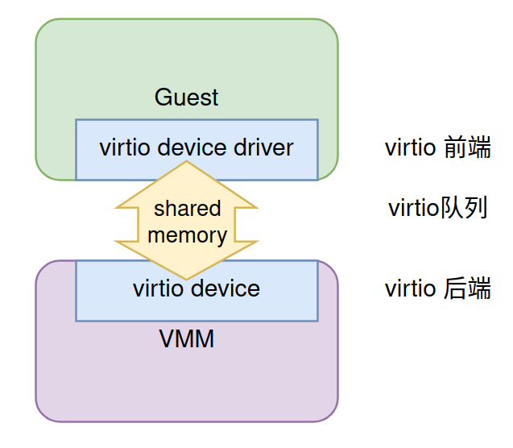

什么是设备虚拟化？一台可用的系统需要外设给用户提供各种功能。物理机可以直接接触到真实的硬件，可以自由地使用这些硬件。虚拟机受控于hypervisor，无法直接接触到硬件，需要借助于hypervisor/vmm来提供必要的支持。在虚拟机中看到的设备基本是在VMM的协助下产生的，是虚拟的。

举一个简单的例子。当我们在一个物理机上的linux终端敲打键盘的时候，控制台会回显出对应的字符。对于物理机，它的原理很容易理解。键盘通过有线或无线发送对应字符的电信号到真正的键盘控制器芯片，由其发送中断信号发送到中断控制器。当中断被cpu接收，调用中断处理函数去取刚刚敲下的字符编号，这样输入端的处理就结束了。接下来会调用输出接口将字符输出到屏幕，我们就可以在控制台看到输出结果。当我们在一台完整的虚拟机上做同样的事情时得到的跟前者没有什么差别，但是它背后的流程却要复杂一些，并不那么直观。

# 设备模拟的驱动力
VMM模拟设备是事件驱动的。在VMM开始模拟设备之前一定要有人来告诉它需要做什么，否则它什么也做不了。这个事件可以是从虚拟机内部，常见的就是虚拟机访问MMIO空间产生VM exit；也可以来自host用户空间，常见的为监控某些文件。

### MMIO exit事件
在物理机中，如果设备想要被用户使用，必须提供一些接口。通常这些接口是设备提供的一系列寄存器。在x86架构中存在一种IO指令，它拥有自己独立于内存地址空间的IO端口，对于映射到某IO的设备，可以通过IO指令加以控制。而arm架构没有这类IO指令，所有的设备地址空间必须映射到cpu的地址空间，也就是memory mapped IO（MMIO）。cpu通过访问MMIO来控制设备。

按照访问是否有副作用，可以将内存分为两种，一种是普通内存（normal memory），典型的就是内存条提供的内存区域，拥有读写执行三种权限组合，可缓存，它是程序运行的基础；另一种是IO内存，没有执行权限，它不是由内存条提供的，而是设备内存或寄存器在cpu地址空间的映射，更为关键的是，读写它可能会有副作用。所谓的副作用指的是，读写它可能会产生读写以外的效果。例如读GIC的IAR寄存器就可以得到当前处在active状态的irq号，同时也会deactive这个irq，后者就是读IAR产生的副作用。因此，对设备的模拟并不是简单的返回或写入一个数值，还要根据设备本身的特性模拟设备读写后的副作用。因此hypervisor必须要监控到对设备内存的读写，并完成模拟。为实现这一点，读写MMIO空间时必须陷入到hypervisor，并由hypervisor完成模拟。这就是设备虚拟化的基础。而MMIO内存的读写在第三章已经有详细的描述，这里不再赘述。

### 文件监控事件
某些物理硬件可以关联到文件，VMM通过监控这些文件获取硬件事件从而模拟设备。典型的如虚拟机利用tap设备上网，VMM就可以监控tap设备文件来知道是否有数据到来。

# 设备模拟方式
设备模拟一般是用户态VMM的工作，典型的如qemu就实现了很多设备。

物理系统有很多的设备，比如鼠标键盘这种简单的交互设备，还有RTC这种提供时间的简单的设备。又比如网卡这种复杂的设备，一般作为pci设备出现。对于前者，我们可以依靠内存虚拟化中讲到的MMIO模拟即可容易的模拟出来，较为简单；对于后者实现起来就比较复杂了。一般来说，设备的模拟分为以下几种方式。

| 种类 | 举例 | 特性 |
| --- | --- | --- |
| 纯软件模拟 | legacy设备，某些网卡等 | 性能最差，适合简单设备的模拟，可以模拟现实中存在的设备 |
| virtio 模型 | 包括virtio，vhost，vhost user | 性能好，可以热迁移 |
| 设备直通 | vfio | 性能最好，很难热迁移 |

上面提到的legacy设备可指代为比较老旧，不需要现代高级总线（pci/pcie）支持的设备，比如RTC，串口设备等。这类设备比较简单，可以依靠纯软件模拟的方式实现。

接下来我们分别讲解纯软件模拟，virtio模型和vfio的基本原理。

## 纯软件模拟
理论上所有的设备都可以使用纯软件模拟，但是这种方式性能较差，很难满足性能需求。适合那些功能简单的设备，数据量很少的设备模拟。在某些场景下，用户希望在虚拟机中使用现实世界中存在的物理设备，可以这种方式实现。下面基于第一章我们写的迷你VMM模拟一个类似于RTC的时钟设备来让大家了解一下设备模拟的基本原理，该设备只有一个显示时间的功能。这个例子也可以作为学习后续高阶模拟方式的基础。

在第一章我们对迷你VMM的核心代码讲解有简单的描述。下面我们将其中跟设备模拟相关的代码摘出来详细分析一下。

### MMIO模拟原理
```plain
...
int vcpufd = ioctl(vmfd, KVM_CREATE_VCPU, 0);
int mmap_size = ioctl(kvmfd, KVM_GET_VCPU_MMAP_SIZE, NULL);
struct kvm_run *run = mmap(NULL, mmap_size, PROT_READ | PROT_WRITE, MAP_SHARED, vcpufd, 0);
while(1) {
ret = ioctl(vcpufd, KVM_RUN, NULL);
switch (run->exit_reason) {
...
case KVM_EXIT_MMIO:
ret = arch_handle_mmio(run);
}
}
```

首先通过KVM_CREATE_VCPU ioctl创建一个vcpu，然后在kvmfd上调用KVM_GET_VCPU_MMAP_SIZE ioctl获取一个关于vcpu的mmap size。接下来会将vcpufd这个匿名文件映射到内存中，大小正是刚刚获得的mmap size的大小。这段内存区域可以作为kvm和用户态VMM之间通信的媒介。这一段代码似乎不那么直观，我们不知道kvm到底做了什么才促成了这一切。下面我们进入kvm代码去看看到底发生了什么。

在进入到kvm代码之前，我们先补充一点关于文件系统的知识。linux中代表文件最重要的数据结构是file。

```plain
struct file {
...
const struct file_operations *f_op;
...
}
```

file结构中跟当下最相关的成员是f_op，它代表了file相关的操作。

```plain
struct file_operations {
ssize_t (*read) (struct file *, char __user *, size_t, loff_t *);
ssize_t (*write) (struct file *, const char __user *, size_t, loff_t *);
int (*mmap) (struct file *, struct vm_area_struct *);
int (*open) (struct inode *, struct file *);
...
}
```

可以看到很多我们熟悉的操作，如读，写，打开，当然还有我们现在最关心的mmap回调。那么在用户态使用mmap跟这个mmap回调是什么关系？答案是当我们调用mmap时，kernel就会调用该文件的mmap回调会做跟特定该文件的mmap操作。于是我们要做的就是找一下kvm在创建vcpu file的时是否给它安装了特定的mmap回调操作，而这个mmap回调又做了什么。

带着这个疑问再去看代码就有目标了。我们直接看跟创建vcpu文件上下文相关的代码。

```plain
static int kvm_vm_ioctl_create_vcpu(struct kvm *kvm, u32 id)
{
...
r = create_vcpu_fd(vcpu);
...
}

static int create_vcpu_fd(struct kvm_vcpu *vcpu)
{
char name[8 + 1 + ITOA_MAX_LEN + 1];

snprintf(name, sizeof(name), "kvm-vcpu:%d", vcpu->vcpu_id);
return anon_inode_getfd(name, &kvm_vcpu_fops, vcpu, O_RDWR | O_CLOEXEC);
}
```

在kvm_vm_ioctl_create_vcpu中调用create_vcpu_fd创建vcpu文件上下文。它调用anon_inode_getfd去做具体事务，而它的第二个入参-&kvm_vcpu_fops就是我们要找的vcpu file结构中的f_op。感兴趣的同学可以去深入该函数，看看fop是如何安装上去的。这里直接看kvm_vcpu_fops包含了那些回调。

```plain
static struct file_operations kvm_vcpu_fops = {
.release = kvm_vcpu_release,
.unlocked_ioctl = kvm_vcpu_ioctl,
.mmap = kvm_vcpu_mmap,
.llseek = noop_llseek,
KVM_COMPAT(kvm_vcpu_compat_ioctl),
};
```

很好，它正好包含了我们想要的mmap回调。看看kvm_vcpu_mmap都做了什么。

```plain
static int kvm_vcpu_mmap(struct file *file, struct vm_area_struct *vma)
{
...
vma->vm_ops = &kvm_vcpu_vm_ops;
return 0;
}
```

略去无关代码后，它最重要的是将kvm_vcpu_vm_ops的指针赋给了vma的vm_ops，然后就结束了。这里还要补充一点有关内存管理的一点知识。当调用mmap时一般只是分配了一段虚拟内存，这段虚拟内存在kernel中由vma表示。当用户去读取这段虚拟内存时就会发生page fault，最终由该vma->vm_ops->fault回调来处理。我们来看一下kvm_vcpu_vm_ops是否有对应的回调。

```plain
static const struct vm_operations_struct kvm_vcpu_vm_ops = {
.fault = kvm_vcpu_fault,
};
```

可以看到，这个变量只有fault一个回调。来看一下kvm_vcpu_fault做了啥。

```plain
static vm_fault_t kvm_vcpu_fault(struct vm_fault *vmf)
{
struct kvm_vcpu *vcpu = vmf->vma->vm_file->private_data;
struct page *page;

if (vmf->pgoff == 0)
page = virt_to_page(vcpu->run);
...
return 0;
}
```

可以看到，读vcpu文件从0开始的一段区域会返回vcpu->run，也就是在univmm代码中的kvm_run结构。这是一个非常复杂的结构，其中包含了上述使用到的exit_reason成员，用来传递虚拟机退出到用户态的原因。这个逻辑在cpu虚拟化章节有讲解，这里我们再重温一下。

当虚拟机退出时，kvm会调用handle_exit去处理。

```plain
/*
* Return > 0 to return to guest, < 0 on error, 0 (and set exit_reason) on
* proper exit to userspace.
*/
int handle_exit(struct kvm_vcpu *vcpu, int exception_index)
{
...
switch (exception_index) {
...
case ARM_EXCEPTION_TRAP:
return handle_trap_exceptions(vcpu);
```

从注释上可以看到，当handle_exit返回0时会返回用户态。这里最常见的返回0的case就是handle_trap_exceptions。它会处理很多情形的退出，以读写MMIO区域为例。

```plain
int kvm_handle_guest_abort(struct kvm_vcpu *vcpu)
{
...
if (kvm_is_error_hva(hva) || (write_fault && !writable)) {
...
fault_ipa |= kvm_vcpu_get_hfar(vcpu) & ((1 << 12) - 1);
ret = io_mem_abort(vcpu, fault_ipa);
```

io_mem_abort用来处理这种情形。

```plain
int io_mem_abort(struct kvm_vcpu *vcpu, phys_addr_t fault_ipa)
{
struct kvm_run *run = vcpu->run;
...
/* Now prepare kvm_run for the potential return to userland. */
run->mmio.is_write = is_write;
run->mmio.phys_addr = fault_ipa;
run->mmio.len = len;
...
if (is_write)
memcpy(run->mmio.data, data_buf, len);
...
run->exit_reason = KVM_EXIT_MMIO;
return 0;
}
```

该函数向kvm_run结构mmio成员的所有信息赋值，包括是否是写退出，退出GPA，数据长度以及退出原因，只会我们就可以在用户态拿到这个结果了。

至此我们已经知道了kvm_run的来历和用法。之所以关注它的实现，只因它是设备虚拟化的基础。

univmm实现了一个非常简单的打印功能，有了上面的背景知识，我们现在可以很容易地理解它的原理。

### 打印功能的实现
在univmm的KVM_RUN ioctl while循环中，如果判断虚拟机退出原因是KVM_EXIT_MMIO，就会调用arch_handle_mmio处理。对于arm64，实现如下：

```plain
int arch_handle_mmio(struct kvm_run *run)
{
int len;

if (!run->mmio.is_write)
return 0;

len = run->mmio.len;
if (len > 8)
len = 8;

for (int i = 0; i < len; i++) {
if (run->mmio.data[i] == 7)
return 1;
printf("%c", run->mmio.data[i]);
}

return 0;
}

```

实现非常简单。首先判断是否为写退出，如果不是就直接返回。然后根据数据长度将存放在data成员中的数据取出打印即可。因为这是目前唯一的设备，因此没有判断读写的GPA，于是只要在guest中写没有注册的内存地址就会被当作打印操作。这样几行代码就实现了一个简单的打印功能，当然，如果要集成更多的设备，这样的代码结构还是过于简陋，至少应该实现一个bus，将设备继承到bus上，方便mmio地址分发。这里仅仅用来展示mmio的基本原理。

基于mmio的设备模拟可以不依赖于任何物理硬件。对于有物理设备参与的设备模拟就不能单单通过这种方式了。

### 键盘输入模拟
本文开头我们举了一个敲击键盘的例子。它在host上工作的原理比较简单，但是在虚拟机中的工作流程在很长的时间都让我很困惑。在揭秘之前，我们不妨猜想一下它是怎么运行的。

按照中断虚拟化中的思路，当一个物理中断到来时，首先会route到EL2，由hypervisor判断它是否为虚拟机需要的中断，如果是就将它注入给虚拟机。但是，hypervisor如何判断这个中断是否是给虚拟机的呢？除非这个中断号是专门给虚拟机用的，否则仅凭一个irq是无法判断的。而且，一个简单的键盘中断就要大费周章给它一些特权是不划算的。

既然从中断虚拟化的角度找不到原因，那么我们按照VMM模拟设备由事件驱动的思路去想，VMM如何得到有键盘输入到来呢？在cpu虚拟化章节，我们了解到VMM的线程模型，整个虚拟机都在VMM的线程组中。当我们面对虚拟机敲击键盘时VMM会收到这个输入并作为标准输入。如果VMM监听stdin文件，它就能得知键盘输入，再将它注入给虚拟机，接下来的事就顺理成章了。为了验证这个猜想，我们找一个成熟的VMM验证一下。

这次我们使用kvmtool作为研究对象（qemu有点复杂，但是原理大致相同）kvmtool也是一款开源的VMM，相比qemu要简单很多。

准备kvmtool。

```plain
# git clone https://github.com/kvmtool/kvmtool.git
# cd kvmtool; make
```

编译后生成的lkvm文件即使kvmtool的可执行文件。用下面的命令创建虚拟机。

```plain
./lkvm run -k /boot/vmlinuz-6.6.0 -i /boot/initrd.img-6.6.0 -d jammy-server-cloudimg-arm64.img -c 2 -m 1G --console serial -p "root=/dev/vda1 console=ttyAMA0"
```

虚拟机启动完成后进入登陆界面，为了验证键盘中断，我们查看一个键盘中断的irq号。

```plain
root@ubuntu:~# cat /proc/interrupts
CPU0 CPU1
11: 4234 3947 GIC-0 27 Level arch_timer
15: 371 0 GIC-0 96 Level ttyS0
...
```

在我们创建的这个虚拟机中，键盘输入是作为串口输入的，因此这个ttyS0可以视为键盘相关联的设备，至于控制台，tty，键盘之间的关系我们无需关注，对键盘虚拟化的原理关系不大，我们在这里简单的“混为一谈”。

当键盘按下，虚拟机必然会被注入中断，如果我们能够监控中断注入函数，打印出它的函数调用栈，或许可以得知kvmtool是如何得知敲击键盘的事件的。bpftrace的uprobe可以用来监控用户态程序的函数。而kvmtool中用来注入中断的函数为kvm__irq_line。bpftrace的脚本如下：

```plain
#!/usr/bin/env bpftrace

uprobe:/path/to/lkvm:kvm__irq_line
{
printf("probe: %s, irq: %d, stack: %s\n", probe, arg1, ustack);
}
```

kvm__irq_line的第二个参数是irq号。上述脚本会在kvm__irq_line执行时打印出其第二个入参和函数调用栈。

执行脚本，然后在虚拟机窗口敲击键盘。我们得到如下输出：

```plain
probe: uprobe:/path/to/lkvm:kvm__irq_line, irq: 96, stack:
kvm__irq_line+0
serial8250__update_consoles+244
kvm__arch_read_term+20
term_poll_thread_loop+144
0xffff9e8cd5c8
0xffff9e935edc

probe: uprobe:/path/to/lkvm:kvm__irq_line, irq: 96, stack:
kvm__irq_line+0
serial8250_mmio+120
kvm__emulate_mmio+156
kvm_cpu__start+576
kvm_cpu_thread+108
0xffff9e8cd5c8
0xffff9e935edc

probe: uprobe:/path/to/lkvm:kvm__irq_line, irq: 96, stack:
kvm__irq_line+0
serial8250_mmio+120
kvm__emulate_mmio+156
kvm_cpu__start+576
kvm_cpu_thread+108
0xffff9e8cd5c8
0xffff9e935edc

probe: uprobe:/path/to/lkvm:kvm__irq_line, irq: 96, stack:
kvm__irq_line+0
serial8250_mmio+120
kvm__emulate_mmio+156
kvm_cpu__start+576
kvm_cpu_thread+108
0xffff9e8cd5c8
0xffff9e935edc
```

在敲击一下键盘后bpftrace监控到kvm__irq_line被连续调用了4次。先看第一次。可以解析的最先被调用的函数是term_poll_thread_loop，看名字就知道是跟终端相关的，上面poll字样显示其似乎在轮询什么文件。

```plain
static void *term_poll_thread_loop(void *param)
{
struct pollfd fds[TERM_MAX_DEVS];
struct kvm *kvm = (struct kvm *) param;
int i;

kvm__set_thread_name("term-poll");

for (i = 0; i < TERM_MAX_DEVS; i++) {
fds[i].fd = term_fds[i][TERM_FD_IN];
fds[i].events = POLLIN;
fds[i].revents = 0;
}

while (1) {
/* Poll with infinite timeout */
if(poll(fds, TERM_MAX_DEVS, -1) < 1)
break;
kvm__arch_read_term(kvm);
}

die("term_poll_thread_loop: error polling device fds %d\n", errno);
return NULL;
}

```

这个函数确实是在poll一些跟终端相关的文件，如果有事件到来就调用kvm__arch_read_term读取终端内容。term_init会创建term-poll线程。

```plain
static int term_init(struct kvm *kvm)
{
struct termios term;
int i, r;

for (i = 0; i < TERM_MAX_DEVS; i++)
if (term_fds[i][TERM_FD_IN] == 0) {
term_fds[i][TERM_FD_IN] = STDIN_FILENO;
term_fds[i][TERM_FD_OUT] = STDOUT_FILENO;
}

if (!isatty(STDIN_FILENO) || !isatty(STDOUT_FILENO))
return 0;

r = tcgetattr(STDIN_FILENO, &orig_term);
if (r < 0) {
pr_warning("unable to save initial standard input settings");
return r;
}

term = orig_term;
term.c_iflag &= ~(ICRNL);
term.c_lflag &= ~(ICANON | ECHO | ISIG);
tcsetattr(STDIN_FILENO, TCSANOW, &term);
/* Use our own blocking thread to read stdin, don't require a tick */
if(pthread_create(&term_poll_thread, NULL, term_poll_thread_loop,kvm))
die("Unable to create console input poll thread\n");

signal(SIGTERM, term_sig_cleanup);
atexit(term_cleanup);

return 0;
}
```

在term_init中我们可以看到term_poll_thread_loop要poll的文件正是标准输入stdin，并更改了一些终端设置。比如将回显（ECHO）取消，这样VMM自身就不会回显输入，防止于虚拟机输出混淆。

当stdin有输出到来，term_getc会读取该文件，调用链为term_poll_thread_loop->kvm__arch_read_term->serial8250__update_consoles->serial8250__receive->term_getc。

```plain
int term_getc(struct kvm *kvm, int term)
{
static bool term_got_escape = false;
unsigned char c;

if (read_in_full(term_fds[term][TERM_FD_IN], &c, 1) < 0)
return -1;
...
return c;
}

```

从stdin读取到内容后会被放入串口设备的寄存器中。

当键盘事件被捕获就需要把串口中断注入到虚拟机中，kvm__irq_line将96号中断注入到虚拟机。这是第一次中断注入。当虚拟机内的kernel收到串口中断，会去读相关的寄存器，也就是后续发生的mmio exit。这其中至少包含读取串口的存放键盘字符的寄存器。每次读取都会发生mmio exit，kvmtool在处理完后再注入一次中断，通知guest。所以，敲击一次键盘在guest中起始会收到多次中断，多次退出。有兴趣的同学可以去深入代码，看看每次中断注入和退出的原因，这里就不做进一步研究了。

如此，困扰我们的键盘输入模拟难题就解开了。我们也了解到监控文件对于VMM设备模拟的作用。

## virtio
提到设备模拟就不能不讲virtio，它在虚拟机设备模拟领域应用非常广泛。

一般的物理设备都是有比较复杂的逻辑结构，如果要完全模拟不仅代码复杂而且性能较差。相比之下virtio属于半虚拟化。对于完全虚拟化，虚拟机是感知不到自己是在使用一个真实的物理设备还是一个模拟的设备。而半虚拟化会让虚拟机感知到自己在使用一个模拟设备。我们可以在linux kernel中看到很多virtio设备。我们可以通过lspci查看到是否有virtio类型的设备，如果有，那么大概率我们是在一台虚拟机里。

架构与原理

完全模拟之所以性能较差是因为它存在过多的IO操作，导致VM exit。但对于虚拟机来讲，设备的细节无足轻重，只要能完成设备的功能就行。virtio是一种开放标准，定义了不同设备之间的通信协议。它可视为真实设备的抽象框架，具体的设备都可以建立在这套框架之上。所以我们可以看到很多virtio设备，比如virtio-net, virtio-blk甚至还有virtio-mem。了解virtio可以通过两种方法，其一就是virtio spec，virtio设备的实现必须遵守该协议；其二就是学习现有的virtio设备源码，比如linux的virtio设备驱动代码和qemu的virtio设备代码。由于spec的内容和设备代码比较庞大，本文只从比较high level上讲述其原理。需要深入学习，可以参考文献。

virtio的结构可以清晰的划分为前端和后端，中间由共享内存来传输数据。前端位于guest kernel中，由驱动承担，后端在VMM中，由设备模拟代码承担。由于VM和VMM是同一个进程，因此可以天然地通过内存来传递数据。这也是virtio能够工作的基础。



virtio前后端的通信可以分为控制相关和数据相关。控制层面前端驱动需要能够通知到后端的VMM中，这就是依靠跟前面类似的MMIO exit；后端通知前端依靠中断注入。数据层面依靠的是virtqueue描述的内存缓冲区。所以，virtio信息传递的逻辑就比较清晰了。首先是前端驱动或后端设备准备好数据，将数据存放的位置信息放在virtqeueu中，接着通过MMIO exit或者irq通知对端，这样就完成了前后端的通信。

virtio的具体实现比较复杂，本文重点在于理解其实现本质，如果想深入了解virtio实现可以参考文献[1][2]。

除了传统的virtio，还有基于virtio协议的vhost，vhost-user的方案。vhost与传统virtio的区别在于，virtio的后端在用户态VMM中，而vhost在kernel里面。这样做的好处在于减少kernel到用户态的切换，提升性能。vhost-user的后端也是在用户态，与virtio不同的是，它的后端在一个独立的进程中，而不是之前的VMM中。这样做是因为有些场景需要和用户态通信，放在内核态反而增加了很多开销，比如open-vswitch。

## VFIO
前面提到的各种方案都是通过VMM模拟的方式来提供设备服务。比如virtio-net，VMM一般是在用户态操纵tap设备来实现网络数据的传递，虽然数据最终可能流向网卡。经过一段比较长的路径，以及多次的上下文切换，性能损耗较大。如果guest可以直接操纵硬件，减少VMM的介入，性能将会有明显的提升。这就是device passthrough方案。

想让guest直接操纵硬件，需要在两个方面提供支持。第一，从控制层面，guest需要有直接读写设备地址空间的能力；第二，从数据层面，guest可以直接设置硬件设备的数据传送地址空间，比如dma buff。

要实现这两点并不容易。设备一般会被内核的驱动来管理，如果要让虚拟机接管设备，首先就要让内核放弃对设备的管理权，然后再将设备配置空间映射到虚拟机内。在前面的章节我们提到，虚拟机的内存由VMM负责分配。以qemu为例，qemu会首先分配一段虚拟地址空间，然后在guest发生page fault的时候将分配实际的物理地址。但是，我们想让做的是让guest物理地址空间映射到host的一段物理地址空间。因此普通的内存分配方式也是无法满足.

VFIO（Virtual Function I/O）正是为了解决上述问题而设计的框架。它是 Linux 内核提供的一套机制，允许用户态进程（如 QEMU）安全地访问和管理物理设备，同时利用硬件的 IOMMU 来保证访问隔离。VFIO 由两个核心模块构成：vfio 内核模块本身，以及与具体总线相关的驱动（如 vfio-pci）。

## IOMMU：数据层面的保障
要让 guest 的 DMA 操作直达硬件，同时不破坏 host 内存安全，需要依赖 IOMMU（Input/Output Memory Management Unit）。IOMMU 的作用类似于 CPU 的 MMU，但针对的是 DMA 地址转换：它能将设备看到的 I/O 虚拟地址（IOVA）翻译成真实的物理地址（HPA）。

在 VFIO 框架中，guest 的 GPA（Guest Physical Address）被配置为 IOVA，IOMMU 负责将其映射到真实的 HPA。这样，guest 向设备写入的 DMA 目标地址可以直接被 IOMMU 解析并转发到正确的物理内存，无需 VMM 介入。同时，由于每个虚拟机拥有独立的 IOMMU 域（IOMMU domain），不同虚拟机或 host 进程之间的 DMA 访问互相隔离，恶意 guest 无法通过 DMA 读写其他 guest 或 host 的内存。

## 设备控制层面：从内核驱动到用户态
要让 guest 接管设备，首先必须让内核放弃对该设备的管理。在 VFIO 框架下，操作步骤如下：

1. 将目标设备绑定到 `vfio-pci` 驱动，从而把设备从其原有的内核驱动（如网卡驱动）接管过来。此后内核不再直接操作该设备。
2. 用户态程序（QEMU）通过 `/dev/vfio/` 暴露的文件描述符接口，打开对应的 VFIO 容器（container）和 IOMMU group，获得对设备的控制权。
3. QEMU 通过 `VFIO_DEVICE_GET_REGION_INFO` 等 ioctl 获取设备的各段地址空间（BAR 寄存器空间、配置空间等），再用 `mmap` 将这些地址空间直接映射到 QEMU 的进程虚拟地址空间。
4. 通过 KVM 的内存槽（memory slot）机制，QEMU 将这段映射进一步暴露给 guest，让 guest 对 BAR 空间的访问绕过 VMM，直接落到真实的设备寄存器上。

## VFIO 的组织结构
VFIO 通过以下几个抽象层来组织设备和访问权限：

+ **Container**：一个 IOMMU 地址空间的容器，代表一个 IOMMU 域。一个 container 可以包含多个 IOMMU group，它们共享同一个 DMA 地址空间映射表。
+ **IOMMU Group**：IOMMU 隔离的最小单位。由于 PCIe 拓扑（如 PCIe switch、ACS 支持情况）的限制，有些设备必须放在同一个 group 里才能保证安全隔离。只有将一个 group 内的所有设备都交给 VFIO 管理，才能打开该 group 并使用其中的设备。
+ **Device**：具体的物理设备，通过 IOMMU group 下的 device fd 进行操作。

```plain
Guest 驱动（Guest 内核空间）
│ │
BAR 寄存器读写 配置空间读写
（内存映射地址） （ECAM 地址）
│ │
直通映射 VM exit
（无需 VM exit） │
│ ▼
│ QEMU（用户态）
│ ├─ device_fd pread/pwrite
│ └─ 配置影子表 + fixup
│ │ ioctl
│ ▼
│ vfio-pci（内核驱动）
│ ├─ Container（IOMMU 域）
│ ├─ IOMMU Group（隔离单元）
│ ├─ 配置空间：模拟 / 直通 / fixup
│ └─ BAR mmap（remap_pfn_range）
│ │
▼ ▼
┌─────────────────────────────┐
│ PCI 物理设备 │
│ BAR 寄存器 │ 配置空间 │
└─────────────────────────────┘
```

## 中断的处理
设备直通还需要解决中断的问题。guest 内的驱动会注册中断处理函数，但中断的触发在 host 侧。VFIO 通过 `VFIO_DEVICE_SET_IRQS` 接口，将设备的物理中断（MSI/MSI-X 或 INTx）与 KVM 的虚拟中断机制绑定。当设备触发中断时，由 host 内核捕获后，直接通过 KVM 向 guest 注入对应的虚拟中断，延迟极低，接近原生硬件中断的响应速度。

```plain
PCI 物理设备
│ MSI-X 中断（写 APIC 消息）
▼
Host CPU 中断控制器
│
▼
vfio-pci 中断处理函数（request_irq ISR）
│ eventfd_signal(eventfd[n])
▼
eventfd（每个 MSI-X 向量一个）
│ ← QEMU 通过 VFIO_DEVICE_SET_IRQS 注册
▼
KVM irqfd（内核态监听，无需唤醒 QEMU 用户态）
│ 注入虚拟中断（直接写 Guest LAPIC）
▼
Guest vCPU
│
▼
Guest 驱动 ISR

全程路径：设备 → vfio-pci ISR → eventfd → KVM irqfd → Guest
完全在内核态完成，绕开 QEMU 用户态，延迟可达微秒级
```

## 整体数据路径
综合以上机制，一次 guest 发起的网络包发送流程大致如下：

1. guest 驱动将数据包写入 DMA buffer，并将该 GPA 写入设备的发送队列寄存器（直接写 BAR 空间，无 VM exit）。
2. 网卡读取发送队列，获得 IOVA（即 GPA），经 IOMMU 翻译为 HPA，直接从物理内存 DMA 读取数据包内容。
3. 数据包发出，网卡触发完成中断，KVM 将中断注入 guest，guest 驱动回收描述符。

```plain
Guest 驱动
│
│ ① 将数据写入 DMA buffer（地址为 GPA: buf_addr）
│
│ ② 将含 buf_addr 的 TX 描述符写入网卡 BAR 寄存器
│ （EPT 直通，GPA → BAR 物理地址，无 VM exit）
│
▼
物理网卡（NIC）
│
│ ③ 读取 TX 描述符，取出 IOVA（= buf_addr = GPA）
│
▼
IOMMU
│
│ ④ IOVA（GPA）──地址翻译──► HPA（真实物理地址）
│
▼
Host 物理内存
│
│ ⑤ NIC 通过 DMA 读取数据包内容（直接访问物理内存）
│
▼
物理网络介质（数据包发出）
│
│ ⑥ 发送完成，NIC 触发 MSI-X 中断
│
▼
KVM irqfd ──注入虚拟中断──► Guest 驱动 ISR（回收描述符）

全程 VMM 不参与数据面，性能接近物理机直接收发
```

整个路径中，VMM 几乎不参与数据面的处理，性能接近物理机直接使用网卡的水平。这也是 VFIO passthrough 相比 virtio 等半虚拟化方案在延迟和吞吐上具有显著优势的根本原因。

## vfio-pci 驱动的实现细节
vfio-pci 是 VFIO 框架中负责 PCI 设备接管的具体驱动，位于内核源码 `drivers/vfio/pci/` 目录下。它的工作可以分为设备接管、地址空间暴露、配置空间模拟和中断管理四个部分。

### 设备接管
vfio-pci 是一个标准的 PCI 驱动，通过 `pci_register_driver` 注册。当用户执行：

```bash
echo vfio-pci > /sys/bus/pci/devices/0000:01:00.0/driver_override
echo 0000:01:00.0 > /sys/bus/pci/drivers_probe
```

内核会将该设备的原有驱动解绑，并调用 vfio-pci 的 `probe` 函数。`probe` 的主要工作是：

1. 调用 `pci_enable_device` 使能设备，调用 `pci_request_regions` 占用所有 BAR 资源，防止其他驱动再次绑定。
2. 将设备注册到 VFIO 核心层，通过 `vfio_add_group_dev` 把设备挂入对应的 IOMMU group。此后用户态可以通过 `/dev/vfio/<group_id>` 打开该 group 并进一步获得 device fd。

### BAR 空间的暴露与 mmap
用户态拿到 device fd 后，调用 `VFIO_DEVICE_GET_REGION_INFO` ioctl 可以枚举设备的所有 region。对于 PCI 设备，每个 BAR 对应一个 region，region 信息中包含大小、偏移和 flags（是否支持 mmap、是否可读写）。

对于内存类型的 BAR（Memory BAR），vfio-pci 实现了 `mmap` 操作：它直接将 BAR 的物理地址（`pci_resource_start`）通过 `remap_pfn_range` 映射到用户态虚拟地址。这样 QEMU 对该虚拟地址的读写会直接命中设备寄存器，不经过任何内核路径。

对于 I/O 类型的 BAR（I/O BAR），由于无法 mmap，访问必须通过 `read`/`write` 系统调用，由 vfio-pci 在内核态执行 `inb`/`outb` 指令完成。这类 BAR 现代设备已很少使用。

### 配置空间的模拟
PCI 配置空间不能直接暴露给 guest，原因有两点：一是部分字段（如 Bus Master Enable 位、BAR 基地址）需要由 host 管控；二是 guest 看到的 BAR 地址应该是 GPA，而不是 host 物理地址。因此 vfio-pci 对配置空间做了软件模拟。

vfio-pci 在内存中维护了一份影子配置空间（shadow config space），并为每个字节标记了访问策略：

+ **直通（passthrough）**：直接读写物理设备配置空间，用于只读的标识字段（Vendor ID、Device ID 等）。
+ **模拟（emulated）**：读返回影子值，写更新影子值，不触碰物理设备，用于 guest 不应直接控制的字段。
+ **写触发（write-through with fixup）**：写操作先更新影子值，再按需同步到物理设备，并做必要的修正，如 BAR 地址的 GPA→HPA 转换。

当 QEMU 对 guest 的配置空间访问产生 VM exit 时，由 QEMU 通过 device fd 的 `pread`/`pwrite` 转发给 vfio-pci，vfio-pci 根据上述策略路由到对应的处理函数。

### MSI/MSI-X 中断的实现
vfio-pci 的中断管理是其最复杂的部分。以 MSI-X 为例，设备支持多个中断向量，每个向量在 host 侧表现为一个 Linux IRQ。vfio-pci 通过以下步骤将它们与 guest 的虚拟中断对接：

1. QEMU 调用 `VFIO_DEVICE_SET_IRQS` ioctl，传入一组 eventfd，每个 eventfd 对应一个 MSI-X 向量。
2. vfio-pci 为每个向量通过 `request_irq` 注册中断处理函数，处理函数的主体就是向对应的 eventfd 写入 1（`eventfd_signal`）。
3. QEMU 侧将这些 eventfd 注册到 KVM 的 `KVM_IRQFD` 接口。KVM 监听到 eventfd 被触发后，直接在内核态向 guest 注入对应的虚拟中断，不需要唤醒 QEMU 用户态线程。

这条路径的关键优势在于：从设备触发中断到 guest 收到中断，整个过程只经过 host 内核（中断处理函数 → eventfd → KVM irqfd），完全绕开了 QEMU 用户态，中断注入延迟可以做到微秒级。

INTx 中断的处理相对复杂，因为 INTx 是电平触发且由总线共享，vfio-pci 需要在中断处理后主动通过 `VFIO_IRQ_SET_ACTION_UNMASK` 解除屏蔽，并协调 QEMU 模拟 PCI 的 INTx 状态位，这里不再展开。

### 设备复位
当虚拟机关机或设备被重新分配时，vfio-pci 需要将设备恢复到干净状态。它会依次尝试以下复位方式，按优先级从高到低：

1. **FLR（Function Level Reset）**：PCIe 标准定义的单函数复位，通过配置空间的 FLR 位触发，影响范围最小。
2. **PM reset**：通过电源管理寄存器将设备切换到 D3hot 再回到 D0，会清除设备内部状态。
3. **PCI 总线复位**：通过上级 PCIe bridge 的 Secondary Bus Reset 位复位整个下游总线，影响范围较大，仅在前两种方式不可用时使用。

如果设备不支持任何复位方式，vfio-pci 会在内核日志中警告，此时重新分配该设备存在状态泄露风险。
